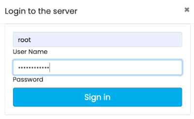

[[docker]]
=== Docker
image:../images/edit.png[link="https://github.com/ArcadeData/arcadedb-docs/blob/main/src/main/asciidoc/administration-guide/docker.adoc" float="right"]

To run the ArcadeDB server with Docker, type this (replace <password> with the root password you want to use):

[source,shell,subs="attributes+"]
----
$ docker run --rm -p 2480:2480 -p 2424:2424 --name my_arcadedb \
             --env JAVA_OPTS="-Darcadedb.server.rootPassword=playwithdata" \
             --hostname my_arcadedb arcadedata/arcadedb:{revnumber}
----

If there are no errors, Docker prints immediately the container id.
You can use that id to stop the container, or execute some commands from it.

To run the console from the container started above, use:

[source,shell,subs="attributes+"]
----
$ docker exec -it my_arcadedb bin/console.sh
ArcadeDB Console v.{revnumber} - Copyrights (c) 2021 Arcade Data (https://arcadedb.com)

>
----

NOTE: The ArcadeDB image can also be used with https://podman.io[Podman], just replace `docker` with `podman` in the examples.

[discrete]
[[quick-start-docker]]
==== Quick start with the OpenBeer database

You can run ArcadeDB server with a demo database in less than 1 minute.
Run ArcadeDB server with docker specifying the database to import as a parameter in the docker command.

Example of running ArcadeDB Server with all the plugins enabled (Redis, Postgres, Mongo, Gremlin) that download and install OrientDB's `OpenBeer` dataset:

[source,shell]
----
$ docker run --rm  -p 2480:2480 -p 2424:2424 -p 6379:6379 -p 5432:5432 -p 8182:8182 --env JAVA_OPTS="\
   -Darcadedb.server.rootPassword=playwithdata \
   -Darcadedb.server.defaultDatabases=Imported[root]{import:https://github.com/ArcadeData/arcadedb-datasets/raw/main/orientdb/OpenBeer.gz} \
   -Darcadedb.server.plugins=Redis:com.arcadedb.redis.RedisProtocolPlugin, \
                             MongoDB:com.arcadedb.mongo.MongoDBProtocolPlugin, \
                             Postgres:com.arcadedb.postgres.PostgresProtocolPlugin, \
                             GremlinServer:com.arcadedb.server.gremlin.GremlinServerPlugin" \
         arcadedata/arcadedb:latest
----

Now point your browser on **http://localhost:2480** and you'll see ArcadeDB Studio.
Now enter "root" as a user and "playwithdata" as a password.

NOTE: User and password are specified in the docker command above.

Now click on the "Database" icon on the toolbar on the left.
This is the database schema.
Click on "OpenBeer" vertex type and then on the action "Display the first 100 records of Beer together with all the vertices that are directly connected".

image::../images/openbeer-demo-schema.png[alt="Demo Database Schema",align="center"]

You should see the first 100 beers in the database and all their connections.

image::../images/openbeer-demo-graph.png[alt="Demo Database Graph",align="center"]

[discrete]
[[dockertuning]]
==== Persistence and Data Storage

By default, ArcadeDB data in Docker containers is stored in `/home/arcadedb/databases` within the container and is not persistent across container restarts. To make your data persistent, you need to mount external storage to this directory.

There are multiple approaches to achieve persistence, and the practical choice depends on your application requirements and environment:

===== Docker Storage Options

Docker provides two main options for persistent storage:

1. **https://docs.docker.com/storage/volumes/[Docker volumes]** - Docker-managed storage sections on the host filesystem. This is the recommended approach for most use cases where the host stores the data.

2. **https://docs.docker.com/storage/bind-mounts/[Bind mounts]** - User-managed host filesystem directories. Use this when the target volume is mounted from network storage or requires specific host paths.

See the https://docs.docker.com/storage/[Docker storage documentation] for detailed setup instructions.

===== ArcadeDB Storage Strategies

Choose the appropriate strategy based on your performance and backup requirements:

1. **Full Database Persistence** - Store the entire database on external storage.
+
All database read/write operations occur on the mounted volume. This may impact performance but ensures complete data persistence. Use `-Darcadedb.server.databaseDirectory=/mydatabases` to specify a custom database directory if needed.

2. **Backup-Only Persistence** - Store only backups on external storage.
+
Database operations use container storage for better performance, but regular backups are stored persistently. Use `-Darcadedb.server.backupDirectory=/mybackup` to specify the backup directory and ensure regular <<sql-backup-database,`BACKUP DATABASE`>> operations.

NOTE: The optimal strategy depends on your infrastructure. "Local storage" performance characteristics vary between bare metal, virtual machines, and container orchestration platforms.

===== Basic Persistence Example

Mount a host directory to the default database directory:

[source,shell,subs="attributes+"]
----
$ docker run --rm -p 2480:2480 -p 2424:2424 --name my_arcadedb \
    -v /path/on/host/databases:/home/arcadedb/databases \
    --env JAVA_OPTS="-Darcadedb.server.rootPassword=playwithdata" \
    --hostname my_arcadedb arcadedata/arcadedb:{revnumber}
----

===== Comprehensive Persistence Example

Mount multiple directories for complete data, backup, log, and configuration persistence:

[source,shell,subs="attributes+"]
----
$ docker run --rm -p 2480:2480 -p 2424:2424 --name my_arcadedb \
    -v /path/on/host/databases:/home/arcadedb/databases \
    -v /path/on/host/backups:/home/arcadedb/backups \
    -v /path/on/host/log:/home/arcadedb/log \
    -v /path/on/host/config:/home/arcadedb/config \
    --env JAVA_OPTS="-Darcadedb.server.rootPassword=playwithdata" \
    --hostname my_arcadedb arcadedata/arcadedb:{revnumber}
----

==== Tuning

In general, the RAM allocated for the JVM should be ≤80% of the container RAM.
The default Dockerfile for ArcadeDB sets 2 GB of RAM for ArcadeDB (`-Xms2G -Xmx2G`), so you should allocate at least 2.3G to the Docker container running exclusively ArcadeDB.

To run ArcadeDB with 1G docker container, you could start ArcadeDB by using 800M for ArcadeDB's server RAM by setting `ARCADEDB_OPTS_MEMORY` variable with Docker:

[source,shell]
----
$ docker ... -e ARCADEDB_OPTS_MEMORY="-Xms800M -Xmx800M" ...
----

To run ArcadeDB with RAM <800M, it's suggested to tune some settings.
You can use the `low-ram` profile to use the least memory possible.

[source,shell]
----
$ docker ... -e ARCADEDB_OPTS_MEMORY="-Xms800M -Xmx800M" -e arcadedb.profile=low-ram ...
----
