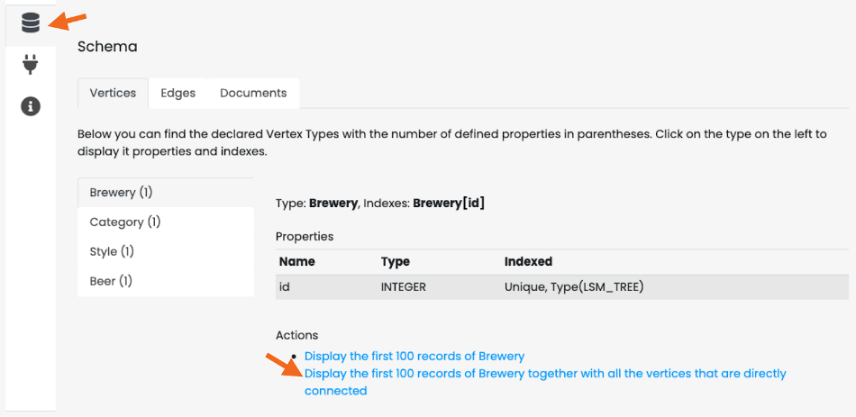

[[docker]]
=== Docker
image:../images/edit.png[link="https://github.com/ArcadeData/arcadedb-docs/blob/main/src/main/asciidoc/administration-guide/docker.adoc" float="right"]

To run the ArcadeDB server with Docker, type this (replace <password> with the root password you want to use):

[source,shell,subs="attributes+"]
----
$ docker run --rm -p 2480:2480 -p 2424:2424 --name my_arcadedb \
             --env JAVA_OPTS="-Darcadedb.server.rootPassword=playwithdata" \
             --hostname my_arcadedb arcadedata/arcadedb:{revnumber}
----

If there are no errors, Docker prints immediately the container id.
You can use that id to stop the container, or execute some commands from it.

To run the console from the container started above, use:

[source,shell,subs="attributes+"]
----
$ docker exec -it my_arcadedb bin/console.sh
ArcadeDB Console v{revnumber} - Copyrights (c) 2021 Arcade Data (https://arcadedb.com)

>
----

NOTE: The ArcadeDB image can also be used with https://podman.io[Podman], just replace `docker` with `podman` in the examples.

[discrete]
[[quick-start-docker]]
==== Quick start with the OpenBeer database

You can run ArcadeDB server with a demo database in less than 1 minute.
Run ArcadeDB server with docker specifying the database to import as a parameter in the docker command.

Example of running ArcadeDB Server with all the plugins enabled (Redis, Postgres, Mongo, Gremlin) that download and install OrientDB's `OpenBeer` dataset:

[source,shell]
----
$ docker run --rm  -p 2480:2480 -p 2424:2424 -p 6379:6379 -p 5432:5432 -p 8182:8182 --env JAVA_OPTS="\
   -Darcadedb.server.rootPassword=playwithdata \
   -Darcadedb.server.defaultDatabases=Imported[root]{import:https://github.com/ArcadeData/arcadedb-datasets/raw/main/orientdb/OpenBeer.gz} \
   -Darcadedb.server.plugins=Redis:com.arcadedb.redis.RedisProtocolPlugin, \
                             MongoDB:com.arcadedb.mongo.MongoDBProtocolPlugin, \
                             Postgres:com.arcadedb.postgres.PostgresProtocolPlugin, \
                             GremlinServer:com.arcadedb.server.gremlin.GremlinServerPlugin" \
         arcadedata/arcadedb:latest
----

Now point your browser on **http://localhost:2480** and you'll see ArcadeDB Studio.
Now enter "root" as a user and "playwithdata" as a password.

NOTE: User and password are specified in the docker command above.

image::../images/openbeer-demo-login.png[alt="Demo Database Login",align="center"]

Now click on the "Database" icon on the toolbar on the left.
This is the database schema.
Click on "OpenBeer" vertex type and then on the action "Display the first 100 records of Beer together with all the vertices that are directly connected".

You should see the first 100 beers in the database and all their connections.

image::../images/openbeer-demo-graph.png[alt="Demo Database Graph",align="center"]

[discrete]
==== Persistence

By default, data created in a Docker container is lost when the container stops. To preserve your ArcadeDB databases beyond the container's lifecycle, you need to configure persistent storage by mounting volumes.

===== Understanding ArcadeDB's Database Directory

ArcadeDB stores its databases in the `/home/arcadedb/databases` directory by default. This is the path you need to mount to persist your data. You can customize this location using the `-Darcadedb.server.databaseDirectory` setting if needed.

===== Docker Volumes vs. Bind Mounts

Docker offers two approaches for persistent storage:

1. **https://docs.docker.com/storage/volumes/[Docker volumes]** - Docker-managed storage sections on the host filesystem. Docker handles the storage location, permissions, and lifecycle. This is the recommended approach for most use cases as it's more portable and easier to manage.

2. **https://docs.docker.com/storage/bind-mounts/[Bind mounts]** - Direct mapping to a specific path on your host machine. This gives you full control over the exact location of your data files and allows direct access to them from the host. Useful when you need to inspect, backup, or manipulate the database files directly.

See the https://docs.docker.com/storage/[Docker storage documentation] for detailed setup instructions.

===== Persisting the Database Directory

The default path `/home/arcadedb/databases` contains all your database files. Mount this directory to make your data persistent. Here's an example using a bind mount:

[source,shell,subs="attributes+"]
----
$ docker run --rm -p 2480:2480 -p 2424:2424 --name my_arcadedb \
    -v /path/on/host/databases:/home/arcadedb/databases \
    --env JAVA_OPTS="-Darcadedb.server.rootPassword=playwithdata" \
    --hostname my_arcadedb arcadedata/arcadedb:{revnumber}
----

Replace `/path/on/host/databases` with your desired directory path. All database read and write operations will occur on this mounted volume.

TIP: If you prefer using Docker volumes instead of bind mounts, replace `-v /path/on/host/databases:/home/arcadedb/databases` with `-v arcadedb-data:/home/arcadedb/databases` where `arcadedb-data` is your chosen volume name.

===== Alternative: Custom Database Directory

If you need to change where ArcadeDB stores databases, use the `-Darcadedb.server.databaseDirectory` setting and mount your volume to match the new path:

[source,shell,subs="attributes+"]
----
$ docker run --rm -p 2480:2480 -p 2424:2424 --name my_arcadedb \
    -v /path/on/host/databases:/mydatabases \
    --env JAVA_OPTS="-Darcadedb.server.databaseDirectory=/mydatabases \
                     -Darcadedb.server.rootPassword=playwithdata" \
    --hostname my_arcadedb arcadedata/arcadedb:{revnumber}
----

This example changes the database directory to `/mydatabases` and mounts the volume to that location.

===== Alternative: Backup-Only Persistence

For better performance, you can keep databases in container storage and only persist backups. All database operations occur in fast container storage, but you must perform regular backups:

[source,shell,subs="attributes+"]
----
$ docker run --rm -p 2480:2480 -p 2424:2424 --name my_arcadedb \
    -v /path/on/host/backups:/home/arcadedb/backups \
    --env JAVA_OPTS="-Darcadedb.server.rootPassword=playwithdata" \
    --hostname my_arcadedb arcadedata/arcadedb:{revnumber}
----

The default backup directory is `/home/arcadedb/backups`. You can customize it with `-Darcadedb.server.backupDirectory=/mybackup`. Remember to execute regular <<sql-backup-database,`BACKUP DATABASE`>> operations.

NOTE: The optimal strategy depends on your infrastructure. "Local storage" performance characteristics vary between bare metal, virtual machines, and container orchestration platforms.

===== Comprehensive Persistence Example

Mount multiple directories for complete data, backup, log, and configuration persistence:

[source,shell,subs="attributes+"]
----
$ docker run --rm -p 2480:2480 -p 2424:2424 --name my_arcadedb \
    -v /path/on/host/databases:/home/arcadedb/databases \
    -v /path/on/host/backups:/home/arcadedb/backups \
    -v /path/on/host/log:/home/arcadedb/log \
    -v /path/on/host/config:/home/arcadedb/config \
    --env JAVA_OPTS="-Darcadedb.server.rootPassword=playwithdata" \
    --hostname my_arcadedb arcadedata/arcadedb:{revnumber}
----

==== Tuning

In general, the RAM allocated for the JVM should be ≤80% of the container RAM.
The default Dockerfile for ArcadeDB sets 2 GB of RAM for ArcadeDB (`-Xms2G -Xmx2G`), so you should allocate at least 2.3G to the Docker container running exclusively ArcadeDB.

To run ArcadeDB with 1G docker container, you could start ArcadeDB by using 800M for ArcadeDB's server RAM by setting `ARCADEDB_OPTS_MEMORY` variable with Docker:

[source,shell]
----
$ docker ... -e ARCADEDB_OPTS_MEMORY="-Xms800M -Xmx800M" ...
----

To run ArcadeDB with RAM <800M, it's suggested to tune some settings.
You can use the `low-ram` profile to use the least memory possible.

[source,shell]
----
$ docker ... -e ARCADEDB_OPTS_MEMORY="-Xms800M -Xmx800M" -e arcadedb.profile=low-ram ...
----
