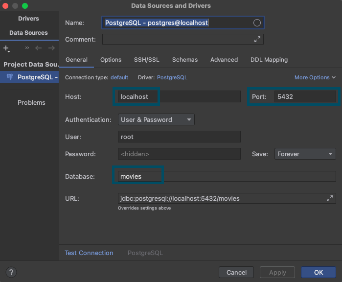
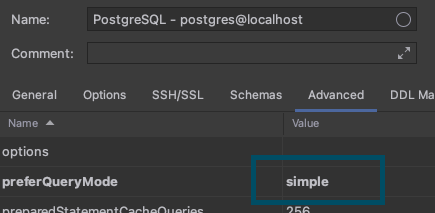

[[Postgres-Driver]]
=== Postgres Protocol Plugin
image:../images/edit.png[link="https://github.com/ArcadeData/arcadedb-docs/blob/main/src/main/asciidoc/api/postgres.adoc" float=right]

ArcadeDB Server supports a subset of the https://postgres.com[Postgres] wire protocol, such as connection and queries.

If you're using ArcadeDB as embedded, please add the dependency to the `arcadedb-postgresw` library.
If you're using Maven include this dependency in your `pom.xml` file.

```xml
<dependency>
    <groupId>com.arcadedb</groupId>
    <artifactId>arcadedb-postgresw</artifactId>
    <version>21.10.1</version>
</dependency>
```

To start the Postgres plugin, enlist it in the <<#_settings,`server.plugins`>> settings.
To specify multiple plugins, use the comma `,` as separator.
Example:

```shell
~/arcadedb $ bin/server.sh -Darcadedb.server.plugins="Postgres:com.arcadedb.postgres.PostgresProtocolPlugin"
```

If you're using MS Windows OS, replace `server.sh` with `server.bat`.

In case you're running ArcadeDB with Docker, use `--env` to pass settings and open the Postgres default port `5432`:

```shell
docker run --rm -p 2480:2480 -p 2424:2424 -p 5432:5432 --env arcadedb.server.rootPassword=playwithdata --env arcadedb.server.plugins="Postgres:com.arcadedb.postgres.PostgresProtocolPlugin" arcadedata/arcadedb:latest
```


The Server output will contain this line:

```
2021-07-08 19:05:06.081 INFO  [ArcadeDBServer] <ArcadeDB_0> - Postgres Protocol plugin started
```

Once you have enabled the Postgres Protocol, you can interact with ArcadeDB server by using any Postgres drivers.
The driver sends the queries to the ArcadeDB server without parsing or checking the syntax.
For this reason, even if ArcadeDB SQL is different from Postgres SQL, you're still able to execute any ArcadeDB SQL command through the Postgres driver.
Check out the following list with the official drivers for the most popular programming languages:

- https://www.postgresql.org/docs/current/libpq.html[C]
- https://www.npgsql.org/[C#]
- http://pqxx.org/development/libpqxx/[C++]
- https://github.com/lib/pq[Go]
- https://github.com/brianc/node-postgres[Javascript - Node.js]
- https://www.php.net/manual/en/book.pgsql.php[PHP]
- https://github.com/MagicStack/asyncpg[Python]
- https://cran.r-project.org/web/packages/RPostgreSQL/index.html[R]
- https://github.com/ged/ruby-pg[Ruby]
- https://github.com/sfackler/rust-postgres[Rust]

For the complete list, please check https://wiki.postgresql.org/wiki/List_of_drivers[Postgres website].

=== Postgres Tools Known to Work

NOTE: Some tools compatible with Postgres may execute queries on internal Postgres tables to retrieve the schema. Those tables are not present in ArcadeDB, so it may return errors at startup. If the tool that you use to work with Postgres is not compatible with ArcadeDB, please https://github.com/ArcadeData/arcadedb/issues[open an issue].

==== JetBrains DataGrip/Database Plugin

Connecting via JetBrains' database plugin is relatively straightforward. The introspection features aren't working yet, but the basics seem to work
well.

To connect, create a new Postgres datasource and point it to the IP/port of your ArcadeDb server. (0.0.0.0:5432 by default) You will need to 
fill out the database field, or you'll get an error on connection. At present, changing the current database requires editing the datasource.



Next, you'll need to set `preferQueryMode` to *simple* on the Advanced tab, like this:



You can then run queries via a console. Even non-SQL queries will work, though expect squigglies!

image::../images/jetbrains-queries.png[]

==== psql

Postgres's psql tool works out of the box, just like with a "real" Postgres server.

Connect like this:
`psql -h localhost -U root movies`

After authenticating, you can run queries as normal. 
