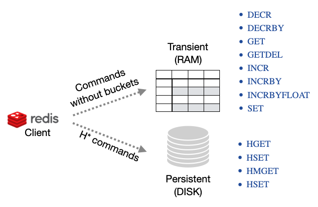

[[Redis-API]]
=== Redis API

image:../images/edit.png[link="https://github.com/ArcadeData/arcadedb-docs/blob/main/src/main/asciidoc/api/redis.adoc" float=right]

ArcadeDB Server supports a subset of the https://redis.io[Redis] protocol. Please open an issue or a discussion on GitHub to support more commands.

ArcadeDB Redis plugin works in 2 ways:

- Manage **transient** (non-persistent) entries in the server. This is useful to manage user sessions and other records you don't need to store in the database.
- Manage **persistent** entries in the database. You can save and read any documents, vertices and edges from the underlying database.

If you're using ArcadeDB as embedded, please add the dependency to the `arcadedb-redisw` library.
If you're using Maven include this dependency in your `pom.xml` file.

```xml
<dependency>
    <groupId>com.arcadedb</groupId>
    <artifactId>arcadedb-redisw</artifactId>
    <version>21.10.1</version>
</dependency>
```

[[Redis-Protocol]]
==== Installation

To start the Redis plugin, enlist it in the <<#_settings,`server.plugins`>> settings.
To specify multiple plugins, use the comma `,` as separator.
Example:

```shell
~/arcadedb $ bin/server.sh -Darcadedb.server.plugins="Redis:com.arcadedb.redis.RedisProtocolPlugin"
```

If you're using MS Windows OS, replace `server.sh` with `server.bat`.

In case you're running ArcadeDB with Docker, open the port `6379` and use `--env` to pass settings:

```shell
docker run --rm -p 2480:2480 -p 2424:2424 -p 6379:6379 --env arcadedb.server.rootPassword=playwithdata --env arcadedb.server.plugins="Redis:com.arcadedb.redisw.RedisProtocolPlugin" arcadedata/arcadedb:latest
```

The Server output will contain this line:

```
2018-10-09 18:47:58:395 INFO  <ArcadeDB_0> - Redis Protocol plugin started [ArcadeDBServer]
```

[[Redis-HowWorks]]
==== How it works

ArcadeDB works in 2 ways with the Redis protocol:

- **Transient commands**, key/value pairs saved will be not saved in the database. This is perfect to store transient data, like user sessions.
- **Persistent commands**, key/value pairs allows to store and retrieve ArcadeDB documents, vertices and edges



[discrete]
==== Transient (RAM Only) Commands

Below you can find the supported commands.
The link takes you to the official Redis documentation.
Please open an issue or a discussion on GitHub to support more commands.

The following commands do not take the bucket as parameter because they work only in RAM on a shared (thread-safe) hashmap.
This means all the stored values are reset when the server restarts.

**Available transient commands (in alphabetic order)**:

- https://redis.io/commands/decr[DECR], Decrement a value by 1
- https://redis.io/commands/decrby[DECRBY], Decrement a value by a specific amount (64 bit precision)
- https://redis.io/commands/get[GET], Returns the value associated to a key
- https://redis.io/commands/getdel[GETDEL], Remove and returns the value associated to a key
- https://redis.io/commands/incr[INCR], Increment a value by 1
- https://redis.io/commands/incrby[INCRBY], Increment a value by a specific amount (64 bit precision)
- https://redis.io/commands/incrbyfloat[INCRBYFLOAT], Increment a value by a specific amount expresses as a float (64 bit precision)
- https://redis.io/commands/set[SET], Sets a value associated with a key

[discrete]
==== Persistent Commands

The following commands act on persistent buckets in the database.
Records (documents, vertices and edges) are always in form of JSON embedded in strings.
The bucket name is mapped as the database name first, then type, the index or the record's <<RID,`RID`>> based on the use case.
An index must exist on the property you used to retrieve the document, otherwise an error is returned.

For the sake of this tutorial, we're going to create the account document type totally schemaless but for some indexed properties: `id` as a unique long, `email` as a unique string and the pair `firstName` and `lastName` both strings and indexed with a composite key:

```SQL
CREATE DOCUMENT TYPE Account

CREATE PROPERTY Account.id LONG
CREATE INDEX `Account[id]` ON Account (id) UNIQUE

CREATE PROPERTY Account.email STRING
CREATE INDEX `Account[email]` ON Account (email) UNIQUE

CREATE PROPERTY Account.firstName STRING
CREATE PROPERTY Account.lastName STRING
CREATE INDEX `Account[firstName,lastName]` ON Account (firstName,lastName) UNIQUE
```

Now you can create a new document with Redis protocol and the https://redis.io/commands/hset[HSET] Redis command:

```redis
HSET MyDatabase.Account "{'id':123,'email':'jay.miner@commodore.com','firstName':'Jay','lastName':'Miner'}"
```

To retrieve the document inserted above by `id` (O(logN) complexity), you can use the https://redis.io/commands/hget[HGET] Redis command:

```redis
HGET MyDatabase.Account[id] 123
"{'@rid':'#1:0','@type':'Account','id':123,'email':'jay.miner@commodore.com','firstName':'Jay','lastName':'Miner'}"
```

To retrieve the same document by `email` (O(logN) complexity), you can use the https://redis.io/commands/hget[HGET] Redis command:

```redis
HGET MyDatabase.Account[email] "jay.miner@commodore.com"
"{'@rid':'#1:0','@type':'Account','id':123,'email':'jay.miner@commodore.com','firstName':'Jay','lastName':'Miner'}"
```

To retrieve the same document by the pair `firstName` and `lastName` (O(logN) complexity), we are going to use the composite key we created before:

```redis
HGET MyDatabase.Account[firstName,lastName] "[\"Jay\",\"Miner\"]"
"{'@rid':'#1:0','@type':'Account','id':123,'email':'jay.miner@commodore.com','firstName':'Jay','lastName':'Miner'}"
```

To retrieve the document inserted above by it <<RID,`RID`>> (O(1) complexity), you can use the https://redis.io/commands/hget[HGET] Redis command:

```redis
HGET MyDatabase "#1:0"
"{'@rid':'#1:0','@type':'Account','id':123,'email':'jay.miner@commodore.com','firstName':'Jay','lastName':'Miner'}"
```

You can also get multiple record in one call by using the https://redis.io/commands/hmget[HMGET] Redis command:

```redis
HMGET MyDatabase "#1:0" "#1:1" "#1:2"
"{'@rid':'#1:0','@type':'Account','id':123,'email':'jay.miner@commodore.com','firstName':'Jay','lastName':'Miner'}"
"{'@rid':'#1:1','@type':'Account','id':232,'email':'jay.miner@commodore.com','firstName':'Jay','lastName':'Miner'}"
"{'@rid':'#1:2','@type':'Account','id':12,'email':'jay.miner@commodore.com','firstName':'Jay','lastName':'Miner'}"
```

Or the same, but by a key:

```redis
HMGET MyDatabase.Account[id] 123 232 12
"{'@rid':'#1:0','@type':'Account','id':123,'email':'jay.miner@commodore.com','firstName':'Jay','lastName':'Miner'}"
"{'@rid':'#1:1','@type':'Account','id':232,'email':'jay.miner@commodore.com','firstName':'Jay','lastName':'Miner'}"
"{'@rid':'#1:2','@type':'Account','id':12,'email':'jay.miner@commodore.com','firstName':'Jay','lastName':'Miner'}"
```


To delete the document inserted above by `email`, you can use the https://redis.io/commands/hdel[HDEL] Redis command:

```redis
HDEL MyDatabase.Account[email] "jay.miner@commodore.com"
:1
```


!NOTE: The returning JSON could have a different ordering of the properties from the one you have inserted.
This is because JSON doesn't maintain the order of properties, but only of arrays (`[]`).

**Available persistent commands (in alphabetic order)**:

- https://redis.io/commands/hdel[HDEL], to delete one or more records by a key, a composite key or record's id
- https://redis.io/commands/hget[HGET], to retrieve a record by a key, a composite key or record's id
- https://redis.io/commands/hget[HMGET], to retrieve multiple records by a key, a composite key or record's id
- https://redis.io/commands/hset[HSET], to create and update one or more records by a key, a composite key or record's id

[discrete]
===== Settings

To change the host where the Redis protocol is listening, set the setting `arcadedb.redis.host`. By default, is `0.0.0.0` which means listen to all the configured network interfaces. To change the default port (6379) set `arcadedb.redis.port`.
