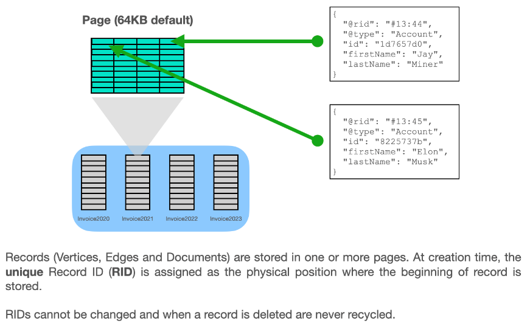
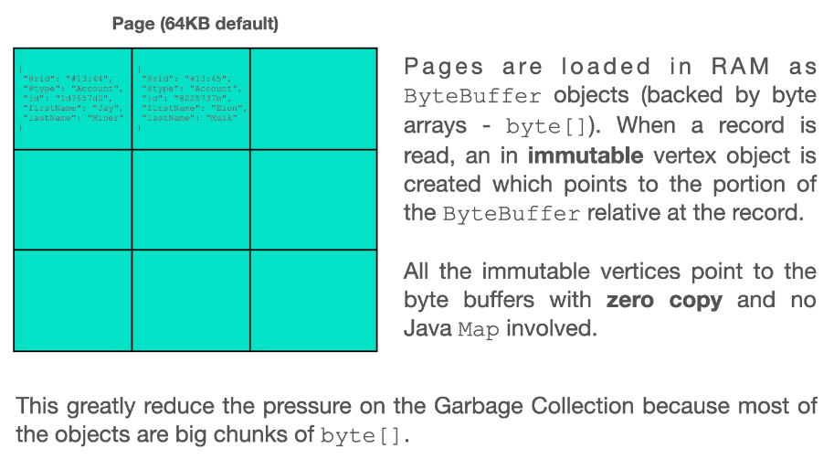
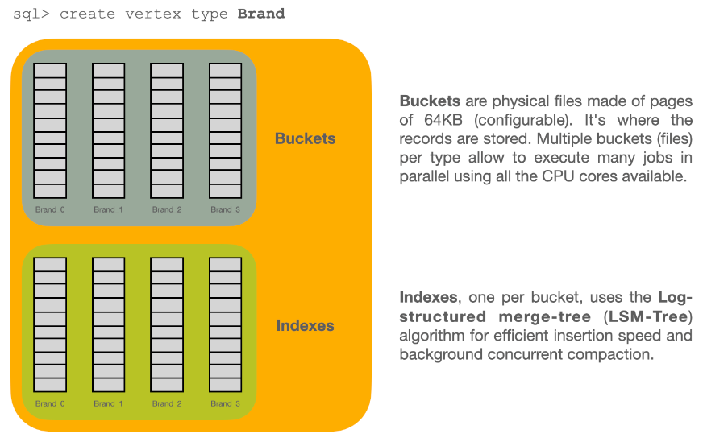
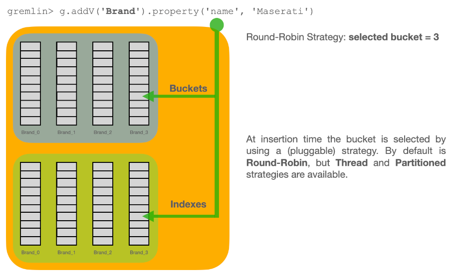
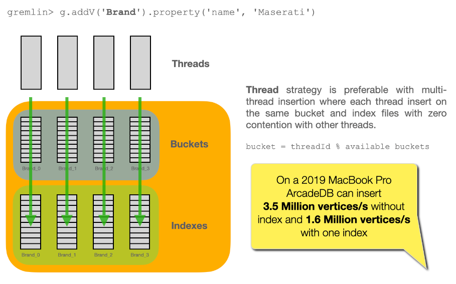
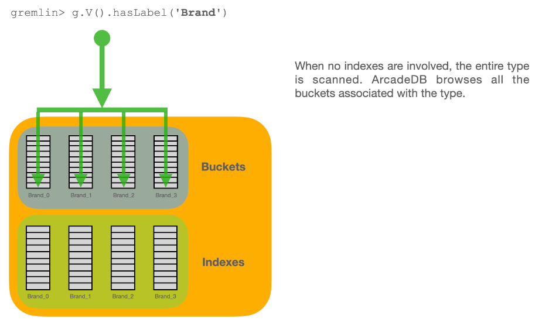
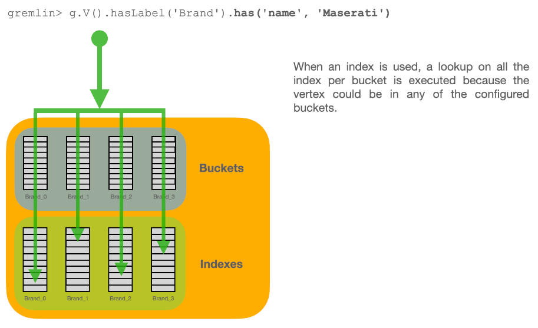
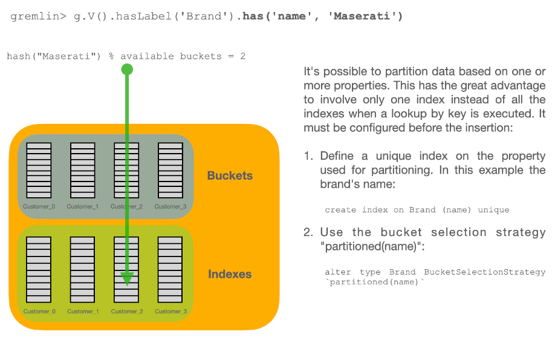
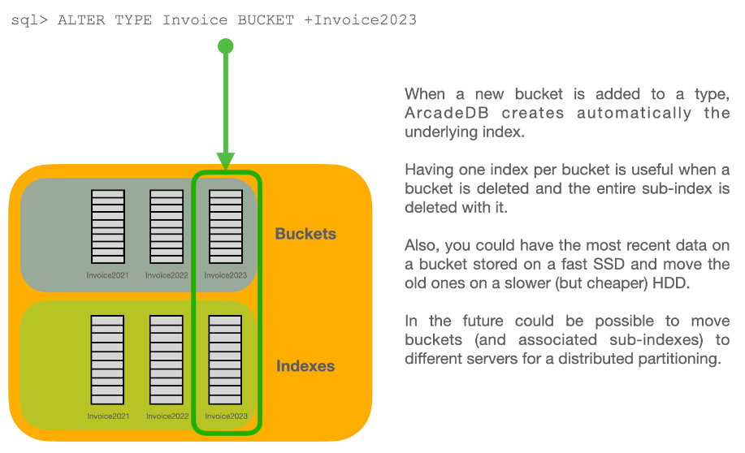
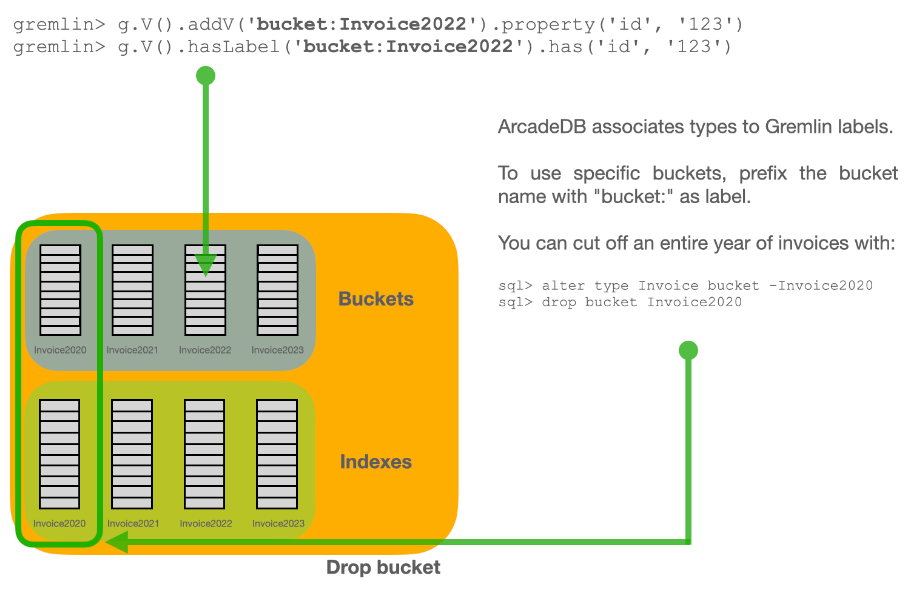

[[Storage-Internals]]
=== Storage Internals
image:../images/edit.png[link="https://github.com/ArcadeData/arcadedb-docs/blob/main/src/main/asciidoc/appendix/storage.adoc" float=right]

==== Pages and Record IDs

==== Zero Copy Objects

==== How Buckets Work

==== Bucket Partitioning

==== Add and Remove Buckets from Types

==== Page Version

Records are stored in pages.
Each page has its own version number, which increments on each update.
At creation the page version is zero.
In optimistic transactions, ArcadeDB checks the version in order to avoid conflicts at commit time.

