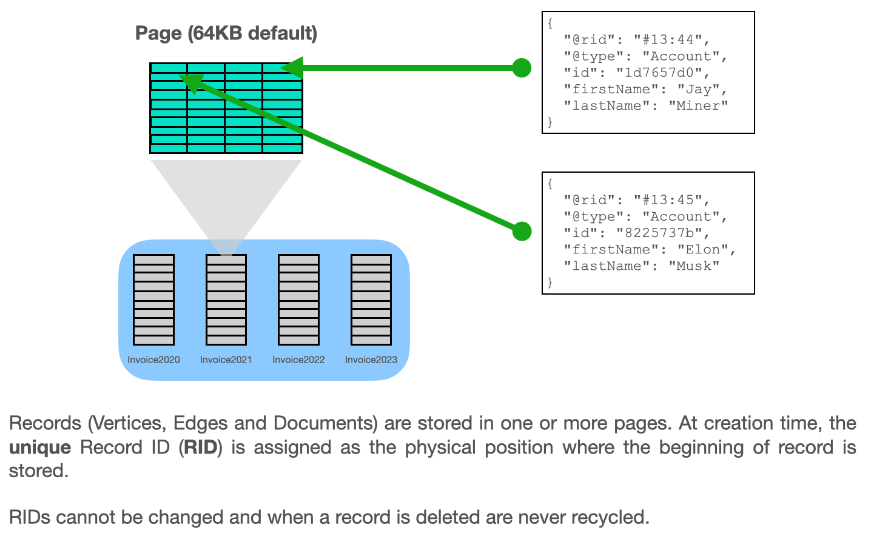
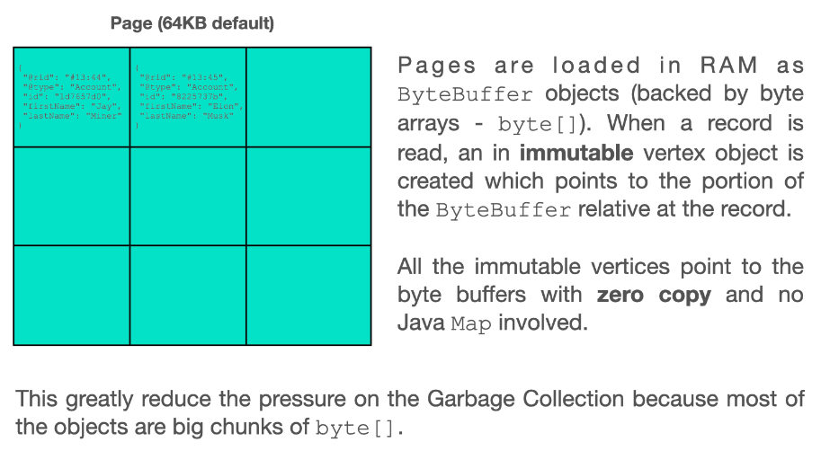
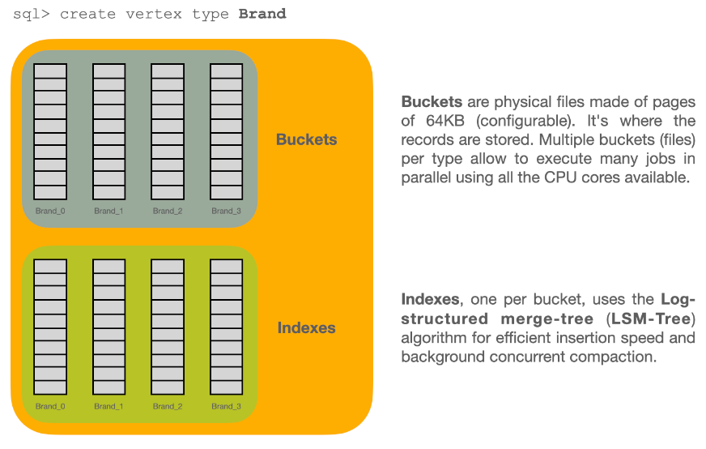
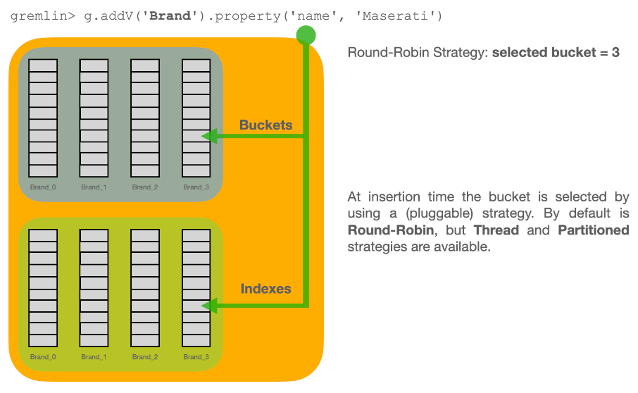
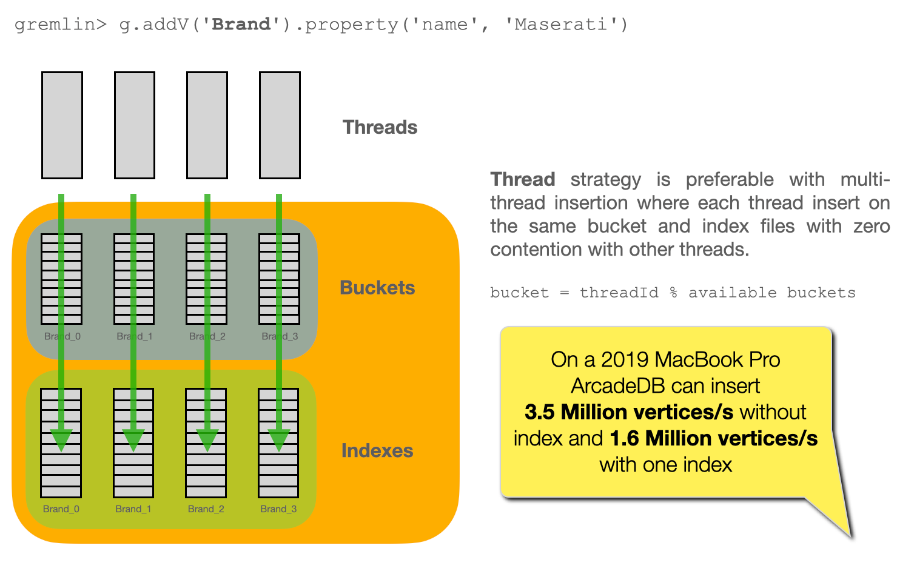
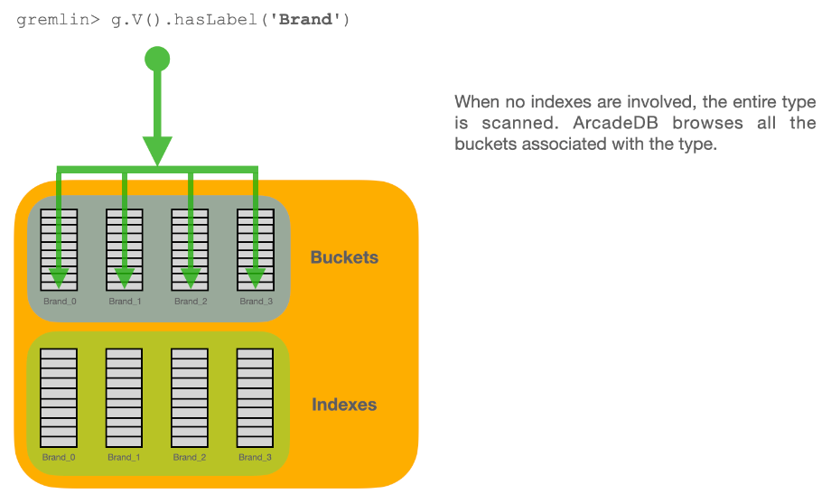
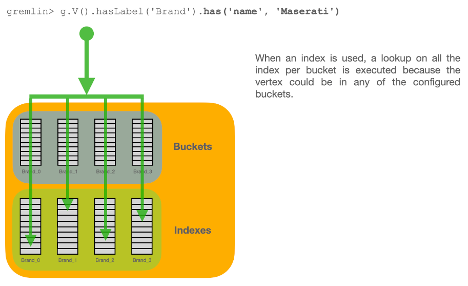
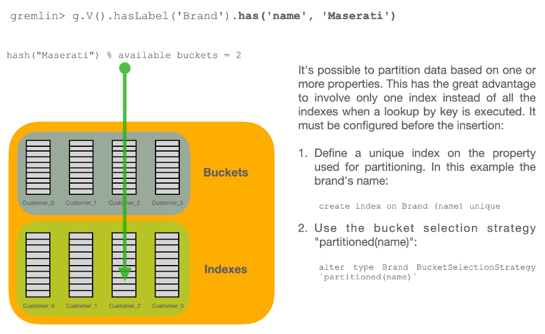
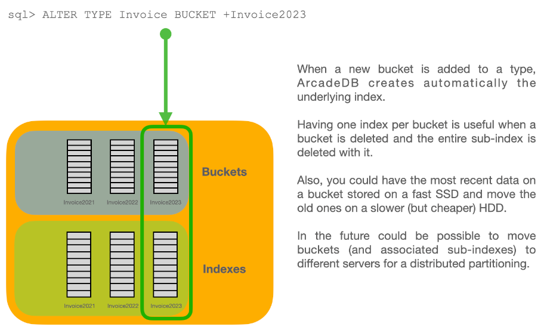
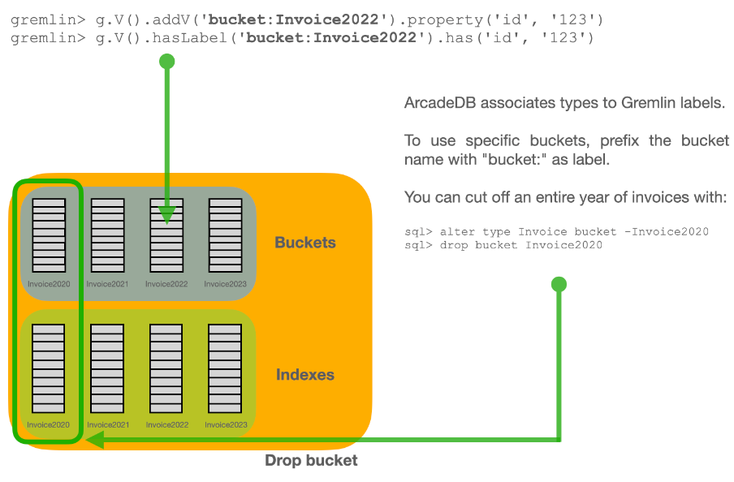

[[storage-internals]]
=== Storage Internals

==== Pages and Record IDs

==== Zero Copy Objects

==== How Buckets Work

==== Bucket Partitioning

==== Add and Remove Buckets from Types

==== Page Version

Records are stored in pages.
Each page has its own version number, which increments on each update.
At creation the page version is zero.
In optimistic transactions, ArcadeDB checks the version in order to avoid conflicts at commit time.

[[schema-file-persistence]]
==== Schema File Persistence

The schema of a database lives in two JSON files in the database directory: `schema.json`, the current generation, and `schema.prev.json`, the generation it replaced.
Every DDL statement rewrites them.

Since v26.10.1, both files are published by an *atomic replacement*: the new content is written to a temporary sibling file, flushed to disk, and then renamed over its target.
A process reading `schema.json` from the filesystem - an external backup, a monitoring script, a snapshot tool - therefore always observes one complete generation.
It is never truncated, and it never disappears.

NOTE: Before v26.10.1, saving the schema renamed `schema.json` aside to `schema.prev.json` and only then wrote the replacement.
For the duration of that write, `schema.json` did not exist, and a process killed inside that window left a database whose schema file was missing and recoverable only from `schema.prev.json`.
If you have tooling that copies a database directory while the database is running, and that tooling tolerates a missing or empty `schema.json`, that workaround is no longer needed.

The previous generation is saved by creating a second hard link to the bytes already on disk where the file system supports it, so `schema.json` and `schema.prev.json` can share one inode until the next DDL statement replaces `schema.json`.
This is invisible to anything that reads or copies the files - `cp`, `tar`, a backup archive and a restore all produce two independent files - but a tool that reports inode identity or disk usage will see the two names counted once.
File systems without hard links (FAT/exFAT, some network mounts) fall back to a byte copy automatically.

On a file system that cannot rename atomically at all, ArcadeDB falls back to a plain replacement and logs a warning once per JVM.
The schema still saves; only the crash-time guarantee is lost.
