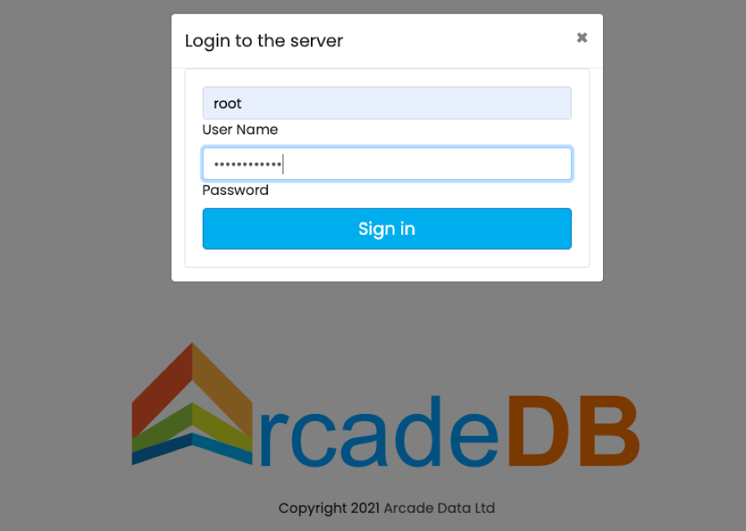
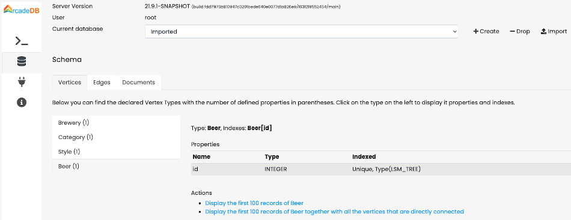
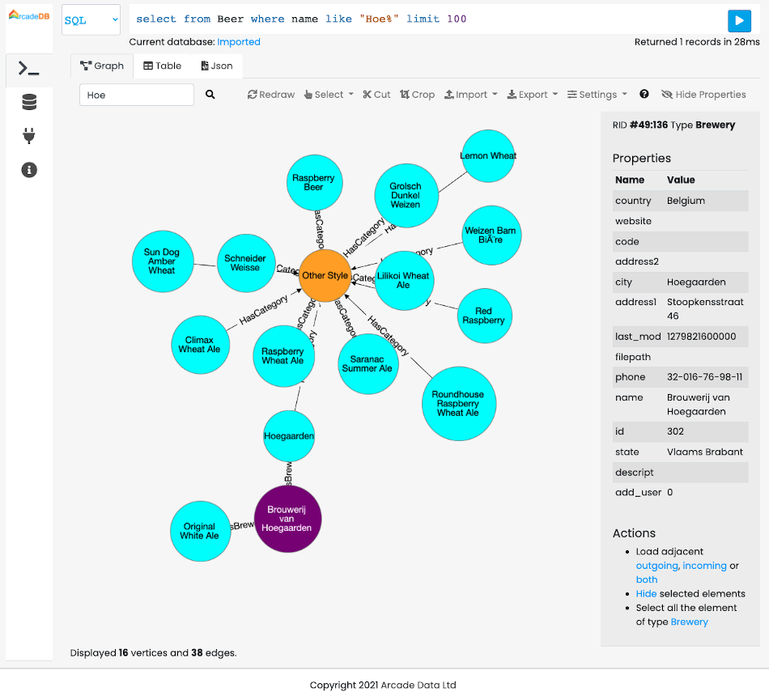

=== Docker
image:../images/edit.png[link="https://github.com/ArcadeData/arcadedb-docs/blob/main/src/main/asciidoc/server/docker.adoc" float="right"]

To run ArcadeDB Server with Docker, type this (replace <password> with the root password you want to use):

[source,shell]
----
~/arcadedb $ docker run --rm -p 2480:2480 -p 2424:2424 \
       --env JAVA_OPTS="-Darcadedb.server.rootPassword=playwithdata" \
            arcadedata/arcadedb:latest

5bb2ef9d4704ae9b55b4dfa08a00568596ab8a89fd8a2135f2a15736c891d248
----

If there are no errors, Docker prints immediately the container id. You can use that id to stop the container, or execute some commands from it.

To run the console from the container started above, use:

[source,shell]
----
~/arcadedb $ docker exec -it 5bb2ef9d4704ae9b55b4dfa08a00568596ab8a89fd8a2135f2a15736c891d248 bin/console.sh
ArcadeDB Console v.21.9.1 - Copyrights (c) 2021 Arcade Data (https://arcadedb.com)

>
----

[[Quick-Start-Docker]]
==== Quick start with the OpenBeer database

You can run ArcadeDB server with a demo database in less than 1 minute. Run ArcadeDB server with docker specifying the database to import as a parameter in the docker command.

Example of running ArcadeDB Server with all the plugins enabled (Redis, Postgres, Mongo, Gremlin) that download and install OrientDB's `OpenBeer` dataset:

[source,shell]
----
docker run --rm  -p 2480:2480 -p 2424:2424 -p 6379:6379 -p 5432:5432 -p 8182:8182 \
       --env JAVA_OPTS="-Darcadedb.server.rootPassword=playwithdata \
          -Darcadedb.server.defaultDatabases=Imported[root]{import:https://github.com/ArcadeData/arcadedb-datasets/raw/main/orientdb/OpenBeer.gz} \
          -Darcadedb.server.plugins=Redis:com.arcadedb.redis.RedisProtocolPlugin,MongoDB:com.arcadedb.mongo.MongoDBProtocolPlugin,Postgres:com.arcadedb.postgres.PostgresProtocolPlugin,GremlinServer:com.arcadedb.server.gremlin.GremlinServerPlugin " \
          arcadedata/arcadedb:latest
----

Now point your browser on **https://localhost:2480** and you'll see ArcadeDB Studio. Now enter "root" as a user and "playwithdata" as a password.

NOTE: user and password are specified in the docker command above

Now click on the "Database" icon on the toolbar on the left. This is the database schema. Click on "OpenBeer" vertex type and then on the action "Display the first 100 records of Beer together with all the vertices that are directly connected".

You should see the first 100 beers in the database and all their connections.

[discrete]
[[DockerTuning]]
==== Tuning

In general, the RAM allocated for the JVM should be <=80% of the container RAM. The default Dockerfile for ArcadeDB sets 2 GB of RAM for ArcadeDB (`-Xms2G -Xmx2G`), so you should allocate at least 2.3G to the Docker container running exclusively ArcadeDB.

To run ArcadeDB with 1G docker container, you could start ArcadeDB by using 800M for ArcadeDB's server RAM by setting `ARCADEDB_OPTS_MEMORY` variable with Docker:

[source,shell]
----
docker ... -e ARCADEDB_OPTS_MEMORY="-Xms800M -Xmx800M" ...
----

To run ArcadeDB with RAM <800M, it's suggested to tune some settings. You can use the `low-ram` profile to use the least memory possible.

[source,shell]
----
docker ... -e ARCADEDB_OPTS_MEMORY="-Xms800M -Xmx800M" -e arcadedb.profile=low-ram ...
----
