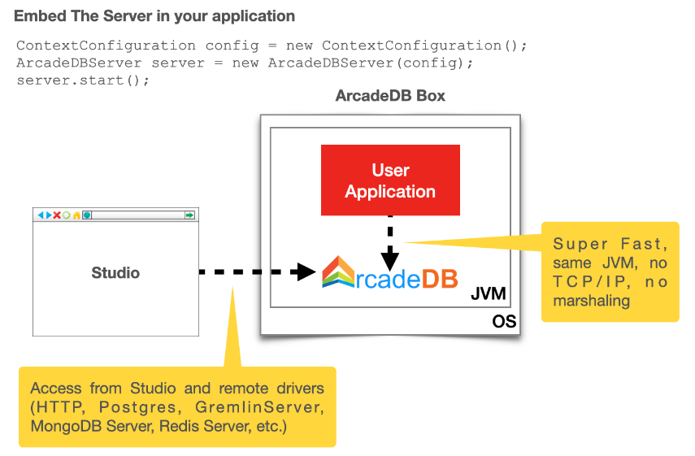
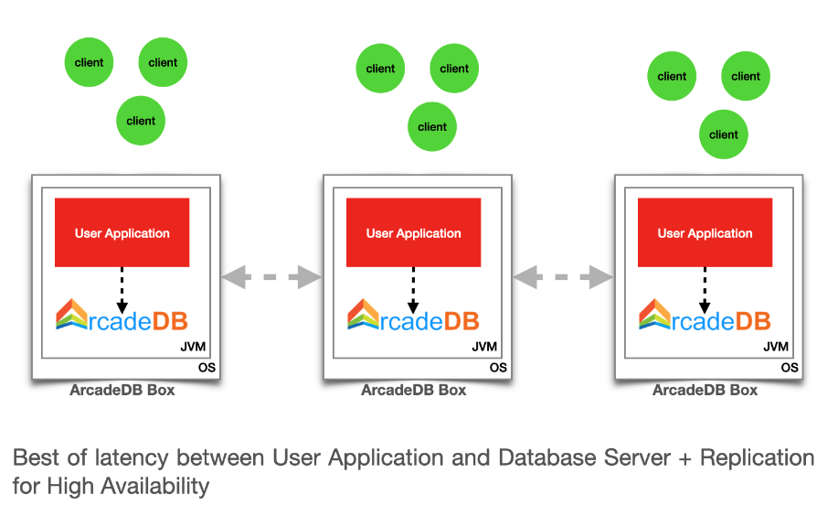

[[embedded-server]]
=== Embedded Server

image:../images/edit.png[link="https://github.com/ArcadeData/arcadedb-docs/blob/main/src/main/asciidoc/server/embed-server.adoc" float="right"]

Embedding the server in your JVM allows to have all the benefits of working in <<embedded-server,embedded>> mode with ArcadeDB (zero cost for network transport and marshalling) and still having the database accessible from the outside, such as Studio, remote API, Postgres, REDIS and MongoDB drivers.

We call this configuration an "ArcadeDB Box".

First, add the server library in your classpath.
If you're using Maven include this dependency in your `pom.xml` file.

[source,xml, subs="+attributes"]
----
<dependency>
    <groupId>com.arcadedb</groupId>
    <artifactId>arcadedb-server</artifactId>
    <version>{revnumber}</version>
</dependency>
----

This library depends on `arcadedb-network-<version>.jar`.
If you're using Maven or Gradle, it will be imported automatically as a dependency, otherwise please add also the `arcadedb-network` library to your classpath.

NOTE: The `arcadedb-server` dependency will only start the ArcadeDB server. You will see the HTTP URL for the server along with the port number displayed, for example, `http://localhost:2480`. However, if you try to access this URL to see the ArcadeDB studio, you will receive a `"Not Found"` message. This is because the arcadedb-server dependency only adds the embedded server. 
If you need to access the ArcadeDB studio to execute graph database queries, then you will need to add the following dependency:

[source,xml, subs="+attributes"]
----
<dependency>
    <groupId>com.arcadedb</groupId>
    <artifactId>arcadedb-studio</artifactId>
    <version>{revnumber}</version>
</dependency>
----

==== Start the server in the JVM

To start a server as <<embedded-server,embedded>>, create it with an empty configuration, so all the setting will be the default ones:

[source,java]
----
ContextConfiguration config = new ContextConfiguration();
ArcadeDBServer server = new ArcadeDBServer(config);
server.start();
----

To start a server in distributed configuration (with replicas), you can set your settings in the `ContextConfiguration`:

[source,java]
----
config.setValue(GlobalConfiguration.HA_SERVER_LIST, "192.168.10.1,192.168.10.2,192.168.10.3");
config.setValue(GlobalConfiguration.HA_REPLICATION_INCOMING_HOST, "0.0.0.0");
config.setValue(GlobalConfiguration.HA_ENABLED, true);
----

When you embed the server, you should always get the database instance from the server itself.
This assures the database instance is just one in the entire JVM.
If you try to create or open another database instance from the `DatabaseFactory`, you will receive an error that the underlying database is locked by another process.

[source,java]
----
Database database = server.getDatabase(<URL>);
----

Or this if you want to create a new database if not exists:

[source,java]
----
Database database = server.getOrCreateDatabase(<URL>);
----

[[custom-http]]
==== Create custom HTTP commands

You can easily add custom HTTP commands on ArcadeDB's Undertow HTTP Server by creating a <<server-plugin,Server Plugin>> (look at `MongoDBProtocolPlugin` plugin implementation for a real example) and implementing the `registerAPI` method.
Example for the HTTP POST API `/myapi/test`:

[source,java]
----
package com.yourpackage;

public class MyTest implements ServerPlugin {
  // ...

  @Override
  public void registerAPI(HttpServer httpServer, final PathHandler routes) {
    routes.addPrefixPath("/myapi",//
      Handlers.routing()//
        .get("/account/{id}", new RetieveeAccount(this))// YOU CAN ADD YOUR HANDLERS UNDER THE SAME PREFIX PATH
        .post("/test/{name}", new MyTestAPI(this))//
    );
  }
}
----

You can use `GET`, `POST` or any HTTP methods when you register your handler.
Note that multiple handlers are defined under the same prefix `/myapi`.
Below you can find the implementation of a "Test" handler that can be called by using the HTTP POST method against the URL `/myapi/test/{name}` where `{name}` is the name passed as an argument.
Note that the `MyTestAPI` class is inheriting `DatabaseAbstractHandler` to have the database instance as a parameter.
If the user is not authenticated, the `execute()` method is not called at all, but an authentication error is returned. If you don't need to access to the database, then you can extend the `AbstractHandler` class instead.

[source,java]
----
public class MyTestAPI extends DatabaseAbstractHandler {

  public MyTestAPI(final HttpServer httpServer) {
    super(httpServer);
  }

  @Override
  public void execute(final HttpServerExchange exchange, ServerSecurityUser user, final Database database) throws IOException {
    final Deque<String> namePar = exchange.getQueryParameters().get("name");
    if (namePar == null || namePar.isEmpty()) {
      exchange.setStatusCode(400);
      exchange.getResponseSender().send("{ \"error\" : \"name is null\"}");
      return;
    }

    final String name = namePar.getFirst();

    // DO SOMETHING MEANINGFUL HERE
    // ...

    exchange.setStatusCode(204);
    exchange.getResponseSender().send("");
  }
}
----

At startup, ArcadeDB server will initiate your plugin and register your API.
To start the server with your plugin, register the full class in
`arcadedb.server.plugins` setting:

Example:

[source,shell]
----
$ java ... -Darcadedb.server.plugins=MyPlugin:com.yourpackage.MyPlugin ...
----

==== HTTPS connection

In order to enable HTTPS on ArcadeDB server, you have to set the following configuration before the server starts:

[source,java]
----
configuration.setValue(GlobalConfiguration.NETWORK_USE_SSL, true);
configuration.setValue(GlobalConfiguration.NETWORK_SSL_KEYSTORE, "src/test/resources/master.jks");
configuration.setValue(GlobalConfiguration.NETWORK_SSL_KEYSTORE_PASSWORD, "keypassword");
configuration.setValue(GlobalConfiguration.NETWORK_SSL_TRUSTSTORE, "src/test/resources/master.jks");
configuration.setValue(GlobalConfiguration.NETWORK_SSL_TRUSTSTORE_PASSWORD, "storepassword");
----

Where:

- `NETWORK_USE_SSL` enable the SSL support for the HTTP Server
- `NETWORK_SSL_KEYSTORE` is the path where is located the keystore file
- `NETWORK_SSL_KEYSTORE_PASSWORD` is the keystore password
- `NETWORK_SSL_TRUSTSTORE` is the path where is located the truststore file
- `NETWORK_SSL_TRUSTSTORE_PASSWORD` is the truststore password

Note that the default port for HTTPs is configured via the global setting:

[source,java]
----
GlobalConfiguration.SERVER_HTTPS_INCOMING_PORT
----

And by default starts from 2490 to 2499 (increases the port if it's already occupied).

NOTE: if HTTP or HTTPS port are already used, the next ports are used. With the default range of 2480-2489 for HTTP and 2490-2499 for HTTPS, if the port 2480 is not available, then the next port for both HTTP and HTTPS will be used, namely 2481 for HTTP and 2491 for HTTPS

==== Replication between boxes

You can replicate databases across multiple boxes to have true high availability:

