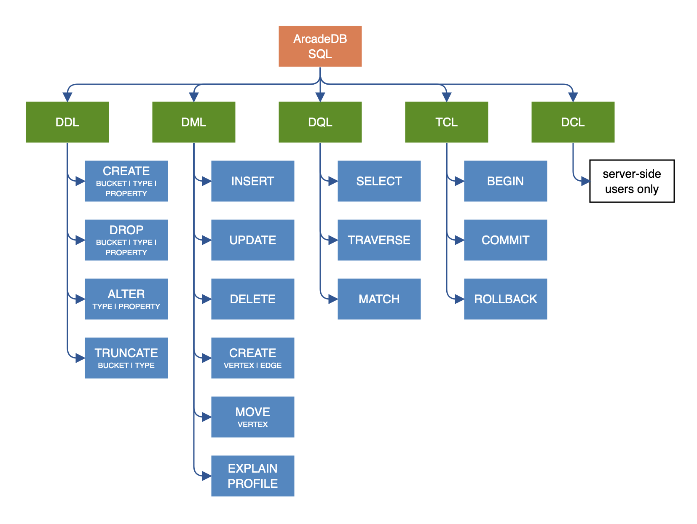

[discrete]

=== Introduction

image:../images/edit.png[link="https://github.com/ArcadeData/arcadedb-docs/blob/main/src/main/asciidoc/sql/SQL-Introduction.adoc" float=right]

When it comes to query languages, https://en.wikipedia.org/wiki/SQL[SQL] is the most widely recognized standard. The majority of developers have experience and are
comfortable with SQL. For this reason ArcadeDB uses SQL as its query language and adds some extensions to enable graph
functionality. There are a few differences between the standard SQL syntax and that supported by ArcadeDB, but for the most part, it
should feel very natural. The differences are covered in the <<ArcadeDB-SQL-Dialect,ArcadeDB SQL dialect>> section of this page.

If you are looking for the most efficient way to traverse a graph, we suggest using <<SQL-Match,MATCH>> instead.

Many SQL commands share the <<Filtering,WHERE condition>>. Keywords are case insensitive, but type names, property names and values
are case sensitive. In the following examples keywords are in uppercase but this is not strictly required.

For example, if you have a type `MyType` with a field named `id`, then the following SQL statements are equivalent:

[source,sql]
----
SELECT FROM MyType WHERE id = 1
select from MyType where id = 1

----

The following is NOT equivalent. Notice that the field name 'ID' is not the same as 'id'.

[source,sql]
----
SELECT FROM MyType WHERE ID = 1

----

Also the following query is NOT equivalent because of the type 'mytype ' is not the same as 'MyType'.

[source,sql]
----
SELECT FROM mytype WHERE id = 1

----

*Automatic usage of indexes*

ArcadeDB allows you to execute queries against any field, indexed or not-indexed. The SQL engine automatically recognizes if any
indexes can be used to speed up execution. You can also query any indexes directly by using `INDEX:&lt;index-name&gt;` as a target.
Example:

[source,sql]
----
SELECT FROM INDEX:myIndex WHERE key = 'Jay'
----

*Extra resources*

* <<SQL-Syntax,Syntax>>
* <<SQL-Projections,Projections>>
* <<Filtering,Where clause>>
* <<_filtering-operators,Operators>>
* <<SQL-Pagination,Pagination>>
* <<SQL-Script,SQL Script>>
* <<SQL-Match,Match>> for traversing graphs

[[ArcadeDB-SQL-Dialect]]
*ArcadeDB SQL dialect*

ArcadeDB supports SQL as a query language with some differences compared with SQL.
The ArcadeDB team decided to avoid creating Yet-Another-Query-Language.
Instead we started from familiar SQL with extensions to work with graphs.
We prefer to focus on standards.

*Learning SQL*

If you want to learn SQL, there are many online courses such as:

* https://cs-blog.khanacademy.org/2015/05/just-released-full-introductory-sql.html[KhanAcademy]
* https://www.w3schools.com/sql/sql_intro.asp[Introduction to SQL at W3 Schools]
* https://blog.udemy.com/beginners-guide-to-sql/[Beginner guide to SQL]
* https://www.sqlcourse2.com/intro2.html[SQLCourse.com]
* https://www.youtube.com/playlist?list=PLD20298E653A970F8[YouTube channel Basic SQL Training by Joey Blue]

alternatively, order a book such as:

* https://www.amazon.com/SQL-Minutes-Sams-Teach-Yourself/dp/0135182794[SQL in 10 Minutes a Day]
* or any of https://www.amazon.com/s/ref=nb_sb_noss/189-0251150-4407173?url=search-alias%3Daps&field-keywords=sql[these].

For details on ArcadeDB's dialect, see <<SQL-Syntax,ArcadeDB SQL Syntax>>.
You can also download a https://github.com/ArcadeData/arcadedb/files/11288907/arcadedb-sql.pdf[SQL Command Cheat Sheet] (pdf).

*No JOINs*
The most important difference between ArcadeDB and a Relational Database is that relationships are represented by `LINKS` instead of
JOINs.

For this reason, the typical JOIN syntax of relational databases is not supported. ArcadeDB uses the "dot (`.`) notation" to
navigate `LINKS`. Example 1 :
In SQL you might create a join such as:

[source,sql]
----
SELECT *
FROM Employee A, City B
WHERE A.city = B.id
AND B.name = 'Rome'
----

In ArcadeDB, an equivalent operation would be:

[source,sql]
----
SELECT * FROM Employee WHERE city.name = 'Rome'
----

This is much more straight forward and powerful! If you use multiple JOINs, the ArcadeDB SQL equivalent will be an even larger
benefit. Example 2: In SQL you might create a join such as:

[source,sql]
----
SELECT *
FROM Employee A, City B, Country C,
WHERE A.city = B.id
AND B.country = C.id
AND C.name = 'Italy'
----

In ArcadeDB, an equivalent operation would be:

[source,sql]
----
SELECT * FROM Employee WHERE city.country.name = 'Italy'
----

Furthermore, RIDs can be resolved by <<_nested-projections,nested projections>>

*Projections*

In SQL, projections are mandatory and you can use the star character `*` to include all of the fields. With ArcadeDB this type of
projection is optional. Example: In SQL to select all of the columns of Customer you would write:

[source,sql]
----
SELECT * FROM Customer
----

In ArcadeDB, the `*` is optional:

[source,sql]
----
SELECT FROM Customer
----

See <<SQL-Projections,Projections>>.

*DISTINCT*

You can use DISTINCT keyword exactly as in a relational database:

[source,sql]
----
SELECT DISTINCT name FROM City
----

*HAVING*

ArcadeDB does not support the `HAVING` keyword, but with a nested query it's easy to obtain the same result. Example in SQL:

[source,SQL]
----
SELECT city, sum(salary) AS salary
FROM Employee
GROUP BY city
HAVING salary > 1000
----

This groups all of the salaries by city and extracts the result of aggregates with the total salary greater than 1,000 dollars. In
ArcadeDB the `HAVING` conditions go in a select statement in the predicate:

[source,SQL]
----
SELECT FROM ( SELECT city, SUM(salary) AS salary FROM Employee GROUP BY city ) WHERE salary > 1000
----

*Multiple targets*

ArcadeDB allows only one type (types are equivalent to tables in this discussion) as opposed to SQL, which allows for many tables
as the target. If you want to select from 2 types, you have to execute 2 sub queries and join them with the `UNIONALL` function:

[source,sql]
----
SELECT FROM E, V
----

In ArcadeDB, you can accomplish this with a few variable definitions and by using the `expand` function to the union:

[source,sql]
----
SELECT EXPAND( $c ) LET $a = ( SELECT FROM E ), $b = ( SELECT FROM V ), $c = UNIONALL( $a, $b )
----
