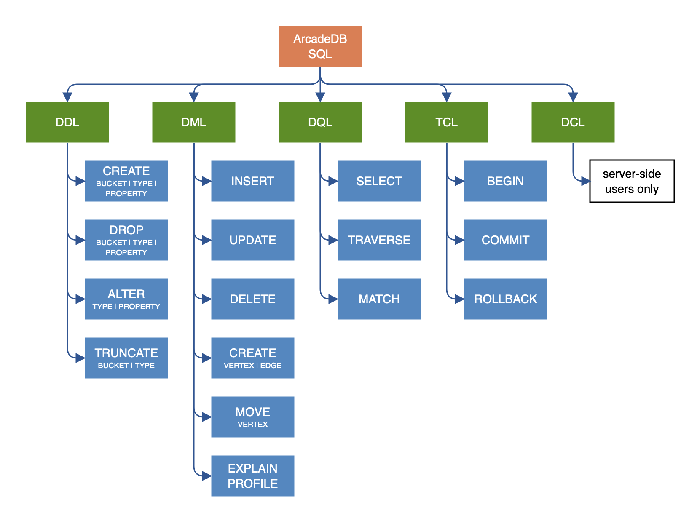

[[sql-introduction]]
[discrete]

=== Introduction

image:../images/edit.png[link="https://github.com/ArcadeData/arcadedb-docs/blob/main/src/main/asciidoc/sql/sql-introduction.adoc" float=right]

When it comes to query languages, https://en.wikipedia.org/wiki/SQL[SQL] is the most widely recognized standard. The majority of developers have experience and are
comfortable with SQL. For this reason ArcadeDB uses SQL as its query language and adds some extensions to enable graph
functionality. There are a few differences between the standard SQL syntax and that supported by ArcadeDB, but for the most part, it
should feel very natural. The differences are covered in the <<arcadedb-sql-dialect,ArcadeDB SQL dialect>> section of this page.

If you are looking for the most efficient way to traverse a graph, we suggest using <<sql-match,MATCH>> instead.

Many SQL commands share the <<filtering,WHERE condition>>. Keywords are case insensitive, but type names, property names and values
are case sensitive. In the following examples keywords are in uppercase but this is not strictly required.

For example, if you have a type `MyType` with a field named `id`, then the following SQL statements are equivalent:

[source,sql]
----
SELECT * FROM MyType WHERE id = 1
select * from MyType where id = 1

----

The following is NOT equivalent. Notice that the field name 'ID' is not the same as 'id'.

[source,sql]
----
SELECT * FROM MyType WHERE ID = 1

----

Also the following query is NOT equivalent because of the type 'mytype ' is not the same as 'MyType'.

[source,sql]
----
SELECT * FROM mytype WHERE id = 1

----

*Automatic usage of indexes*

ArcadeDB allows you to execute queries against any field, indexed or not-indexed. The SQL engine automatically recognizes if any
indexes can be used to speed up execution. You can also query any indexes directly by using `INDEX:&lt;index-name&gt;` as a target.
Example:

[source,sql]
----
SELECT * FROM INDEX:myIndex WHERE key = 'Jay'
----

*Extra resources*

* <<sql-syntax,Syntax>>
* <<sql-projections,Projections>>
* <<filtering,Where clause>>
* <<filtering-operators,Operators>>
* <<sql-pagination,Pagination>>
* <<sql-script,SQL Script>>
* <<sql-match,Match>> for traversing graphs

[[arcadedb-sql-dialect]]
*ArcadeDB SQL dialect*

ArcadeDB supports SQL as a query language with some differences compared with SQL.
The ArcadeDB team decided to avoid creating Yet-Another-Query-Language.
Instead we started from familiar SQL with extensions to work with graphs.
We prefer to focus on standards.

*Learning SQL*

If you want to learn SQL, there are many online courses such as:

* https://cs-blog.khanacademy.org/2015/05/just-released-full-introductory-sql.html[KhanAcademy]
* https://www.w3schools.com/sql/sql_intro.asp[Introduction to SQL at W3 Schools]
* https://blog.udemy.com/beginners-guide-to-sql/[Beginner guide to SQL]
* https://www.sqlcourse2.com/intro2.html[SQLCourse.com]
* https://www.youtube.com/playlist?list=PLD20298E653A970F8[YouTube channel Basic SQL Training by Joey Blue]

alternatively, order a book such as:

* https://www.amazon.com/SQL-Minutes-Sams-Teach-Yourself/dp/0135182794[SQL in 10 Minutes a Day]
* or any of https://www.amazon.com/s/ref=nb_sb_noss/189-0251150-4407173?url=search-alias%3Daps&field-keywords=sql[these].

For details on ArcadeDB's dialect, see <<sql-syntax,ArcadeDB SQL Syntax>>.
You can also download a https://github.com/ArcadeData/arcadedb/files/14324183/arcadedb-sql.pdf[SQL Command Cheat Sheet] (pdf).

The simplest SQL query just returns a constant, and is given by:

[source,sql]
----
SELECT 1
----

and could have practical use, for example, as a connection test.
Furthermore, such constant queries can be used as a calculator:

[source,sql]
----
SELECT sqrt(6.0 * 7.0)
----

A typical ArcadeDB SQL query has the following components:

[source,sql]
----
SELECT projections
FROM type
WHERE predicate
GROUP BY property
ORDER BY projection
SKIP number
LIMIT number
----

for further components or details, see the <<sql-select,SELECT command>>.
As for classic SQL the execution order in ArcadeDB SQL is:

1. `FROM`
2. `WHERE`
3. `GROUP BY`
4. `SELECT`
5. `ORDER BY`
6. `SKIP`
7. `LIMIT`

*No JOINs*

The most important difference between ArcadeDB and a Relational Database is that relationships are represented by `LINKS` instead of
JOINs.

For this reason, the typical JOIN syntax of relational databases is not supported. ArcadeDB uses the "dot (`.`) notation" to
navigate `LINKS`. Example 1 :
In SQL you might create a join such as:

[source,sql]
----
SELECT *
FROM Employee A, City B
WHERE A.city = B.id
  AND B.name = 'Rome'
----

In ArcadeDB, an equivalent operation would be:

[source,sql]
----
SELECT *
FROM Employee
WHERE city.name = 'Rome'
----

Another example:

[source,sql]
----
SELECT B.name, A.salary
FROM Employee A, City B
WHERE A.city = B.id
  AND B.country.name = 'Italy'
----

In ArcadeDB, an equivalent operation would be:

[source,sql]
----
SELECT city.name, salary
FROM Employee
WHERE city.country.name = 'Italy'
----

*Projection*

In SQL, projections are mandatory. In ArcadeDB this is not mandatory. When the projection in ArcadeDB is the character `*`, it
represents the full record.
In SQL, when a query is executed, the column names of the returned set depend on the projections.
For instance:

[source,sql]
----
SELECT first_name, last_name FROM Employee
----

results in a data set with two columns, the first is named "first_name" and the second is "last_name".

In ArcadeDB, all column names correspond to property names on the record and projections only affect which columns will be returned.
The above query would result in a dataset with two columns, "first_name" and "last_name".

However, there is a SQL condition where the two systems do differ. When you use functions that do not affect the column name, SQL
defines that function name as the column name. In ArcadeDB, since we're projecting from a record, the resulting name remains the
property name.

For instance, in SQL:

[source,sql]
----
SELECT count(*) FROM Employee
----

would result in a data set with one column named "count(*)".

The ArcadeDB equivalent is:

[source,sql]
----
SELECT count(*) FROM Employee
----

resulting in a data set with one column name of "count". If you specify a name for a column in a projection using the AS keyword,
both SQL and ArcadeDB would use the provided name.

[NOTE]
If you prefer having the function name as the column name, like standard SQL, use AS, like: 

[source,sql]
----
SELECT count(*) as _count_ FROM Employee
----

*Commands*

While the ArcadeDB SQL syntax is very similar to SQL-92, commands are different, except for "SELECT", "INSERT", and "UPDATE", plus "CREATE" and "DROP" for entities.

[source,sql]
----
SELECT
INSERT
UPDATE
----

See also:

* <<sql-select,SELECT>>
* <<sql-insert,INSERT>>
* <<sql-update,UPDATE>>

For more commands, see the [[sql-command-reference-chart]]<<sql-command-reference-chart,diagram above>>.

*Comments*

Use `//` for single line comments:

[source,sql]
----
// This is a single line comment
----

Use `/* ... */` for multi-line comments.

[source,sql]
----
/* this is a
   multiline comment */
----

[[query-results]]
== Query Results

ArcadeDB can return query results in different formats:

- Record Lists
- Document collections
- Vertices, edges or paths from graphs

*Records*

In ArcadeDB SQL, a record is the smallest unit you can load and save. A record can be a:

- Document
- Vertex 
- Edge

Every record has an associated Record ID which is also referred to as a RID.
The syntax for a RID is:

[source,sql]
----
#<bucket>:<position>
----

where:

* **`&lt;bucket&gt;`** is the bucket number. A bucket is a place where ArcadeDB stores records.
* **`&lt;position&gt;`** is the absolute position of the record inside the bucket.

For example: `#12:3`.
