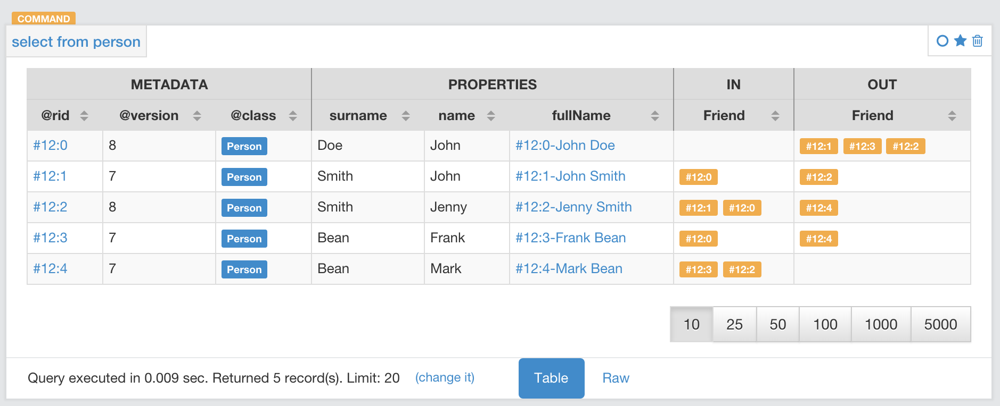

[[sql-match]]
[discrete]

=== SQL - `MATCH`

image:../images/edit.png[link="https://github.com/ArcadeData/arcadedb-docs/blob/main/src/main/asciidoc/sql/sql-match.adoc" float=right]

Queries the database in a declarative manner, using pattern matching (inspired by https://neo4j.com/docs/cypher-manual/current/clauses/match/[Cypher]).

Let's start with some examples.

The following examples are based on this sample data-set from the type `People`:

image:../images/match-example-graph.png[]

* Find all people with the name John:
[source,sql]
----
ArcadeDB> MATCH {type: Person, as: people, where: (name = 'John')} 
            RETURN people

---------
  people 
---------
  #12:0
  #12:1
---------
----

* Find all people with the name John and the surname Smith:
[source,sql]
----
ArcadeDB> MATCH  {type: Person, as: people, where: (name = 'John' AND surname = 'Smith')} 
	        RETURN people

-------
people
-------
 #12:1
-------
----

* Find people named John with their friends:
[source,sql]
----
ArcadeDB> MATCH {type: Person, as: person, where: (name = 'John')}.both('Friend') {as: friend} 
            RETURN person, friend

--------+---------
 person | friend 
--------+---------
 #12:0  | #12:1
 #12:0  | #12:2
 #12:0  | #12:3
 #12:1  | #12:0
 #12:1  | #12:2
--------+---------
----

* Find friends of friends:
[source,sql]
----
ArcadeDB> MATCH {type: Person, as: person, where: (name = 'John' AND surname = 'Doe')}
		    .both('Friend').both('Friend') {as: friendOfFriend} 
		    RETURN person, friendOfFriend

--------+----------------
 person | friendOfFriend 
--------+----------------
 #12:0  | #12:0
 #12:0  | #12:1
 #12:0  | #12:2
 #12:0  | #12:3
 #12:0  | #12:4
--------+----------------
----

* Find people, excluding the current user:
[source,sql]
----
ArcadeDB> MATCH {type: Person, as: person, where: (name = 'John' AND 
            surname = 'Doe')}.both('Friend').both('Friend'){as: friendOfFriend,
			where: ($matched.person != $currentMatch)} 
			RETURN person, friendOfFriend

--------+----------------
 person | friendOfFriend
--------+----------------
 #12:0  | #12:1
 #12:0  | #12:2
 #12:0  | #12:3
 #12:0  | #12:4
--------+----------------
----

* Find friends of friends to the sixth degree of separation:
[source,sql]
----
ArcadeDB> MATCH {type: Person, as: person, where: (name = 'John' AND 
            surname = 'Doe')}.both('Friend'){as: friend, 
			where: ($matched.person != $currentMatch) while: ($depth < 6)} 
			RETURN person, friend

--------+---------
 person | friend
--------+---------
 #12:0  | #12:0
 #12:0  | #12:1
 #12:0  | #12:2
 #12:0  | #12:3
 #12:0  | #12:4
--------+---------
----

* Finding friends of friends to six degrees of separation, since a particular date:
[source,sql]
----
ArcadeDB> MATCH {type: Person, as: person, 
            where: (name = 'John')}.(bothE('Friend'){
			where: (date < ?)}.bothV()){as: friend, 
			while: ($depth < 6)} RETURN person, friend
----

In this case, the condition `$depth &lt; 6` refers to traversing the block `bothE(&#39;Friend&#39;)` six times.

* Find friends of my friends who are also my friends, using multiple paths:
[source,sql]
----
ArcadeDB> MATCH {type: Person, as: person, where: (name = 'John' AND 
            surname = 'Doe')}.both('Friend').both('Friend'){as: friend},
			{ as: person }.both('Friend'){ as: friend } 
			RETURN person, friend

--------+--------
 person | friend
--------+--------
 #12:0  | #12:1
 #12:0  | #12:2
--------+--------
----

In this case, the statement matches two expression: the first to friends of friends, the second to direct friends. Each expression shares the common aliases (`person` and `friend`). To match the whole statement, the result must match both expressions, where the alias values for the first expression are the same as that of the second.

* Find common friends of John and Jenny:
[source,sql]
----
ArcadeDB> MATCH {type: Person, where: (name = 'John' AND 
            surname = 'Doe')}.both('Friend'){as: friend}.both('Friend')
			{type: Person, where: (name = 'Jenny')} RETURN friend

--------
 friend
--------
 #12:1
--------
----

The same, with two match expressions:

[source,sql]
----
ArcadeDB> MATCH {type: Person, where: (name = 'John' AND 
            surname = 'Doe')}.both('Friend'){as: friend}, 
			{type: Person, where: (name = 'Jenny')}.both('Friend')
			{as: friend} RETURN friend
----

[discrete]
==== Simplified Syntax

----
MATCH
  {
    [type: <type>],
    [as: <alias>],
    [where: (<whereCondition>)]
  }
  .<functionName>(){
    [type: <typeName>],
    [as: <alias>],
    [where: (<whereCondition>)],
    [while: (<whileCondition>)],
    [maxDepth: <number>],
    [depthAlias: <identifier> ],
    [pathAlias: <identifier> ],
    [optional: (true | false)]
  }*
  [,
    [NOT]
    {
      [as: <alias>],
      [type: <type>],
      [where: (<whereCondition>)]
    }
    .<functionName>(){
      [type: <typeName>],
      [as: <alias>],
      [where: (<whereCondition>)],
      [while: (<whileCondition>)],
      [maxDepth: <number>],
      [depthAlias: <identifier> ],
      [pathAlias: <identifier> ],
      [optional: (true | false)]
    }*
  ]*
RETURN [DISTINCT] <expression> [ AS <alias> ] [, <expression> [ AS <alias> ]]*
[ GROUP BY <expression> [, <expression>]* ]
[ ORDER BY <expression> [, <expression>]* ]
[ UNWIND <Field>* ]
[ SKIP <number> ]
[ LIMIT <number> ]
----

* *`&lt;type&gt;`* Defines a valid target type.
* *`as: &lt;alias&gt;`* Defines an alias for a node in the pattern.
* *`&lt;whereCondition&gt;`* Defines a filter condition to match a node in the pattern. It supports the normal SQL <<Filtering,`WHERE`>> clause. You can also use the `$currentMatch` and `$matched` <<Match-Context-Variables,context variables>>.
* *`&lt;functionName&gt;`* Defines a graph function to represent the connection between two nodes. For instance, `out()`, `in()`, `outE()`, `inE()`, etc.
For out(), in(), both() also a shortened _arrow_ syntax is supported:
* `{...}.out(){...}` can be written as `{...}--&gt;{...}`
* `{...}.out(&quot;EdgeType&quot;){...}` can be written as `{...}-EdgeType-&gt;{...}`
* `{...}.in(){...}` can be written as `{...}&lt;--{...}`
* `{...}.in(&quot;EdgeType&quot;){...}` can be written as `{...}&lt;-EdgeType-{...}`
* `{...}.both(){...}` can be written as `{...}--{...}`
* `{...}.both(&quot;EdgeType&quot;){...}` can be written as `{...}-EdgeType-{...}`
* *`&lt;whileCondition&gt;`* Defines a condition that the statement must meet to allow the traversal of this path. It supports the normal SQL <<Filtering,`WHERE`>> clause. You can also use the `$currentMatch`, `$matched` and `$depth` <<Match-Context-Variables,context variables>>. For more information, see <<Deep-Traversal,Deep Traversal While Condition>>, below.
* *`&lt;maxDepth&gt;`* Defines the maximum depth for this single path.
* *`&lt;depthAlias&gt;`* This is valid only if you have a `while` or a `maxDepth`. It defines the alias to be used to store the depth of this traversal. This alias can be used in the `RETURN` block to retrieve the depth of current traversal.
* *`&lt;pathAlias&gt;`* This is valid only if you have a `while` or a `maxDepth`. It defines the alias to be used to store the elements traversed to reach this alias. This alias can be used in the `RETURN` block to retrieve the elements traversed to reach this alias.
* *`RETURN &lt;expression&gt; [ AS &lt;alias&gt; ]`* Defines elements in the pattern that you want returned. It can use one of the following:
* Aliases defined in the `as:` block.
* `$matches` Indicating all defined aliases.
* `$paths` Indicating the full traversed paths.
* `$elements` Indicating that all the elements that would be returned by the $matches have to be returned flattened, without duplicates.
* `$pathElements` Indicating that all the elements that would be returned by the $paths have to be returned flattened, without duplicates.
* *`optional`* if set to true, allows to evaluate and return a pattern even if that particular node does not match the pattern itself (ie. there is no value for that node in the pattern). In current version, optional nodes are allowed only on right terminal nodes, eg. `{} --&gt; {optional:true}` is allowed, `{optional:true} &lt;-- {}` is not.
* *`NOT` patterns* Together with normal patterns, you can also define negative patterns. A result will be returned only if it also DOES NOT match any of the negative patterns, ie. if it matches at least one of the negative patterns it won't be returned.
* *<<sql-select-unwind,`UNWIND`>>* Designates the field on which to unwind the collection.

[discrete]
==== Arrow notation

`out()`, `in()` and `both()` operators can be replaced with arrow notation `--&gt;`, `&lt;--` and `--`

Eg. the query

[source,sql]
----
MATCH {type: V, as: a}.out(){}.out(){}.out(){as:b}
RETURN a, b
----

can be written as

[source,sql]
----
MATCH {type: V, as: a}-->{}-->{}-->{as:b}
RETURN a, b
----

Eg. the query (things that belong to friends)

[source,sql]
----
MATCH {type: Person, as: a}.out('Friend'){as:friend}.in('BelongsTo'){as:b}
RETURN a, b
----

can be written as

[source,sql]
----
MATCH {type: Person, as: a}-Friend->{as:friend}<-BelongsTo-{as:b}
RETURN a, b
----

Using arrow notation the curly braces are mandatory on both sides. eg:

[source,sql]
----
MATCH {type: Person, as: a}-->{}-->{as:b} RETURN a, b  //is allowed

MATCH {type: Person, as: a}-->-->{as:b} RETURN a, b  //is NOT allowed

MATCH {type: Person, as: a}.out().out(){as:b} RETURN a, b  //is allowed

MATCH {type: Person, as: a}.out(){}.out(){as:b} RETURN a, b  //is allowed
----

*Negative (NOT) patterns*

Together with normal patterns, you can also define negative patterns. A result will be returned only if it also DOES NOT match any of the negative patterns, ie. if the result matches at least one of the negative patterns it won't be returned.

As an example, consider the following problem: given a social network, choose a single person and return all the people that are friends of their friends, but that are not their direct friends.

The pattern can be calculated as follows:

----

MATCH
  {type:Person, as:a, where:(name = "John")}-FriendOf->{as:b}-FriendOf-> {as:c},
  NOT {as:a}-FriendOf->{as:c}
RETURN c.name

----

*DISTINCT*

The `MATCH`` statement returns all the occurrences of a pattern, even if they are duplicated. To have unique, distinct records
as a result, you have to specify the `DISTINCT` keyword in the `RETURN` statement.

Example: suppose you have a dataset made like following:

[source,sql]
----
 INSERT INTO V SET name = 'John', surname = 'Smith';
 INSERT INTO V SET name = 'John', surname = 'Harris'
 INSERT INTO V SET name = 'Jenny', surname = 'Rose'
----

This is the result of the query without a `DISTINCT` clause:

[source,sql]
----
ArcadeDB> MATCH {type: Person, as:p} RETURN p.name as name

--------
 name
--------
 John
--------
 John
--------
 Jenny
--------
----

And this is the result of the query with a DISTINCT clause:

[source,sql]
----
ArcadeDB> MATCH {type: Person, as:p} RETURN DISTINCT p.name as name

--------
 name
--------
 John
--------
 Jenny
--------
----

[[Match-Context-Variables]]
*Context Variables*

When running these queries, you can use any of the following context variables:

[%header,cols=2]
|===
| Variable | Description
|`$matched`| Gives the current matched record. You must explicitly define the attributes for this record in order to access them. You can use this in the `where:` and `while:` conditions to refer to current partial matches or as part of the `RETURN` value.
|`$currentMatch`| Gives the current complete node during the match.
|`$depth`| Gives the traversal depth, following a single path item where a `while:` condition is defined.
|===

*Use Cases*

*Expanding Attributes*

You can run this statement as a sub-query inside of another statement. Doing this allows you to obtain details and aggregate data from the inner <<sql-select,`SELECT`>> query.

[source,sql]
----
ArcadeDB> SELECT person.name AS name, person.surname AS surname,
          friend.name AS friendName, friend.surname AS friendSurname
		  FROM (MATCH {type: Person, as: person,
		  where: (name = 'John')}.both('Friend'){as: friend}
		  RETURN person, friend)

--------+----------+------------+---------------
 name   | surname  | friendName | friendSurname
--------+----------+------------+---------------
 John   | Doe      | John       | Smith
 John   | Doe      | Jenny      | Smith
 John   | Doe      | Frank      | Bean
 John   | Smith    | John       | Doe
 John   | Smith    | Jenny      | Smith
--------+----------+------------+---------------
----

As an alternative, you can use the following:

[source,sql]
----
ArcadeDB> MATCH {type: Person, as: person,
		  where: (name = 'John')}.both('Friend'){as: friend}
		  RETURN 
		  person.name as name, person.surname as surname, 
		  friend.name as friendName, friend.surname as friendSurname

--------+----------+------------+---------------
 name   | surname  | friendName | friendSurname
--------+----------+------------+---------------
 John   | Doe      | John       | Smith
 John   | Doe      | Jenny      | Smith
 John   | Doe      | Frank      | Bean
 John   | Smith    | John       | Doe
 John   | Smith    | Jenny      | Smith
--------+----------+------------+---------------
----

*Incomplete Hierarchy*

Consider building a database for a company that shows a hierarchy of departments within the company. For instance,

[source,sql]
----
          [manager] department        
          (employees in department)    
                                       
                                       
                [m0]0                   
                 (e1)                  
                 /   \                 
                /     \                
               /       \               
           [m1]1        [m2]2
          (e2, e3)     (e4, e5)        
             / \         / \           
            3   4       5   6          
          (e6) (e7)   (e8)  (e9)       
          /  \                         
      [m3]7    8                       
      (e10)   (e11)                    
       /                               
      9                                
  (e12, e13)                         
----

This loosely shows that,
- Department `0` is the company itself, manager 0 (`m0`) is the CEO
- `e10` works at department `7`, his manager is `m3`
- `e12` works at department `9`, this department has no direct manager, so `e12`'s manager is `m3` (the upper manager)

In this case, you would use the following query to find out who's the manager to a particular employee:

[source,sql ]
----
ArcadeDB> MATCH {type:Employee, where: (name = ?)}.out('WorksAt').out('ParentDepartment')
		  {while: (out('Manager').size() == 0), 
		  where: (out('Manager').size() > 0)}.out('Manager')
		  {as: manager} RETURN expand(manager)
----

[[Deep-Traversal]]
*Deep Traversal*

Match path items act in a different manners, depending on whether or not you use `while:` conditions in the statement.

For instance, consider the following graph:

[source,sql]
----
[name='a'] -FriendOf-> [name='b'] -FriendOf-> [name='c']
----

Running the following statement on this graph only returns `b`:

[source,sql]
----
ArcadeDB> MATCH {type: Person, where: (name = 'a')}.out("FriendOf")
          {as: friend} RETURN friend

--------
 friend 
--------
 b
--------
----

What this means is that it traverses the path item `out(&quot;FriendOf&quot;)` exactly once. It only returns the result of that traversal.

If you add a `while` condition:

[source,sql]
----
ArcadeDB> MATCH {type: Person, where: (name = 'a')}.out("FriendOf")
          {as: friend, while: ($depth < 2)} RETURN friend

---------
 friend 
---------
 a
 b
---------
----

Including a `while:` condition on the match path item causes ArcadeDB to evaluate this item as zero to _n_ times. That means that it returns the starting node, (`a`, in this case), as the result of zero traversal.

To exclude the starting point, you need to add a `where:` condition, such as:

[source,sql]
----
ArcadeDB> MATCH {type: Person, where: (name = 'a')}.out("FriendOf")
          {as: friend, while: ($depth < 2) where: ($depth > 0)} 
		  RETURN friend
----

As a general rule,

* *`while` Conditions:* Define this if it must execute the next traversal, (it evaluates at level zero, on the origin node).
* *`where` Condition:* Define this if the current element, (the origin node at the zero iteration the right node on the iteration is greater than zero), must be returned as a result of the traversal.

For instance, suppose that you have a genealogical tree. In the tree, you want to show a person, grandparent and the grandparent of that grandparent, and so on. The result: saying that the person is at level zero, parents at level one, grandparents at level two, etc., you would see all ancestors on even levels. That is, `level % 2 == 0`.

To get this, you might use the following query:

[source,sql]
----
ArcadeDB> MATCH {type: Person, where: (name = 'a')}.out("Parent")
          {as: ancestor, while: (true) where: ($depth % 2 = 0)} 
		  RETURN ancestor
----

*Best practices*

Queries can involve multiple operations, based on the domain model and use case. In some cases, like projection and aggregation, you can easily manage them with a <<sql-select,`SELECT`>> query. With others, such as pattern matching and deep traversal, <<sql-match,`MATCH`>> statements are more appropriate.

Use <<sql-select,`SELECT`>> and <<sql-match,`MATCH`>> statements together (that is, through sub-queries), to give each statement the correct responsibilities. Here,

*Filtering Record Attributes for a Single Type*

Filtering based on record attributes for a single type is a trivial operation through both statements. That is, finding all people named John can be written as:

[source,sql]
----
ArcadeDB> SELECT FROM Person WHERE name = 'John'
----

You can also write it as,

[source,sql]
----
ArcadeDB> MATCH {type: Person, as: person, where: (name = 'John')} 
          RETURN person
----

The efficiency remains the same. Both queries use an index. With <<sql-select,`SELECT`>>, you obtain expanded records, while with <<sql-match,`MATCH`>>, you only obtain the Record ID's. If you want to return expanded records from the MATCH, use the `expand()` function in the return statement:

[source,sql]
----
ArcadeDB> MATCH {type: Person, as: person, where: (name = 'John')}
          RETURN expand(person)
----

*Filtering on Record Attributes of Connected Elements*

Filtering based on the record attributes of connected elements, such as neighboring vertices, can grow trick when using <<sql-select,`SELECT`>>, while with <<sql-match,`MATCH`>> it is simple.

For instance, find all people living in Rome that have a friend called John. There are three different ways you can write this, using <<sql-select,`SELECT`>>:

----
ArcadeDB> SELECT FROM Person WHERE BOTH('Friend').name CONTAINS 'John'
          AND out('LivesIn').name CONTAINS 'Rome'

ArcadeDB> SELECT FROM (SELECT BOTH('Friend') FROM Person WHERE name
          'John') WHERE out('LivesIn').name CONTAINS 'Rome'

ArcadeDB> SELECT FROM (SELECT in('LivesIn') FROM City WHERE name = 'Rome')
          WHERE BOTH('Friend').name CONTAINS 'John'
----

In the first version, the query is more readable, but it does not use indexes, so it is less optimal in terms of execution time. The second and third use indexes if they exist, (on `Person.name` or `City.name`, both in the sub-query), but they're harder to read. Which index they use depends only on the way you write the query. That is, if you only have an index on `City.name` and not `Person.name`, the second version doesn't use an index.

Using a <<sql-match,`MATCH`>> statement, the query becomes:

[source,sql]
----
ArcadeDB> MATCH {type: Person, where: (name = 'John')}.both("Friend")
          {as: result}.out('LivesIn'){type: City, where: (name = 'Rome')}
		  RETURN result
----

Here, the query executor optimizes the query for you, choosing indexes where they exist. Moreover, the query becomes more readable, especially in complex cases, such as multiple nested <<sql-select,`SELECT`>> queries.

*`TRAVERSE` Alternative*

There are similar limitations to using <<sql-traverse,`TRAVERSE`>>. You may benefit from using <<sql-match,`MATCH`>> as an alternative.

For instance, consider a simple <<sql-traverse,`TRAVERSE`>> statement, like:

[source,sql]
----
ArcadeDB> TRAVERSE out('Friend') FROM (SELECT FROM Person WHERE name = 'John') 
          WHILE $depth < 3
----

Using a <<sql-match,`MATCH`>> statement, you can write the same query as:

[source,sql]
----
ArcadeDB> MATCH {type: Person, where: (name = 'John')}.both("Friend")
          {as: friend, while: ($depth < 3)} RETURN friend
----

Consider a case where you have a `since` date property on the edge `Friend`. You want to traverse the relationship only for edges where the `since` value is greater than a given date. In a <<sql-traverse,`TRAVERSE`>> statement, you might write the query as:

[source,sql]
----
ArcadeDB> TRAVERSE bothE('Friend')[since > date('2012-07-02', 'yyyy-MM-dd')].bothV()
          FROM (SELECT FROM Person WHERE name = 'John') WHILE $depth < 3
----

Unfortunately, this statement DOESN'T WORK in the current release. However, you can get the results you want using a <<sql-match,`MATCH`>> statement:

[source,sql]
----
ArcadeDB> MATCH {type: Person, where: (name = 'John')}.(bothE("Friend")
          {where: (since > date('2012-07-02', 'yyyy-MM-dd'))}.bothV())
		  {as: friend, while: ($depth < 3)} RETURN friend
----

*Projections and Grouping Operations*

Projections and grouping operations are better expressed with a <<sql-select,`SELECT`>> query. If you need to filter and do projection or aggregation in the same query, you can use <<sql-select,`SELECT`>> and <<sql-match,`MATCH`>> in the same statement.

This is particular important when you expect a result that contains attributes from different connected records (cartesian product). For instance, to retrieve names, their friends and the date since they became friends:

[source,sql]
----
ArcadeDB> SELECT person.name AS name, friendship.since AS since, friend.name 
          AS friend FROM (MATCH {type: Person, as: person}.bothE('Friend')
		  {as: friendship}.bothV(){as: friend, 
		  where: ($matched.person != $currentMatch)} 
		  RETURN person, friendship, friend)
----

The same can be also achieved with the MATCH only:

[source,sql]
----
ArcadeDB> MATCH {type: Person, as: person}.bothE('Friend')
		  {as: friendship}.bothV(){as: friend, 
		  where: ($matched.person != $currentMatch)} 
		  RETURN person.name as name, friendship.since as since, friend.name as friend
----

*RETURN expressions*

In the RETURN section you can use:

*multiple expressions*, with or without an alias (if no alias is defined, ArcadeDB will generate a default alias for you), comma separated

[source,sql]
----
MATCH 
  {type: Person, as: person}
  .bothE('Friend'){as: friendship}
  .bothV(){as: friend, where: ($matched.person != $currentMatch)} 
RETURN person, friendship, friend

result: 

| person | friendship | friend |
--------------------------------
| #12:0  | #13:0      | #12:2  |
| #12:0  | #13:1      | #12:3  |
| #12:1  | #13:2      | #12:3  |
----

[source,sql]
----
MATCH 
  {type: Person, as: person}
  .bothE('Friend'){as: friendship}
  .bothV(){as: friend, where: ($matched.person != $currentMatch)} 
RETURN person.name as name, friendship.since as since, friend.name as friend

result: 

| name | since | friend |
-------------------------
| John | 2015  | Frank  |
| John | 2015  | Jenny  |
| Joe  | 2016  | Jenny  |

----

[source,sql]
----
MATCH 
  {type: Person, as: person}
  .bothE('Friend'){as: friendship}
  .bothV(){as: friend, where: ($matched.person != $currentMatch)} 
RETURN person.name + " is a friend of " + friend.name as friends

result: 

| friends                    |
------------------------------
| John is a friend of Frank  |
| John is a friend of Jenny  |
| Joe is a friend of Jenny   |

----

*$matches*, to return all the patterns that match current statement. Each row in the result set will be a single pattern, containing only nodes in the statement that have an `as:` defined

[source,sql]
----
MATCH 
  {type: Person, as: person}
  .bothE('Friend'){} // no 'as:friendship' in this case
  .bothV(){as: friend, where: ($matched.person != $currentMatch)} 
RETURN $matches

result: 

| person |  friend | 
--------------------
| #12:0  |  #12:2  |
| #12:0  |  #12:3  |
| #12:1  |  #12:3  |

----

*$paths*, to return all the patterns that match current statement. Each row in the result set will be a single pattern, containing all th nodes in the statement. For nodes that have an `as:`, the alias will be returned, for the others a default alias is generated (automatically generated aliases start with `$ORIENT_DEFAULT_ALIAS_`)

[source,sql]
----
MATCH 
  {type: Person, as: person}
  .bothE('Friend'){} // no 'as:friendship' in this case
  .bothV(){as: friend, where: ($matched.person != $currentMatch)} 
RETURN $paths

result: 

| person | friend | $ORIENT_DEFAULT_ALIAS_0 |
---------------------------------------------
| #12:0  | #12:2  | #13:0                   |
| #12:0  | #12:3  | #13:1                   |
| #12:1  | #12:3  | #13:2                   |
----

*$elements* the same as `$matches`, but for each node present in the pattern, a single row is created in the result set (no duplicates)

[source,sql]
----
MATCH 
  {type: Person, as: person}
  .bothE('Friend'){} // no 'as:friendship' in this case
  .bothV(){as: friend, where: ($matched.person != $currentMatch)} 
RETURN $elements

result: 

| @rid   |  @type | name   |  .....   |
----------------------------------------
| #12:0  |  Person | John   |  .....   |
| #12:1  |  Person | Joe    |  .....   |
| #12:2  |  Person | Frank  |  .....   |
| #12:3  |  Person | Jenny  |  .....   |

----

*$pathElements* the same as `$paths`, but for each node present in the pattern, a single row is created in the result set (no duplicates)

[source,sql]
----
MATCH 
  {type: Person, as: person}
  .bothE('Friend'){} // no 'as:friendship' in this case
  .bothV(){as: friend, where: ($matched.person != $currentMatch)} 
RETURN $pathElements

result: 

| @rid   |  @type | name   | since  |  .....   |
-------------------------------------------------
| #12:0  |  Person | John   |        |  .....   |
| #12:1  |  Person | Joe    |        |  .....   |
| #12:2  |  Person | Frank  |        |  .....   |
| #12:3  |  Person | Jenny  |        |  .....   |
| #13:0  |  Friend |        |  2015  |  .....   |
| #13:1  |  Friend |        |  2015  |  .....   |
| #13:2  |  Friend |        |  2016  |  .....   |

----

*NOTE*: When using the MATCH statement in ArcadeDB Studio Graph panel you have to use `$elements` or `$pathElements` as return type, to let the Graph panel render the matched patterns correctly.
