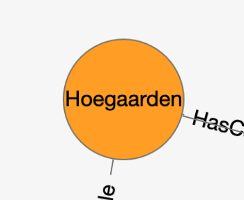
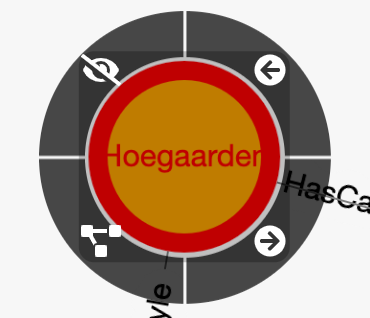
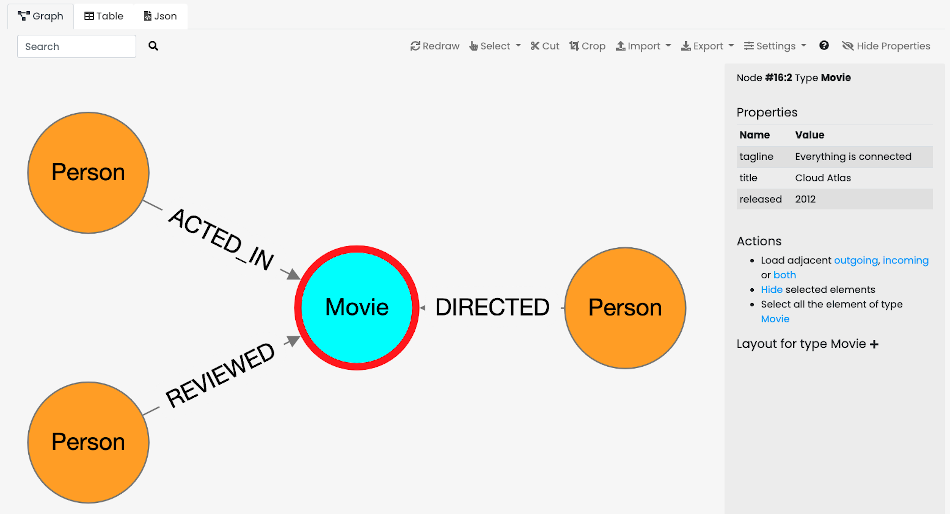
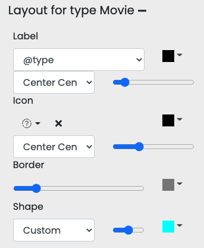
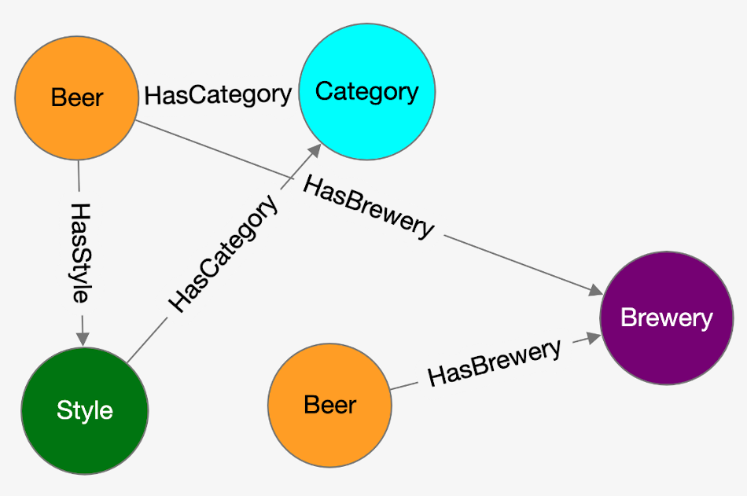
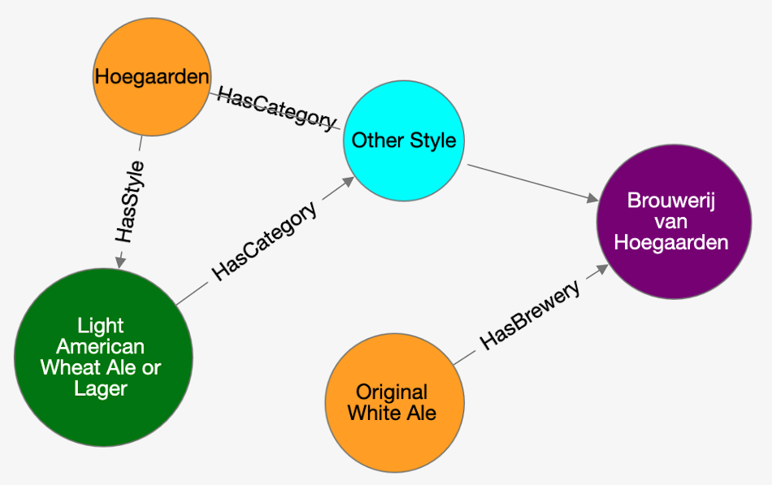
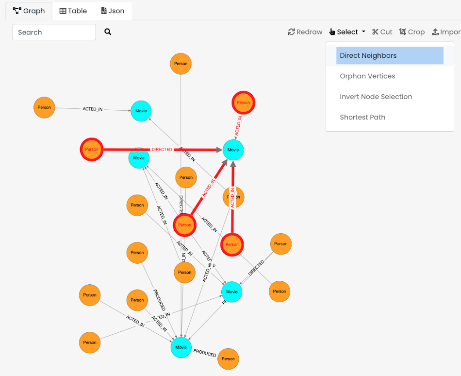
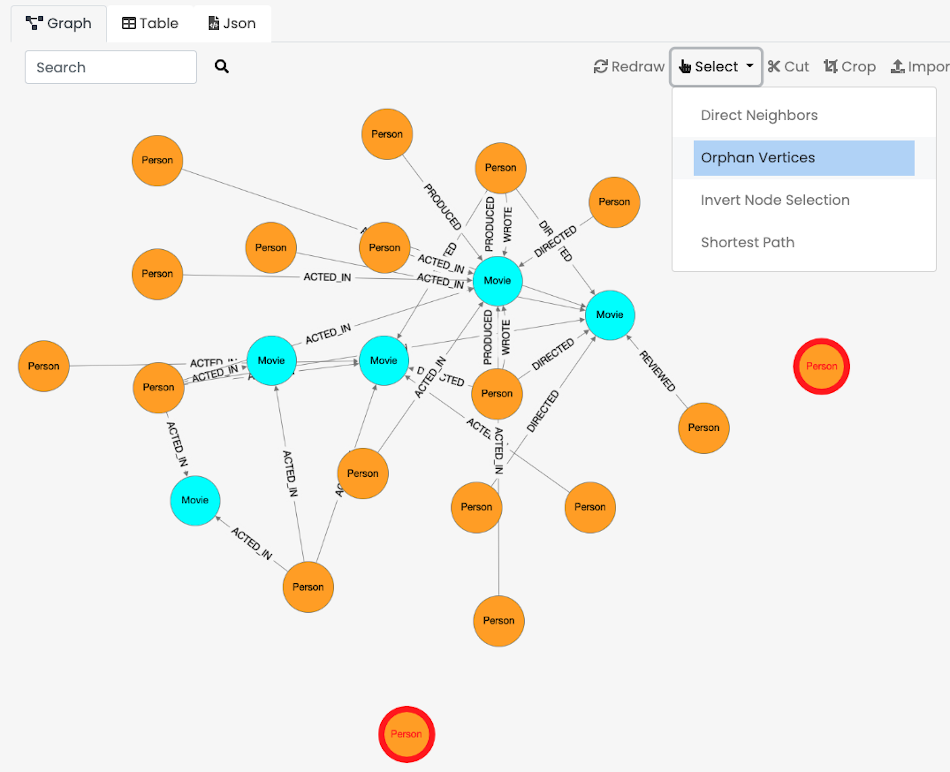
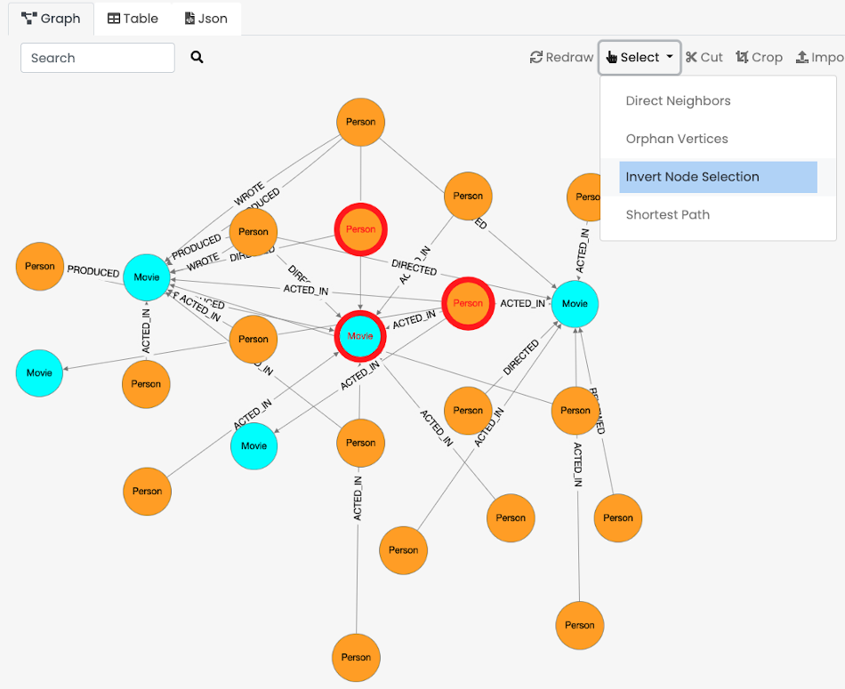
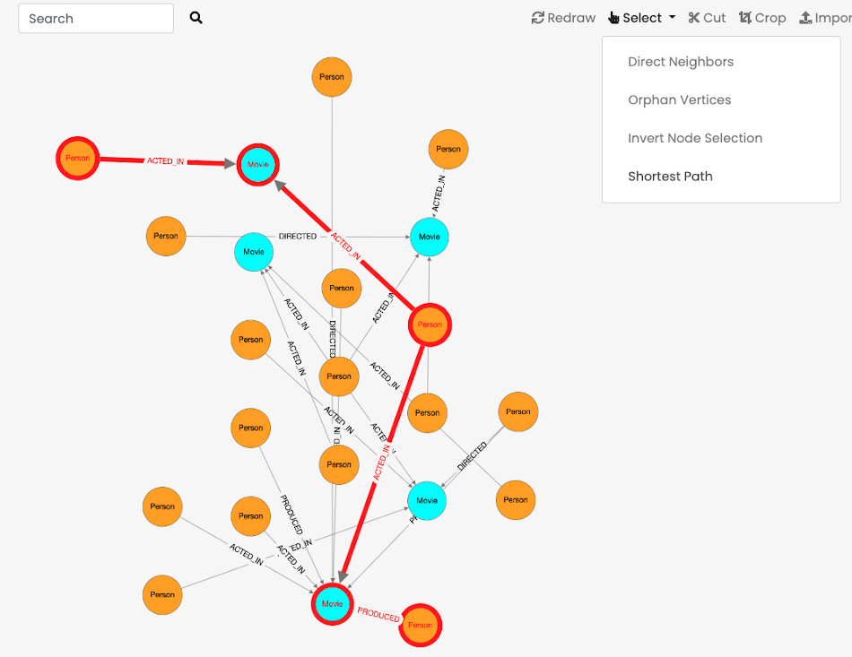

[[Studio-Graph]]
### Query

Coming Soon.

### Database

Coming Soon.

### Table Panel

Coming Soon.

### Graph Panel

[%header,cols=3]
|===
||Hold the selection on a node to show its context menu. Then while still holding the selection, slide on the action to execute and then release the selection.
|
|===

The context manu has the following actions:

* `<-`  Load incoming vertices
* `->`  Load outgoing vertices
* Load both incoming and outgoing vertices
* Hide the current node. This action will remove the node from the graph

#### Node Panel

When a node is selected, its property are displayed in the right panel.

The right panel can always be hidden by clicking on `Hide Properties` button.

In the right panel you can find all the information relative to the selected node, such as:

- Element type: `Node` or `Edge`
- <<RID,Record ID (RID)>>
- Type
- Properties table
- Actions, containing quick actions to execute against the selected node
- Layout

##### Node Layout

Click on the `+` button to expand and make visible the layout panel relative to the node type selected.

Change the label to an attribute that represents the node.
In this example, selecting the title for the type `Movie` and the name for `Person`, makes the same graph much more readable and useful in terms of information.

This is the default rendering of a small graph from the OpenBeer dataset.
The nodes have the type as label.

After selecting the attribute `name` on each node types, this is the result.

You can save your setting in a file and share the settings with your colleagues.
To do this, look at <<ExportSettings,Export Settings>>.

#### Direct Neighbors

Selects the nodes directly connected to the selected ones.

*Usage*

Select one or more nodes from the graph and click on `Select -> Direct Neighbors`.

#### Orphan Vertices

Selects the nodes that are not connected with any other node.

*Usage*

Click on `Select -> Orphan Vertices`.

#### Invert Node Selection

Inverts the current selection.
All the elements that are currently selected will be not selected and all the element that were not selected become selected.

*Usage*

Select some nodes from the graph and click on `Select -> Invert Node Selection`.

#### Shortest Path

Displays the shortest path between 2 nodes.
The Dijkstra algorithm is used (with fixed weight 1 per node).
If the two nodes are connected, the entire path will be selected.

*Usage*

Select 2 nodes from the graph and click on `Select -> Shortest Path`.

#### Edge Panel

Coming Soon.