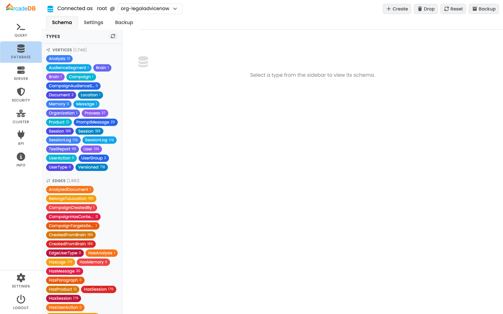

[[studio-database]]
[discrete]
### Database Panel

The Database Panel shows the information about the selected database and its schema and allows to execute the most common operations.

The main parts of the Database Panel are:

* *Server Version*, report the version you are using when you open an issue
* *User*, the user logged into the server.
The list of available databases is filtered by the current user.
User the `admin` user to access to all the databases.
See <<users,Users>>.
* *Selected Database*, the selected database.
Click to select a different database from the available on the server for the current user.
* *Database Commands*:
** *Create* to create a new database.
Enter the database name in the popup and the new database will be ready to be used
** *Drop* to drop the current database.
*_NOTE: This operation cannot be undone._*
** *Backup* to execute a backup of the selected database.
The backup will be available under the directory `backups` where ArcadeDB server is installed.
The generated backup filename is in the format `backups/<db-name>/<db-name>-backup-<timestamp>.tgz`, where the timestamp is expresses from the year to the millisecond.
Example of backup file name `backups/TheMatrix/TheMatrix-backup-20210921-172750767.zip`.
For more information look at <<backup,Backup>>.
* *Types*, with a vertical tab you can select the type you're interested in.
One a type is selected, its information are displayed, such as configured indexes and properties.
* *Actions* is a list of quick actions you can execute against the selected type.
The most common actions are:
** *Display tge first 30 records* of the selected type
** *Display tge first 30 records with all the vertices connected* to display a graph of the first 30 records.
The graph will have the 30 records and their direct neighbors.
