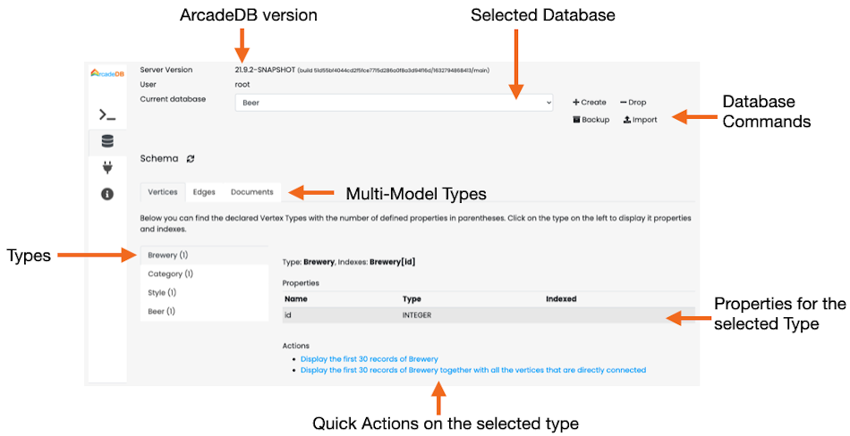

[[studio-database]]
[discrete]
==== Database Panel

The Database Panel shows the information about the selected database and its schema and allows to execute the most common operations.

The main parts of the Database Panel are:

* *Server Version*, report the version you are using when you open an issue
* *User*, the user logged into the server.
The list of available databases is filtered by the current user.
User the `admin` user to access to all the databases.
See <<users,Users>>.
* *Selected Database*, the selected database.
Click to select a different database from the available on the server for the current user.
* *Database Commands*:
** *Create* to create a new database.
Enter the database name in the popup and the new database will be ready to be used
** *Drop* to drop the current database.
*_NOTE: This operation cannot be undone._*
** *Backup* to execute an immediate backup of the selected database.
The backup will be available under the directory `backups` where ArcadeDB server is installed.
The generated backup filename is in the format `backups/<db-name>/<db-name>-backup-<timestamp>.zip`, where the timestamp is expressed from the year to the second.
Example of backup file name `backups/TheMatrix/TheMatrix-backup-20210921-172750.zip`.
For more information look at <<backup,Backup>>.
** *Reset* to drop all data and schema from the database.
* *Types*, with a vertical tab you can select the type you're interested in.
One a type is selected, its information are displayed, such as configured indexes and properties.
* *Actions* is a list of quick actions you can execute against the selected type.
The most common actions are:
** *Display the first 30 records* of the selected type
** *Display the first 30 records with all the vertices connected* to display a graph of the first 30 records.
The graph will have the 30 records and their direct neighbors.

The Database Panel also includes tabs for:

* *Database Schema* - View and manage vertex, edge, and document types
* *Database Settings* - View and modify database configuration settings
* *Backup* - View backup configuration and available backups for the current database

[[studio-database-backup]]
===== Database Backup Tab

The Backup tab in the Database Panel shows backup information specific to the selected database.

image::../../images/studio-database-backup.png[Database Backup Tab]

The Backup tab displays:

* *Backup Configuration* - Shows the current backup schedule and retention settings for this database
* *Statistics* - Total number of backups and disk space used
* *Available Backups* - List of all backup files with timestamps and file sizes

From this tab you can:

* Click *Refresh* to reload the backup list
* Click *Backup Now* to trigger an immediate backup of the current database
* View backup history and verify successful backups
