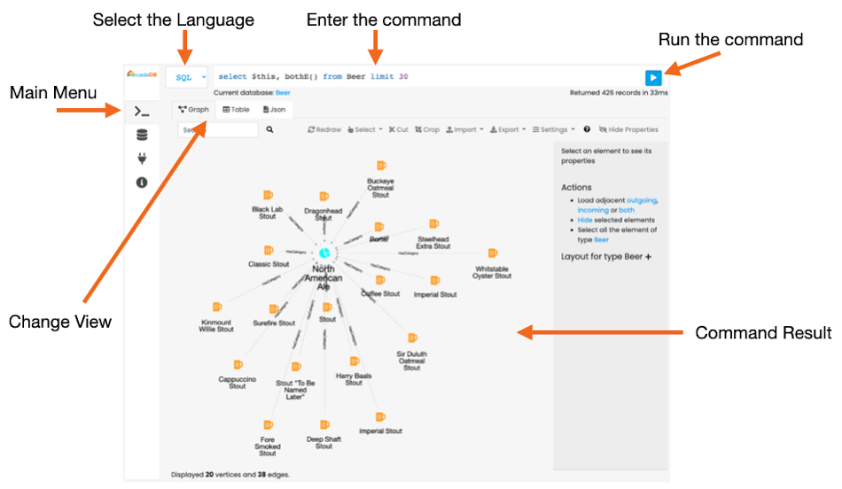
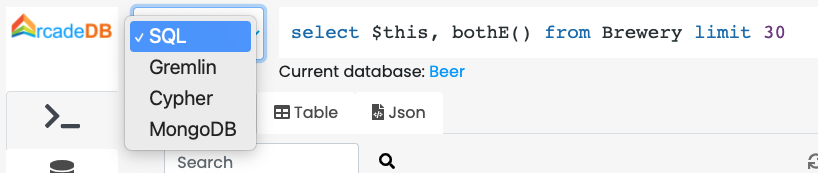

[[studio]]
=== Studio
image:../images/edit.png[link="https://github.com/ArcadeData/arcadedb-docs/blob/main/src/main/asciidoc/tools-guide/studio/main.adoc" float=right]

To use the ArcadeDB Studio, point your web browser to the server and port that hosts the ArcadeDB server (in "development" or "test" <<_server-modes,mode>>).
For instance, when running ArcadeDB locally with the default port this means: http://localhost:2480 .

[discrete]
==== Command

The first and most important panel in Studio is the Command panel.
Below you can find a screenshot with the main components.

* *Main Menu* is the vertical tab with the following options:
** *Command*, the current panel to execute commands against the database
** *Database*, containing the information about the selected database and its schema.
From this panel you can switch to a different database
** *API*, with the description of the public HTTP API exposed on the current server
** *Information*, containing a quick reference to the online documentation

[discrete]
===== Execute a command/query

In order to execute a command (or query), select the language first. By default is SQL, but you can choose between:

* *SQL* (for any models, including graphs and documents)
* *SQL Script* (multiple commands/queries)
* *Apache Tinkerpop Gremlin* (only for graphs)
* *Open Cypher* (only for graphs)
* *MongoDB* (only for documents)
* *GraphQL*

Based on the selected language, the command text area will adjust the syntax highlighting to simplify the writing of the command.

The result of the command will appear in the Command Result area as a <<studio-graph,Graph>> a <<studio-table,Table>> or <<studio-json>>.

