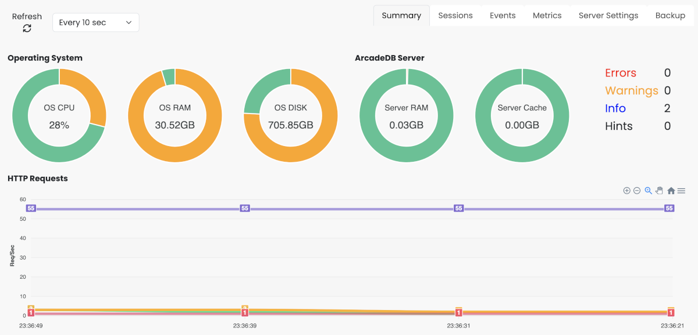
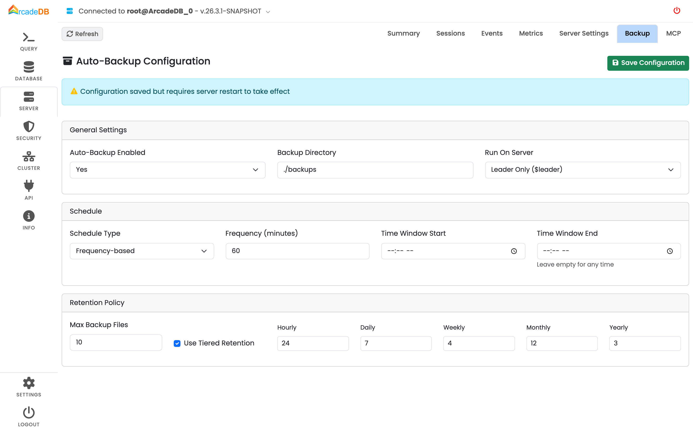

[[studio-server]]
[discrete]
==== Server Panel

The Server Panel provides monitoring and administration capabilities for the ArcadeDB server.

The Server Panel includes the following tabs:

* *Summary* - Overview of server resources (CPU, RAM, disk usage) and request metrics
* *Sessions* - Active authentication sessions on the server
* *Events* - Server event log with filtering options
* *Metrics* - Detailed server metrics and statistics
* *Server Settings* - View server configuration settings
* *Backup* - Configure automatic backup scheduling

[[studio-backup]]
===== Backup Configuration Tab

The Backup tab in the Server Panel allows you to configure the automatic backup scheduler.

The configuration is organized into three sections:

*General Settings*

* *Auto-Backup Enabled* - Enable or disable automatic backups
* *Backup Directory* - Directory where backups are stored (relative to server root)
* *Run On Server* - In HA clusters, which server runs backups (`$leader` or `*`)

*Schedule*

* *Schedule Type* - Choose between frequency-based or CRON-based scheduling
* *Frequency* - Minutes between backups (when using frequency-based scheduling)
* *CRON Expression* - Cron expression for precise scheduling (when using CRON-based scheduling)
* *Time Window* - Optional time window to restrict when backups can run

*Retention Policy*

* *Max Backup Files* - Maximum number of backup files to keep per database
* *Use Tiered Retention* - Enable grandfathering backup rotation
* *Tiered Settings* - Number of hourly, daily, weekly, monthly, and yearly backups to retain

Click *Save Configuration* to save changes.
The configuration is stored in `config/backup.json`.

NOTE: After saving a new configuration for the first time, a server restart is required to activate the auto-backup scheduler plugin.

For more information about automatic backups, see <<auto-backup,Automatic Backup Scheduler>>.
