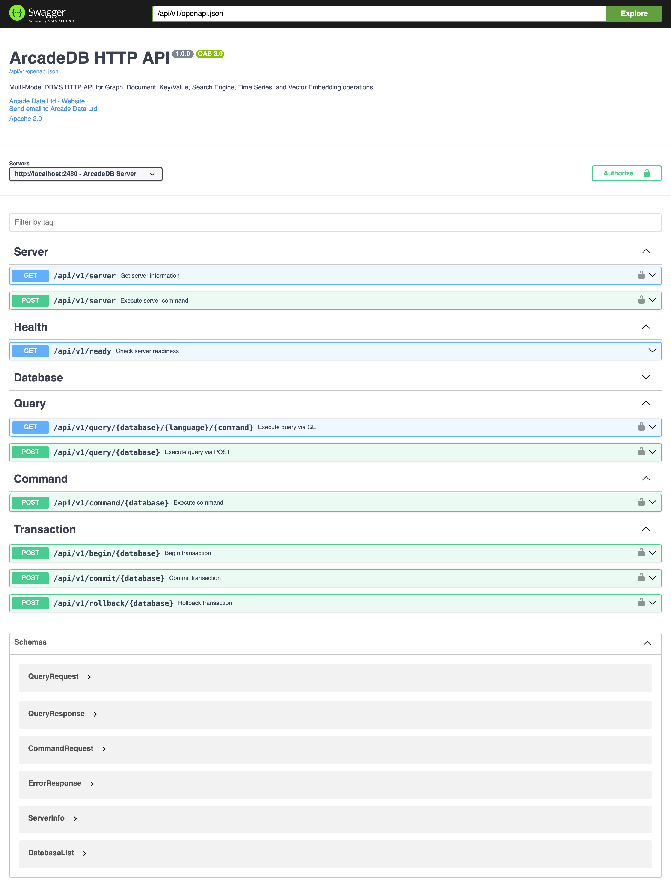

[[swagger-ui]]
=== Swagger-UI

To use the https://swagger.io/tools/swagger-ui/[Swagger-UI], point your web browser to the server and port that hosts the ArcadeDB server at the `/api/v1/docs` endpoint.
For instance, when running ArcadeDB locally with the default port this means: http://localhost:2480/api/v1/docs .

With the Swagger UI you can hands-on explore the <<http-api,HTTP API>> and test requests.
