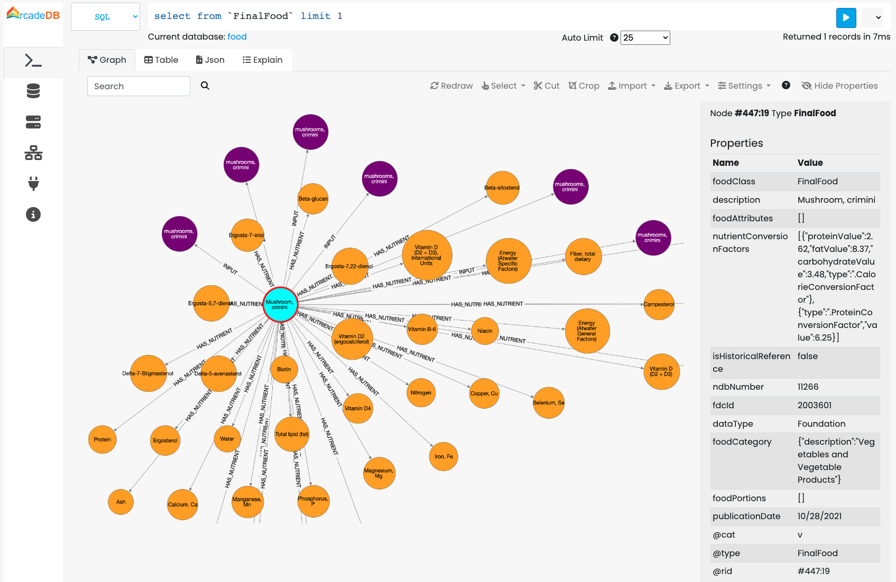

[[JSON-Importer]]
==== JSON Importer

image:../images/edit.png[link="https://github.com/ArcadeData/arcadedb-docs/blob/main/src/main/asciidoc/tools/json-importer.adoc" float=right]

ArcadeDB is able to import data from JSON format.
Thanks to the flexible mapping, it's possible to define the rules of conversion between the input json file and the graph.

Example to import the database of food and nutrients from the link:https://fdc.nal.usda.gov/download-datasets.html[U.S. DEPARTMENT OF AGRICULTURE website (USDA)].
USDA provides updated files to download in both CSV and JSON format.

First, create a new database "food" by using the console:

```
~/arcadedb $ create database food
```

Then execute the following command:

```
import database https://fdc.nal.usda.gov/fdc-datasets/FoodData_Central_foundation_food_json_2022-10-28.zip
with mapping = {
	"FoundationFoods": [{
		"@cat": "v",
		"@type": "<foodClass>",
		"foodNutrients": [{
			"@cat": "e",
			"@type": "HAS_NUTRIENT",
			"@in": "nutrient",
			"nutrient": {
				"@cat": "v",
				"@type": "Nutrient",
				"@id": "id",
				"@idType": "long",
				"@strategy": "merge"
			},
			"foodNutrientDerivation": "@ignore"
		}],
		"inputFoods": [{
			"@cat": "e",
			"@type": "INPUT",
			"@in": "inputFood",
			"inputFood": {
				"@cat": "v",
				"@type": "<foodClass>",
				"@id": "fdcId",
				"@idType": "long",
				"@strategy": "merge",
				"foodCategory": {
					"@cat": "e",
					"@type": "HAS_CATEGORY",
					"@in": {
						"@cat": "v",
						"@type": "FoodCategory",
						"@id": "id",
						"@idType": "long",
						"@strategy": "merge"
					}
				}
			}
		}]
	}]
}
```




This command downloads the zip file from the USDA website and uses the mapping to create the graph from the JSON file.

The mapping file is a JSON snippet with directives about what to import, what to ignore and how to map edges with JSON objects.
Below all the supported tags:

* `@cat`: is the category of record to use between "v" for vertex, "e" for edge and "d" for document
* `@type`: is the type name to use on record creation.
If the type doesn't exist, it's implicitly created during the import
* `@id`: is the property that works as primary key. if not already defined, a unique index is created on the configured `@id` property
* `@idType`: is the type of the primary key in the `@id` property.
If not defined, the type is taken from the first value found.
In case of numbers, the JSON parser always uses DOUBLE as a type.
You can, for example, use LONG to force using LONG instead of DOUBLE
* `@cardinality`: if "no=duplicates", the edges are not created if there is an edge of the same type between the two vertices
* `@strategy`: represents the strategy to use when the record with the configured `@id` already exists By default the existent record is used, but the "merge" strategy allows to merge the current record with the existent one.
The current properties will overwrite the existent ones
* `@in`: used for edges and represents the destination vertex for the edge
* `@ignore`: ignore the property, do not import into the database