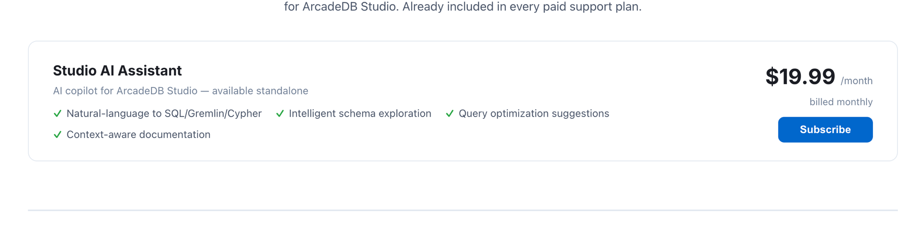
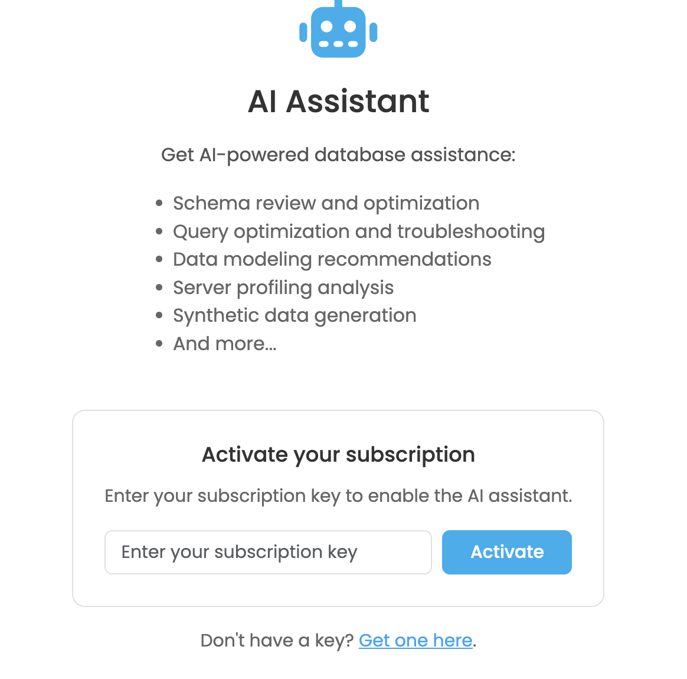

[[studio-ai]]
==== AI Assistant Panel

The AI Assistant Panel turns Studio into a chat-driven workspace where you can ask questions about your database in natural language and get answers, schema insights, and executable queries back.
The assistant can read your schema, run read-only queries on your behalf, and propose commands you can execute with one click directly from the conversation.

Typical use cases include:

* Schema review and optimization
* Query optimization and troubleshooting
* Data modeling recommendations
* Server profiling analysis
* Synthetic data generation
* Translating natural language into SQL, Apache Tinkerpop Gremlin or Open Cypher

[[studio-ai-subscription]]
===== Subscription

The AI Assistant is a paid add-on for ArcadeDB Studio.
You can subscribe to it standalone or get it bundled with any ArcadeDB paid support plan from the https://arcadedb.com/pricing.html#studio-ai[Pricing] page.

[[studio-ai-activation]]
===== Activation

The first time you open the *AI Assistant* tab from the Studio main menu, you are asked to activate your subscription.
Enter the subscription key you received after purchase and click *Activate*.

If you do not have a key yet, click *Get one here* to be redirected to the ArcadeDB pricing page.

When you activate, you are shown the AI Assistant Terms of Use.
You must accept them to start using the service.
The key points are:

* *Data transmission.* To provide AI-powered assistance, information from your database — such as schema definitions, metadata, query structures and small data excerpts — is transmitted to a third-party Large Language Model (LLM) provider for processing.
* *No training on your data.* Your data is never used to train any AI or machine learning model and is not retained by the LLM provider beyond the duration of the request.
* *Use of test data recommended.* For maximum privacy protection, use the AI Assistant with non-production, test, or anonymized datasets whenever possible.
* *User responsibility.* You are responsible for ensuring that your use of the AI Assistant complies with all applicable data protection regulations (GDPR, CCPA, and equivalent legislation).

Once activated, the subscription is stored on the ArcadeDB server and is shared by all Studio users connected to it.

[[studio-ai-using]]
===== Using the assistant

After activation, the panel switches to chat mode.
The layout is composed of:

* *Chat history* on the left, grouping past conversations as *Today*, *Yesterday*, *This Week* and *Older*.
You can create a new chat with *New Chat* or delete a previous one with the trash icon.
* *Database selector* at the top of the chat area.
The assistant only operates on the database you select here, so make sure to pick the right one before sending a message.
* *Mode toggle* at the top right, see <<studio-ai-modes>>.
* *Messages area* with the conversation between you and the assistant.
* *Input box* at the bottom: type your question and press *Enter* (use *Shift+Enter* to insert a newline) or click *Send*.
While a response is being generated, the *Send* button turns into a *Stop* button you can use to cancel the request.

The assistant renders answers as Markdown, including formatted text, lists and syntax-highlighted code blocks.

[[studio-ai-modes]]
===== Modes

The AI Assistant supports two modes, switchable at any time from the toggle at the top right of the panel.
The selected mode is remembered across sessions.

* *Auto Run Read Only Queries* — the assistant can autonomously execute read-only queries (for example to inspect the schema or sample data) and use the results to compose its answer.
Every tool call performed during a turn is shown in the message as a transparent log, so you can always see which queries were run.
* *Review First* — the assistant never runs anything on its own.
It can still propose commands, but it is up to you to inspect and run them.

In both modes, *write* operations (inserts, updates, deletes, schema changes) are never executed automatically: they are always returned as command blocks for you to review.

[[studio-ai-commands]]
===== Executing suggested commands

When the assistant proposes one or more commands, each is rendered in a dedicated block showing:

* A short *purpose* describing what the command does
* A language badge (`SQL`, `SQL Script`, `GREMLIN`, `CYPHER`, `MONGO`, `GRAPHQL`)
* The command itself
* Action buttons:
** *Copy* to copy the command to the clipboard
** *Open in Query* to switch to the <<studio,Query>> panel with the command and language preloaded, ready to be tweaked and executed
** *Execute* to run the command in place against the currently selected database; the outcome (success with result count, or error) is shown right below the block

If the assistant returns multiple commands, an additional *Execute All* button runs them sequentially in the order they were proposed, stopping at the first error.

Multi-statement SQL blocks are automatically executed as `sqlscript` so that several statements separated by `;` can run in a single request.

[[studio-ai-privacy]]
===== Privacy and security notes

* The assistant only operates on the database explicitly selected in the panel.
* All requests are sent over the same authenticated connection used by the rest of Studio.
* The subscription key is validated on every request; if the key is invalid, expired or has been disabled, the panel switches back to the activation screen.
* For sensitive workloads, prefer the *Review First* mode and use a dedicated read-only Studio user when granting access to the AI Assistant.
