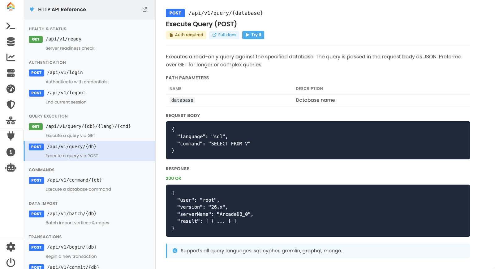
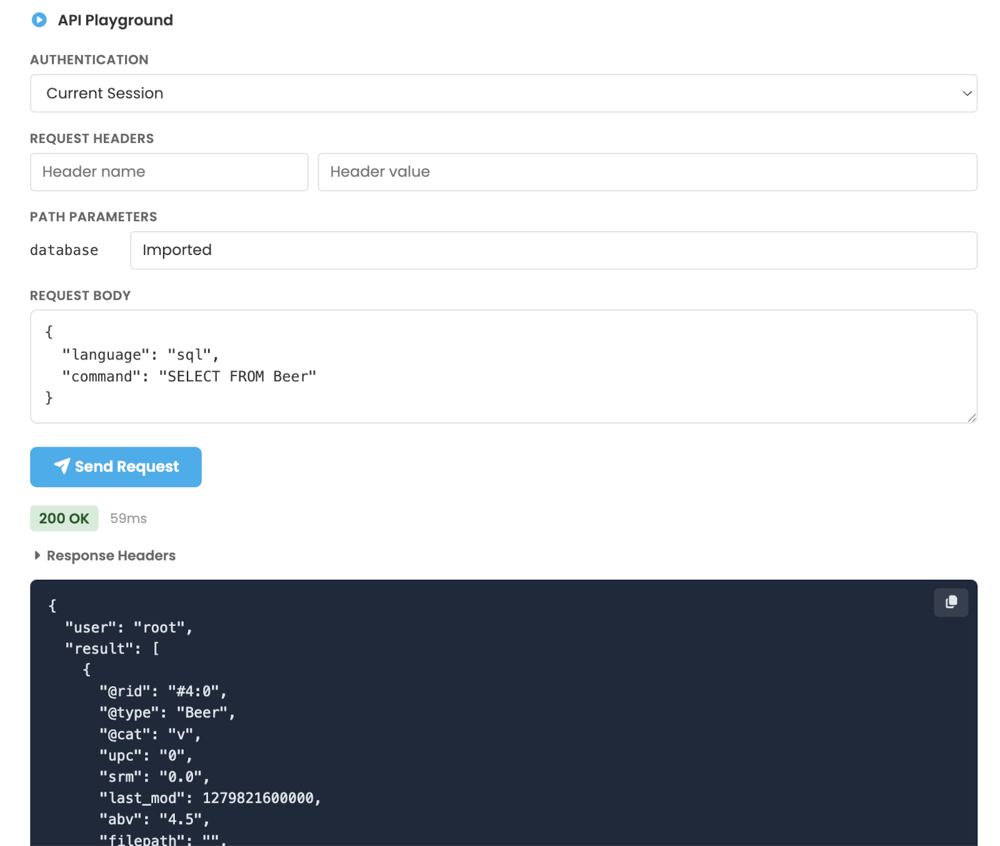

[[studio-api]]
==== API Panel

The *API* panel is an interactive browser for the HTTP API exposed by the current ArcadeDB server.
Pick an endpoint from the left sidebar to see its contract on the right; flip the *Try It* toggle to send a real request from the built-in playground.

See <<http-json-api,HTTP API>> for the full reference.

// TODO: screenshot of the API tab with an endpoint selected.

[[studio-api-sidebar]]
===== Endpoint sidebar

The left sidebar groups the API surface by topic:

* *Health & Status*
* *Authentication*
* *Query Execution*
* *Commands*
* *Data Import*
* *Transactions*
* *Server Management*
* *Database Management*
* *TimeSeries*
* *Documentation*

Each entry shows the HTTP verb badge (`GET`, `POST`, `PUT`, `DELETE`), the path, and a one-line description.
Clicking an entry loads its detail in the right pane.

[[studio-api-detail]]
===== Detail pane

For the selected endpoint the right pane shows:

* The verb and path, the human-readable title and the long description.
* Badges for *Auth required* / *No auth*, and a *Full Docs* link that jumps to the relevant page in this manual.
* *Path Parameters*, *Query Parameters* and *Request Headers* tables.
* The *Request Body* example (pretty-printed).
* The *Response* example with the typical status code, body and optional headers.
* Implementation *Notes* — quirks, defaults, references to related endpoints.

[[studio-api-playground]]
===== Try It playground

Toggle *Try It* to reveal a request playground for the selected endpoint:

* *Auth* — pick *Current Session* (reuse the Studio login), *Basic* (username + password), *Bearer* (API token) or *None*.
* *Request Headers* — add custom headers.
* *Path Parameters* and *Query Parameters* — inputs are pre-filled with sensible defaults where applicable.
* *Request Body* editor with syntax highlighting.
* *Send Request* — execute and view the response status, headers (collapsible) and body, with a *Copy* button.

For transactional flows the playground automatically captures the `arcadedb-session-id` returned by `POST /api/v1/begin/{db}` and re-injects it in the following `command`, `commit` and `rollback` calls — so you can walk through a complete transaction without copy-pasting the session header.

// TODO: screenshot of the playground with a request and response.

