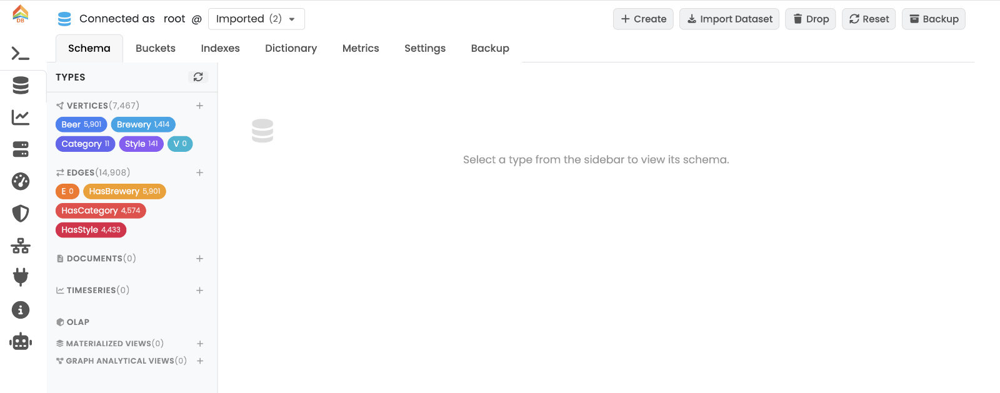
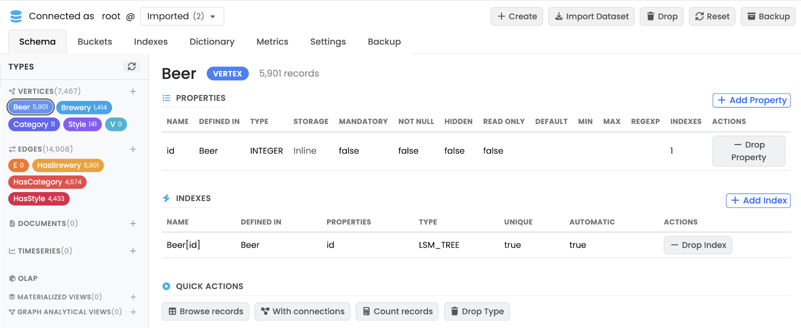
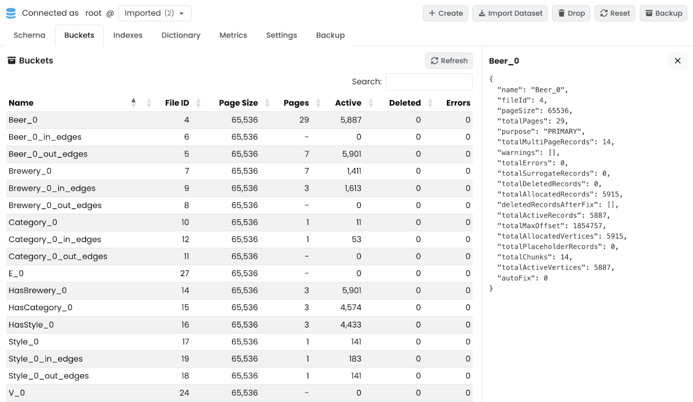
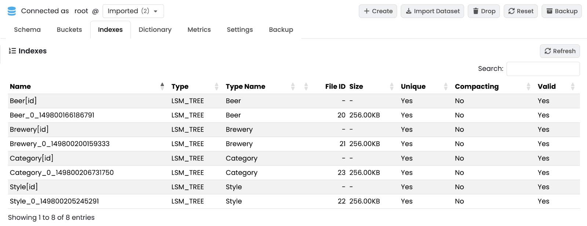
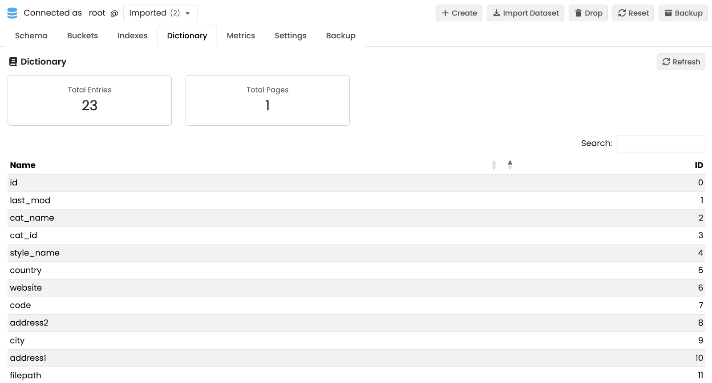
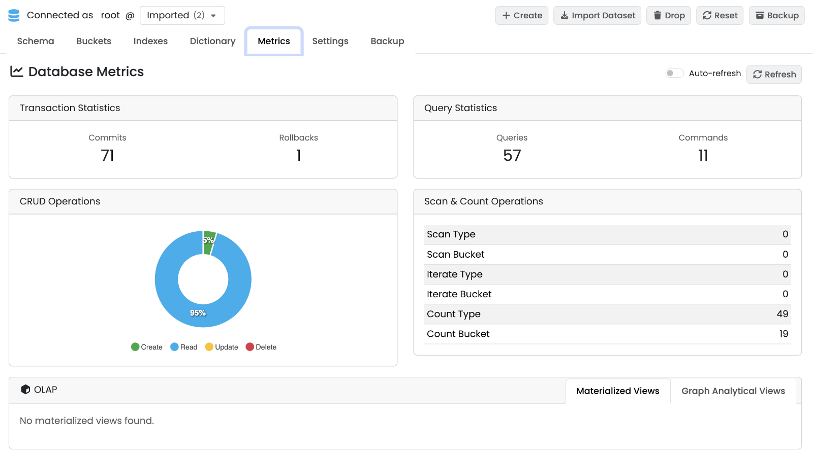
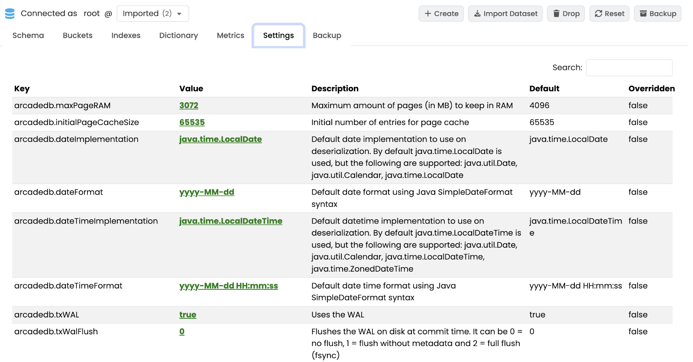
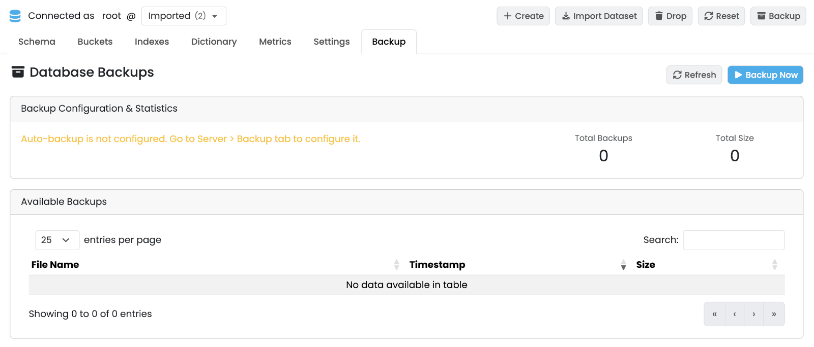

[[studio-database]]
==== Database Panel

The *Database* panel manages everything that lives inside one database: schema, storage layout, indexes, dictionary, metrics, settings and per-database backups.

// TODO: screenshot of the Database tab with the Schema sub-tab active.

The header shows the current user, the database selector, and the database-level actions:

* *Create Database* — create a new database from a name.
* *Import Dataset* — open a modal to import a dataset (e.g. https://docs.arcadedb.com/#_importer[importer formats], JSON, OrientDB or Neo4j export).
* *Drop Database* — *_irreversible_* removal of the current database.
* *Reset Database* — drop all data and schema while keeping the database file.
* *Backup Database* — trigger an immediate backup of the current database.
The resulting file is written under `backups/<db-name>/<db-name>-backup-<timestamp>.zip`.
See <<backup,Backup>>.

The panel is split into seven sub-tabs.

[[studio-database-schema]]
===== Schema

Lists every type in the database (document types, vertex types and edge types) in a scrollable left sidebar.
Selecting a type loads its detail on the right: declared properties (name, type, constraints), indexes built on the type, parent / child types, and quick-action buttons.

// TODO: screenshot of the Schema sub-tab with a type selected.

[[studio-database-buckets]]
===== Buckets

Lists the storage buckets that back the database.
Selecting a row opens a detail panel on the right with file path, record count, page count and per-bucket counters.

// TODO: screenshot of the Buckets sub-tab.

[[studio-database-indexes]]
===== Indexes

Lists every index defined on the database with type, properties, status and entry count.
Selecting a row opens a detail panel with the index definition and statistics.

// TODO: screenshot of the Indexes sub-tab.

[[studio-database-dictionary]]
===== Dictionary

The dictionary deduplicates property names and string values across the database.
The sub-tab shows summary cards (total entries, total pages) and a paginated table of the dictionary entries.

// TODO: screenshot of the Dictionary sub-tab.

[[studio-database-metrics]]
===== Metrics

Live counters and charts for the selected database.
*Auto Refresh* keeps the values updated at a fixed interval.

* *Transaction Statistics* — commits and rollbacks since startup.
* *Query Statistics* — queries and commands executed.
* *CRUD Chart* — running chart of creates, reads, updates and deletes.
* *Scan & Count* — full-scan and count operations per type.
* *OLAP* — nested tabs for <<materialized-views,Materialized Views>> and Graph Analytical Views: refresh status, last computation, row counts.

// TODO: screenshot of the Metrics sub-tab with the chart populated.

[[studio-database-settings]]
===== Database Settings

Key-value table of the database-scoped configuration settings.
Values are editable by users with database-settings permission; others see a read-only view.
See <<arcadedb-settings,Settings>> for the full setting reference.

// TODO: screenshot of the Database Settings sub-tab.

[[studio-database-backup]]
===== Backup

Per-database backup management.

The sub-tab displays:

* *Backup Configuration* — current schedule and retention settings for this database (read-only here; configured server-wide in the <<studio-backup,Server › Backup>> panel).
* *Statistics* — total number of backups and disk space used.
* *Available Backups* — paginated list of backup files with timestamps and sizes.

From this sub-tab you can:

* Click *Refresh* to reload the list.
* Click *Backup Now* to trigger an immediate backup of the current database.
* Restore or delete an individual backup from the row actions.

// TODO: screenshot of the Backup sub-tab.

