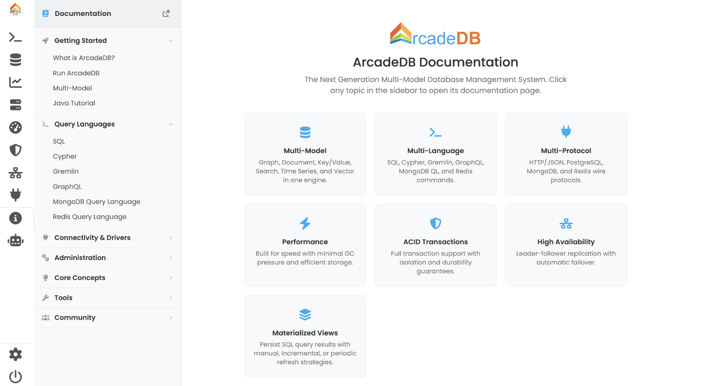

[[studio-info]]
==== Info Panel

The *Info* panel is a quick-reference launcher into this documentation and a short feature overview, all without leaving Studio.

// TODO: screenshot of the Info tab.

[[studio-info-sidebar]]
===== Documentation sidebar

The left sidebar is a collapsible table of contents grouped by topic:

* *Getting Started* — What is ArcadeDB, Run, Multi-Model overview, Java Tutorial.
* *Query Languages* — SQL, Cypher, Gremlin, GraphQL, MongoDB, Redis.
* *Connectivity & Drivers* — HTTP, Java, JDBC, Python, PostgreSQL wire, MongoDB wire, Redis wire.
* *Administration* — Installation, Docker, Kubernetes, Backup, Security, High Availability, Settings.
* *Core Concepts* — Graph, Schema, Indexes, Transactions, Materialized Views.
* *Tools* — Console, Importer.
* *Community* — GitHub, Issues, Discussions.

Each entry opens the corresponding page on `docs.arcadedb.com` in a new browser tab.

[[studio-info-overview]]
===== Feature overview

The right pane shows a welcome card and a grid of feature cards (Multi-Model, Multi-Language, Multi-Protocol, Performance, ACID Transactions, High Availability, Materialized Views) plus *Quick Links* to the full documentation, the GitHub repository and the community discussions.
