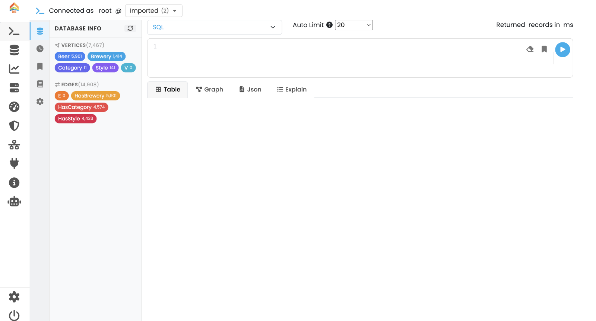

[[studio]]
=== Studio

ArcadeDB Studio is the web-based workbench that ships with every ArcadeDB server.
You can open it by pointing a browser at the server and port that host the ArcadeDB server (in "development" or "test" <<server-modes,mode>>); for a default local install this is http://localhost:2480 .

// TODO: replace with a fresh screenshot of the new Studio shell (full UI with the left icon sidebar visible).

==== Main menu

The vertical icon bar on the left is the main navigation.
Each icon opens one tab in the main canvas:

[cols="1,3,1",options="header"]
|===
|Icon |Tab |Needs a selected database
|🔎 |<<studio-query,Query>> — write and execute commands in SQL, SQL Script, Open Cypher, Apache TinkerPop Gremlin, GraphQL, MongoDB or Redis; visualise results as Table, Graph, JSON or Explain |Yes
|🗄 |<<studio-database,Database>> — manage schema, buckets, indexes, dictionary, metrics, settings and per-database backups |Yes
|📈 |<<studio-timeseries,TimeSeries>> — create, query, visualise and ingest time-series data; integrate with Grafana |Yes
|🖥 |<<studio-server,Server>> — server health summary, metrics, sessions, events, server-wide settings, auto-backup and MCP configuration |No
|⏱ |<<studio-profiler,Profiler>> — record and analyse query execution across protocols, save runs, optionally analyse with AI |No
|🛡 |<<studio-security,Security>> — manage users, user groups (roles) and API tokens |No
|🌐 |<<studio-cluster,Cluster>> — replication topology, leader election, peer add/remove |No
|🔌 |<<studio-api,API>> — browse and try the HTTP API endpoints from an interactive playground |No
|ℹ |<<studio-info,Info>> — quick links into this documentation |No
|🤖 |<<studio-ai,AI Assistant>> — natural-language assistant for schema, queries and data modelling (paid add-on) |Yes
|⚙ |<<studio-settings,Settings>> — Studio appearance (light/dark/system theme) |No
|===

The current user and database selector are shown at the top of every tab that operates on a database.
Tabs that do not need a database (Server, Profiler, Security, Cluster, API, Info, AI, Settings) are enabled as soon as you sign in.

==== Login and themes

Studio uses the same users as the server (see <<security,Security>>).
The theme (Light, Dark or System) is set from the <<studio-settings,Settings>> tab and persists across sessions.

A *Logout* button sits at the very bottom of the icon sidebar.
