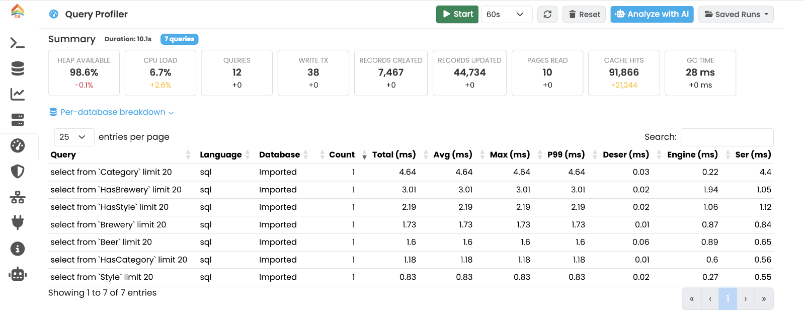
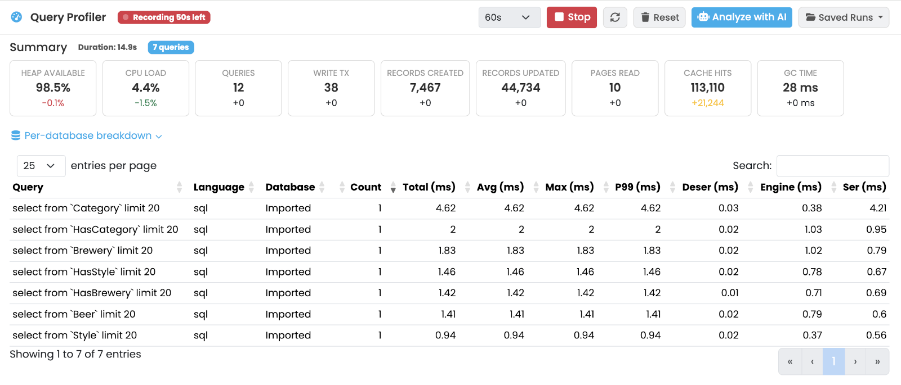
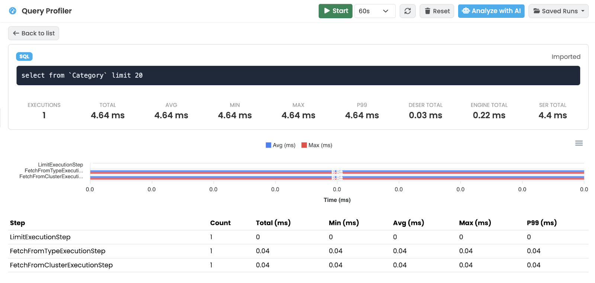

[[studio-profiler]]
==== Profiler Panel

The *Profiler* panel records the queries executed on the server across every protocol (HTTP, Java embedded, BOLT, PostgreSQL, MongoDB, Redis, MCP), aggregates them by canonical form, and lets you drill into per-step timings to find slow paths.
Runs can be saved for later comparison, and an *Analyze with AI* button (requires the <<studio-ai,AI Assistant>> subscription) produces a natural-language commentary on the captured run.

// TODO: screenshot of the Profiler tab during a recording with the query list populated.

===== Toolbar

* *Start* — begin a new recording.
A *Timeout* selector next to it caps the run length (`30s` to `10m`, default `60s`); recording stops automatically when the timeout elapses.
* *Stop* — stop the recording before the timeout (only visible while recording).
* *Refresh* — re-pull the current run from the server.
* *Reset* (trash icon) — clear the current run.
* *Analyze with AI* — open the AI commentary panel (only shown when results are available and the subscription is active).
* *Saved Runs* — dropdown of previously saved sessions; pick one to load it back into the view.

===== Summary

Once a recording exists, a summary header appears at the top:

* *Duration* of the recording.
* *Total Queries* captured.
* *Metric Delta* cards comparing this run to the baseline (where applicable).
* Per-database breakdown, collapsible.

[[studio-profiler-queries]]
===== Query list

The default view is a table of distinct queries collected during the run.
Columns: *Query* (canonical text), *Language*, *Database*, *Count* (executions), *Total*, *Avg*, *Max*, *P99* (ms), and per-stage timings *Deser*, *Engine*, *Ser* (ms).

Click a row to drill into that query.

// TODO: screenshot of the query list.

[[studio-profiler-detail]]
===== Query detail

The detail view exposes:

* *Back to List* button to return.
* Query card with the *Language* badge, *Database*, the canonical query text and stat cards (*Count*, *Total*, *Avg*, *Max*, *P99*).
* *Step Chart* — ApexCharts breakdown of execution-step timings.
* *Step table* — for each execution step: name, count, total, min, avg, max, p99 (ms).

// TODO: screenshot of the per-query detail.

[[studio-profiler-ai]]
===== AI analysis

When you click *Analyze with AI*, a panel slides in with AI-generated insights — likely bottlenecks, suggested rewrites, indexes that may help.
Closing the panel keeps the underlying run intact.

// TODO: screenshot of the AI analysis panel.
image::../../images/studio-profiler-ai.png[Profiler AI analysis]
