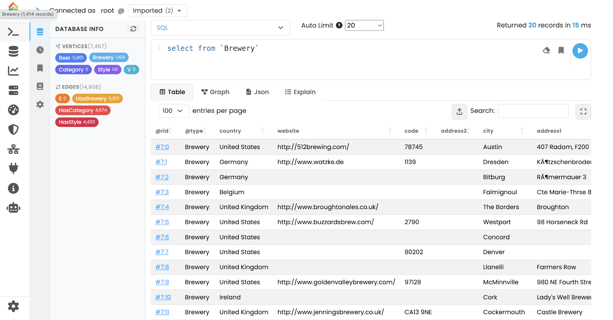
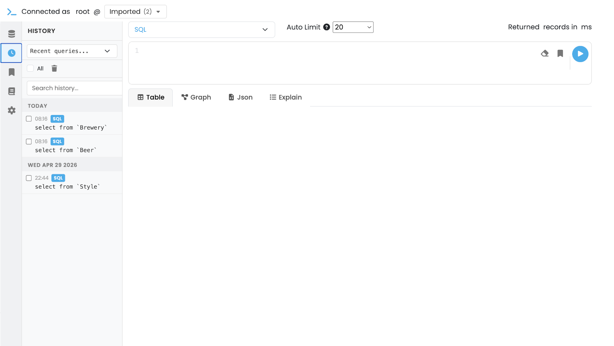
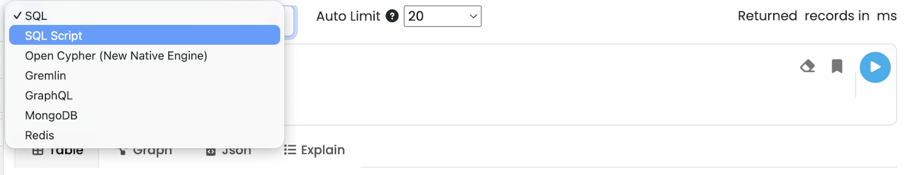
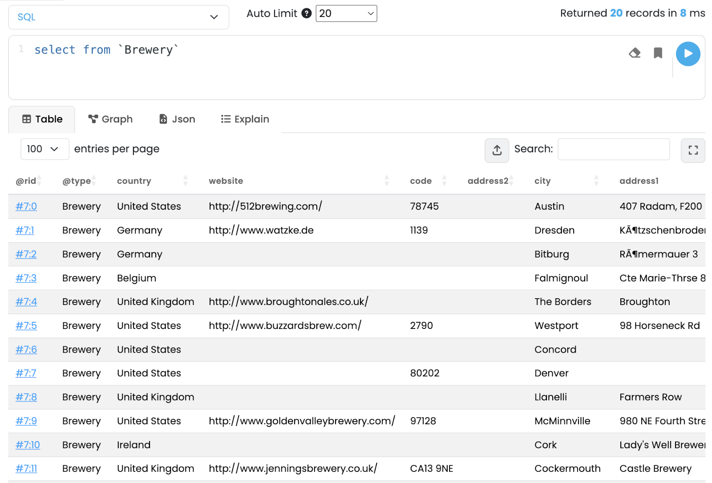
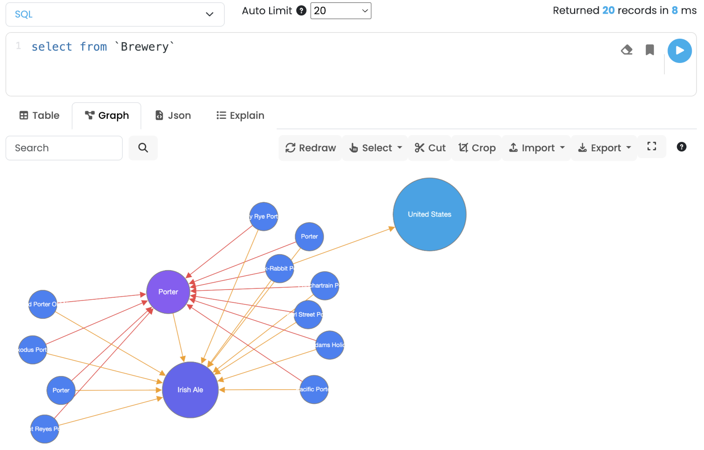
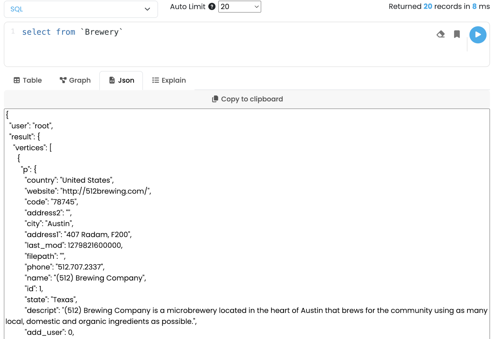
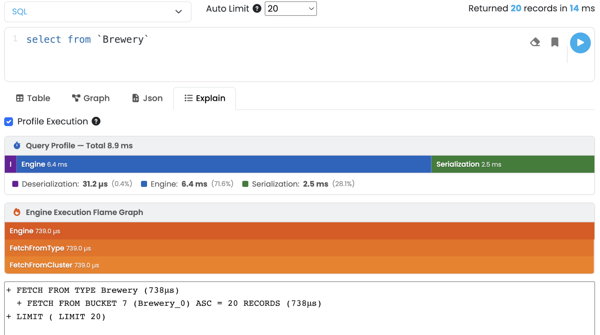

[[studio-query]]
==== Query Panel

The *Query* panel is the everyday workspace: write a command in any supported language, run it against the selected database, and inspect the result as a table, a graph, a JSON document, or an execution plan.

// TODO: full screenshot of the Query tab showing the icon sidebar, editor and a result.

The header shows the current user and the *Database Selector*; pick the database to run against here.
The status bar at the top right reports `Returned X records in Y ms` after every execution.

[[studio-query-sidebar]]
===== Left icon sidebar

The narrow icon column on the left of the editor switches between auxiliary panes; the main editor and results stay in place.

* *Overview* — summary information about the selected database (default view).
* *History* — list of recently executed commands.
Click an entry to load it back into the editor.
* *Saved* — saved queries.
Use the *Save Query* button in the editor toolbar to add the current command to this list.
* *Reference* — searchable reference of SQL functions and methods plus quick links to the other query languages.
* *Settings* — editor preferences (theme, font size, key bindings).

// TODO: screenshot of the Query sidebar expanded on, e.g., History or Saved.

[[studio-query-editor]]
===== Editor and toolbar

The editor is a CodeMirror instance with syntax highlighting that follows the selected language.

The toolbar above the editor exposes:

* *Language* selector with: *SQL*, *SQL Script* (multi-statement), *Open Cypher* (native engine), *Apache TinkerPop Gremlin*, *GraphQL*, *MongoDB*, *Redis*.
* *Auto Limit* dropdown — caps the number of rows returned by interactive runs (`20`, `50`, `100`, `500`, *No Limits*).
Useful to stay safe on large datasets; the cap is applied as a `LIMIT` when the language supports it.
* *Clear* — empties the editor.
* *Save Query* — adds the current command to the Saved pane in the sidebar.
* *Run* (or kbd:[Ctrl+Enter] / kbd:[Cmd+Enter]) — executes the command.

// TODO: close-up of the language selector and toolbar.

[[studio-query-results]]
===== Result views

The result area sits below the editor and exposes four tabs.
Studio automatically picks the most appropriate one for the result type, but you can switch at any time.

[[studio-query-table]]
====== Table

Tabular view backed by https://datatables.net[DataTables] with sorting, paging and per-column search.

* *Click a cell* to open the *Record Editor* in a modal overlay, where you can edit fields and save the record back to the database.
* The header tools allow exporting the current result to CSV.

// TODO: screenshot of the Table view with a result loaded.

[[studio-query-graph]]
====== Graph

Force-directed graph view powered by https://js.cytoscape.org[Cytoscape.js].
Vertices and edges returned by the command are added to the canvas; existing nodes are kept so you can incrementally explore the graph.

Toolbar actions:

* *Search* — locate a node by `@rid` or a property value.
* *Redraw* — reapply the layout.
* *Select* — selection helpers: *Direct Neighbors*, *Orphans*, *Invert Selection*, *Shortest Path*.
* *Cut* / *Crop* — remove the selected nodes / keep only the selected nodes.
* *Import* / *Export* — JSON, GraphML, PNG, JPEG.
* *Settings* — per-type style overrides (label, color, size, icon).
* *Fullscreen* — expand the canvas to the full browser window.

Interactions:

* *Click* on a node selects it; kbd:[Cmd]/kbd:[Ctrl]-drag rubber-bands a block selection.
* *Hold the mouse* on a node opens its context menu (load neighbors, edit, delete).
* *Double-click* on a node loads its direct neighbors.

// TODO: screenshot of the Graph view with a sample graph.

// TODO: optional close-up of the node context menu (replaces old studio-graph-node-menu-selected.png / -unselected.png).
image::../../images/studio-query-graph-node-menu.png[Graph node context menu]

[[studio-query-json]]
====== JSON

The raw response is rendered as pretty-printed JSON in a read-only viewer.
A *Copy to Clipboard* button copies the full payload.

// TODO: screenshot of the JSON view.

[[studio-query-explain]]
====== Explain

Shows the execution plan for the current command.
Tick *Profile Execution* before running to collect per-step timings; the result is rendered as a flame graph on top of the textual plan, so you can spot the heaviest steps at a glance.

// TODO: screenshot of the Explain view with Profile Execution enabled.

