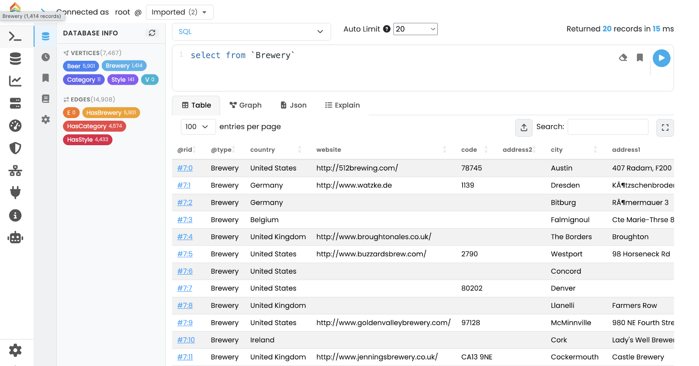
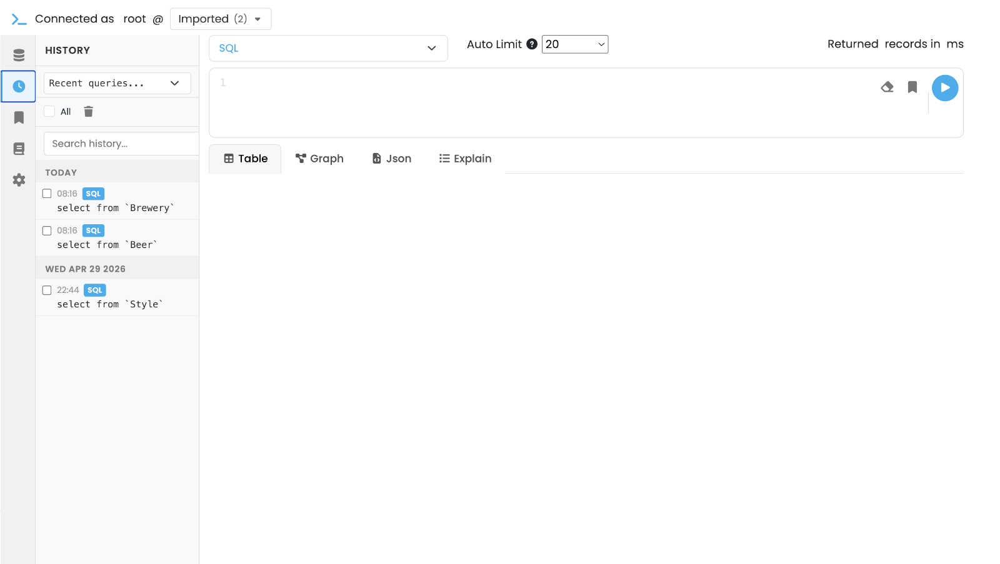
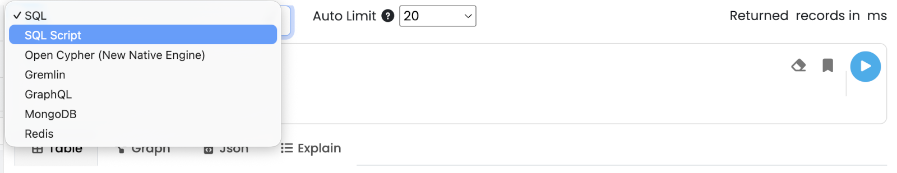
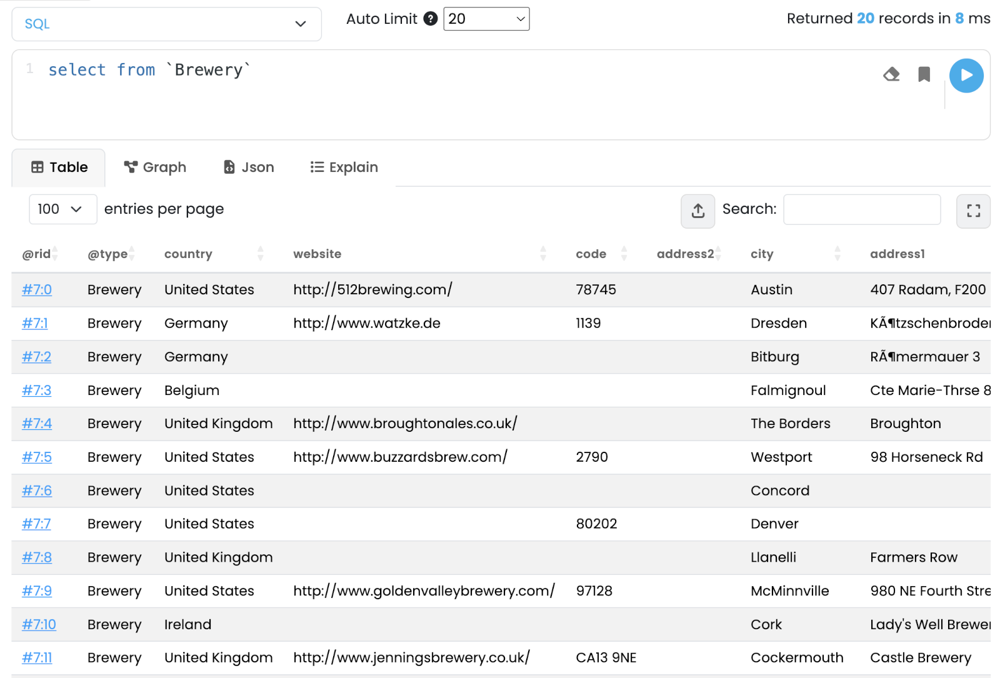
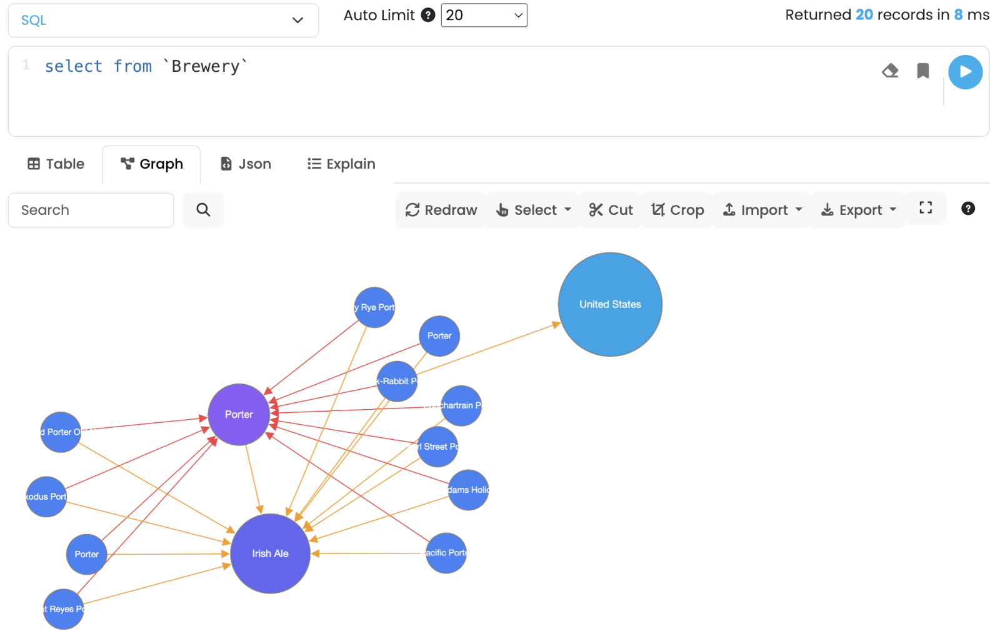
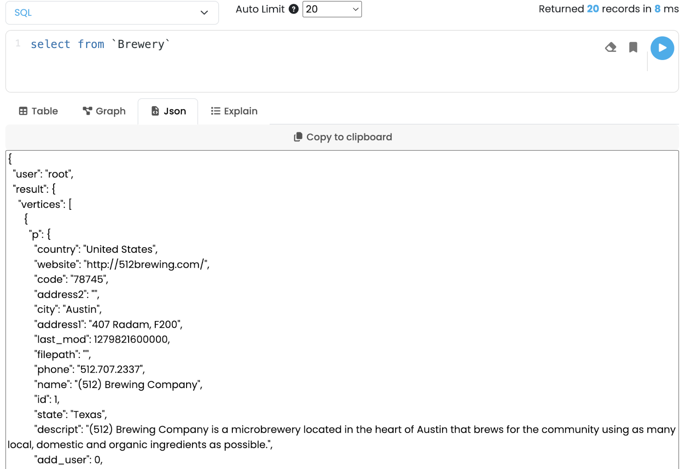
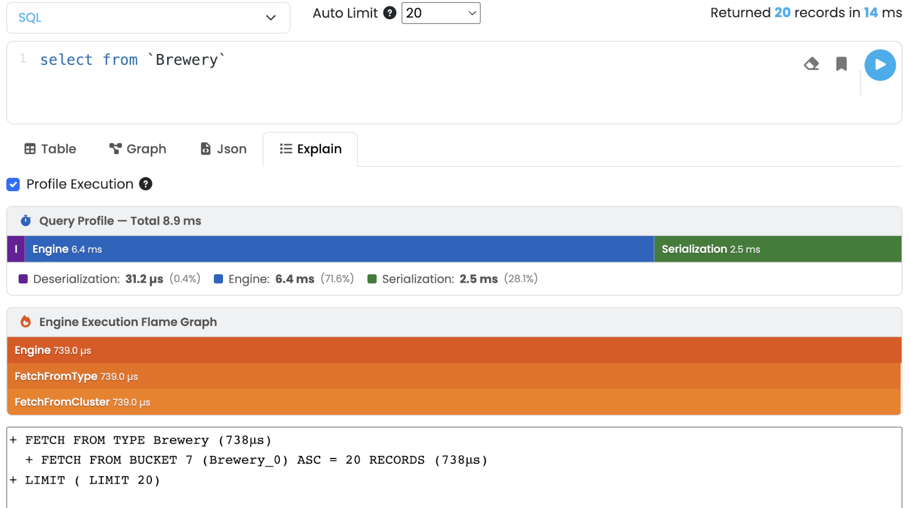

[[studio-query]]
==== Query Panel

The *Query* panel is the everyday workspace: write a command in any supported language, run it against the selected database, and inspect the result as a table, a graph, a chart, a JSON document, or an execution plan.

// TODO: full screenshot of the Query tab showing the icon sidebar, editor and a result.

The header shows the current user and the *Database Selector*; pick the database to run against here.
The status bar at the top right reports `Returned X records in Y ms` after every execution.

[[studio-query-sidebar]]
===== Left icon sidebar

The narrow icon column on the left of the editor switches between auxiliary panes; the main editor and results stay in place.

* *Overview* — summary information about the selected database (default view).
* *History* — list of recently executed commands.
Click an entry to load it back into the editor.
* *Saved* — saved queries.
Use the *Save Query* button in the editor toolbar to add the current command to this list.
* *Reference* — searchable reference of SQL functions and methods plus quick links to the other query languages.
* *Settings* — editor preferences (theme, font size, key bindings).

// TODO: screenshot of the Query sidebar expanded on, e.g., History or Saved.

[[studio-query-editor]]
===== Editor and toolbar

The editor is a CodeMirror instance with syntax highlighting that follows the selected language.

The toolbar above the editor exposes:

* *Language* selector with: *SQL*, *SQL Script* (multi-statement), *Open Cypher* (native engine), *Apache TinkerPop Gremlin*, *GraphQL*, *MongoDB*, *Redis*, *PromQL (Time Series)*, and under *Index search*: *Vector search*, *Hybrid search*, *Full-text search* (see <<studio-query-index-search,Index search>>).
* *Auto Limit* dropdown — caps the number of rows returned by interactive runs (`20`, `50`, `100`, `500`, *No Limits*).
Useful to stay safe on large datasets; the cap is applied as a `LIMIT` when the language supports it.
* *Clear* — empties the editor.
* *Save Query* — adds the current command to the Saved pane in the sidebar.
* *Run* (or kbd:[Ctrl+Enter] / kbd:[Cmd+Enter]) — executes the command.

// TODO: close-up of the language selector and toolbar.

[[studio-query-index-search]]
===== Index search (Vector, Hybrid, Full-text)

The last three entries of the *Language* selector query an index instead of running a command.
Selecting one replaces the editor with a small form, while *Auto Limit* is hidden because the form carries its own `k` or limit.
*Run*, *Clear*, *Save Query*, the history and the result views (Table, Json, Explain) work as for any other language.

* *Vector search* - pick an `LSM_VECTOR` or `LSM_SPARSE_VECTOR` index, enter the query vector (`[0.12, -0.5, 0.33]` or `0.12, -0.5, 0.33`), `k`, an optional SQL `WHERE` filter, and for a dense index `efSearch`. For a sparse index you can also enter the sparse dimension ids.
* *Hybrid search* - the vector inputs above plus a full-text leg (index and Lucene query), the fusion strategy, per-leg weights and an optional graph expansion (edge types, direction, max depth).
* *Full-text search* - pick a `FULL_TEXT` index, enter a Lucene query (for example `+java -python`) and a limit.

The form checks what it can before sending: a vector whose length differs from the index dimensions is refused without a round trip, and the limits for `k`, `efSearch`, `limit` and `maxDepth` are read from the server, so they always match the running version.
The index list is read from the database schema; a database without a vector or full-text index shows a note instead.

Each hit is one table row: `@rid`, `@type`, then the ranking value (`distance`, `score` or `fusedScore`, and for hybrid the `sources`), then the record properties.
The *Json* tab holds the raw response, and the *Explain* tab summarizes which index answered, how it ranks, and whether the result window was filled.
When the count reads *(truncated)*, more matches exist: raise `k`.

The form runs the same operations as the HTTP endpoints `POST /api/v1/vector/{database}/search`, `/hybrid` and `/fulltext`.
These searches used to live in a separate *Vector* tab, which was removed.

[[studio-query-results]]
===== Result views

The result area sits below the editor and exposes four tabs.
Studio automatically picks the most appropriate one for the result type, but you can switch at any time.

[[studio-query-table]]
====== Table

Tabular view backed by https://datatables.net[DataTables] with sorting, paging and per-column search.

* *Click a cell* to open the *Record Editor* in a modal overlay, where you can edit fields and save the record back to the database.
* The header tools allow exporting the current result to CSV.

// TODO: screenshot of the Table view with a result loaded.

[[studio-query-graph]]
====== Graph

Force-directed graph view powered by https://js.cytoscape.org[Cytoscape.js].
Vertices and edges returned by the command are added to the canvas; existing nodes are kept so you can incrementally explore the graph.

Toolbar actions:

* *Search* — locate a node by `@rid` or a property value.
* *Redraw* — reapply the layout.
* *Select* — selection helpers: *Direct Neighbors*, *Orphans*, *Invert Selection*, *Shortest Path*.
* *Cut* / *Crop* — remove the selected nodes / keep only the selected nodes.
* *Import* / *Export* — JSON, GraphML, PNG, JPEG.
* *Settings* — per-type style overrides (label, color, size, icon).
* *Fullscreen* — expand the canvas to the full browser window.

Interactions:

* *Click* on a node selects it; kbd:[Cmd]/kbd:[Ctrl]-drag rubber-bands a block selection.
* *Hold the mouse* on a node opens its context menu (load neighbors, edit, delete).
* *Double-click* on a node loads its direct neighbors.

The node context menu offers four ways to expand:

* the three arrows load *all* neighbours - both directions, outgoing only, incoming only;
* the *funnel* opens the relationship picker, where you choose exactly what to add.

The picker lists one row per relationship type and direction with its edge count, largest first, so you can add
only the `Bought` edges going out and the `Knows` edges coming in, rather than everything at once. A *Max
elements per direction* box caps how much a single expansion may add. This is what keeps a node with thousands
of connections from filling the canvas with a hairball; the counts are computed on the server, so opening the
picker does not download those edges just to count them. Available since 26.10.1.

// TODO: screenshot of the Graph view with a sample graph.

// TODO: optional close-up of the node context menu (replaces old studio-graph-node-menu-selected.png / -unselected.png).
image::../../images/studio-query-graph-node-menu.png[Graph node context menu]

[[studio-query-chart]]
====== Chart

The *Chart* tab plots the rows of the last result, whatever language produced them: SQL, Open Cypher, Gremlin, PromQL and so on.
The role of each column is inferred from its values, and every choice can be changed in the tab:

* *X axis* - the first time column (epoch milliseconds or an ISO date string), otherwise the first text column, otherwise the row number. A time axis is sorted; a text axis keeps the row order, so a `GROUP BY` result becomes a bar-friendly category chart.
* *Measures* - the numeric columns to plot, one line, area or bar series each.
* *Split by* - a text column to turn into one series per value. On a time chart it defaults to the first text column with at most 12 distinct values (a host, a metric label), so a result with `ts, host, usage` draws one line per host.
* *Line*, *Area*, *Bar* - the chart type.

Record metadata (`@rid`, `@type`) and nested values are not plotted, and a value that is not a number leaves a gap rather than a zero.
Chart does not run anything by itself: run a query as usual, then open the tab.

[source,sql]
----
SELECT ts, host, usage FROM Cpu
----

[[studio-query-promql]]
====== PromQL

Selecting *PromQL (Time Series)* in the language selector lets you type a PromQL expression, for example `Cpu{host="a"}`.
*Auto Limit* is replaced by a *Range* (last 5 minutes to 7 days) and a *Step* (1 second to 1 hour).
The expression runs as a range query against the database's Prometheus-compatible endpoint, and the points arrive as rows `timestamp`, `metric`, `value`, so they can be read in the Table and Json tabs; the Chart tab opens automatically, with one series per `metric`.

[[studio-query-json]]
====== JSON

The raw response is rendered as pretty-printed JSON in a read-only viewer.
A *Copy to Clipboard* button copies the full payload.

// TODO: screenshot of the JSON view.

[[studio-query-explain]]
====== Explain

Shows the execution plan for the current command.
Tick *Profile Execution* before running to collect per-step timings; the result is rendered as a flame graph on top of the textual plan, so you can spot the heaviest steps at a glance.
Profiling times the query as it normally runs, without changing how it is executed, so the numbers describe the same work the query does when profiling is off.

// TODO: screenshot of the Explain view with Profile Execution enabled.

