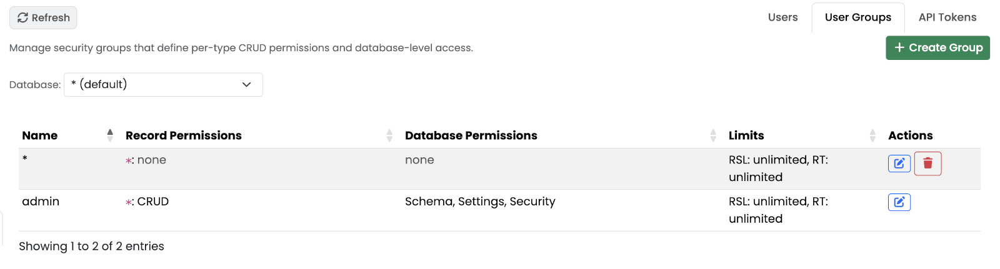
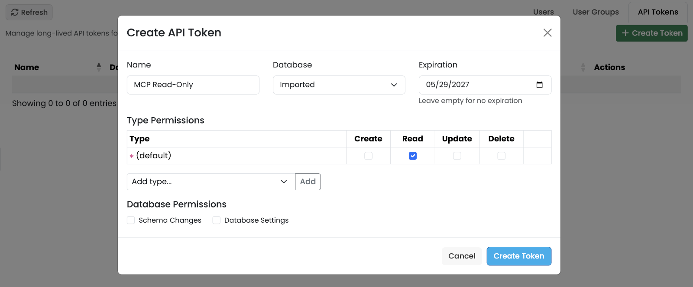

[[studio-security]]
==== Security Panel

The *Security* panel manages who can log into the server, with which permissions, and which automated clients have API tokens.
It is the UI front-end of the ArcadeDB security model — see <<users,Users>>, <<groups,Groups>> and <<security-policy,Security Policy>> for the underlying concepts.

// TODO: screenshot of the Security tab on the Users sub-tab.
image::../../images/studio-security.png[Security Panel]

The header has a *Refresh* button.
The panel is split into three sub-tabs.

[[studio-security-users]]
===== Users

Lists every user known to the server: username, e-mail, and the groups they belong to in each database.

* *Create User* — open the *Create User* modal.
* Per-row actions: *Edit*, *Delete*.

The *Create User* modal asks for:

* *Username* and *Password*.
* *Database Access* — a table mapping each database to a group.
The wildcard `*` row represents the default group used for any database not listed.
Use the *Add Database* dropdown to grant access to additional databases with a specific group.

// TODO: screenshot of the Users sub-tab with the Create User modal open.
image::../../images/studio-security-users.png[Users sub-tab]

[[studio-security-groups]]
===== User Groups

Groups (aka roles) bundle the permissions granted to the users that belong to them.

* *Database* filter at the top — limit the table to groups defined for a specific database.
* *Create Group* — open the *Create Group* modal.
* Table columns: *Name*, *Result Set Limit*, *Read Timeout*, type-level CRUD checkboxes, database-level permission checkboxes.

The *Create / Edit Group* modal exposes:

* *Database* and *Name*.
* *Result Set Limit* — cap the number of rows returned per query.
* *Read Timeout* — cap on the duration of read queries (ms).
* *Type Permissions* — per-type *Create*, *Read*, *Update*, *Delete* checkboxes.
The `*` row is the default applied to types not explicitly listed; use the *Add Type* dropdown to override the default for specific types.
* *Database Permissions* — *Schema Changes*, *Database Settings*, *Security*.

// TODO: screenshot of the User Groups sub-tab.

[[studio-security-tokens]]
===== API Tokens

Long-lived bearer tokens you can issue to scripts and services in place of username/password authentication.

* *Create Token* — open the *Create Token* modal.
* Table columns: *Name*, *Database*, *Expiration*, *Status* (Active / Expired), *Actions* (View / Revoke).

The *Create Token* modal asks for:

* *Name* and *Database*.
* *Expiration* date.
* *Type Permissions* and *Database Permissions* — same structure as the Groups modal.

When you submit the form the new token is shown once in the *Token Created* modal, with a *Copy* button.
The token is *not* shown again, so copy and store it before closing the dialog.

// TODO: screenshot of the API Tokens sub-tab.

