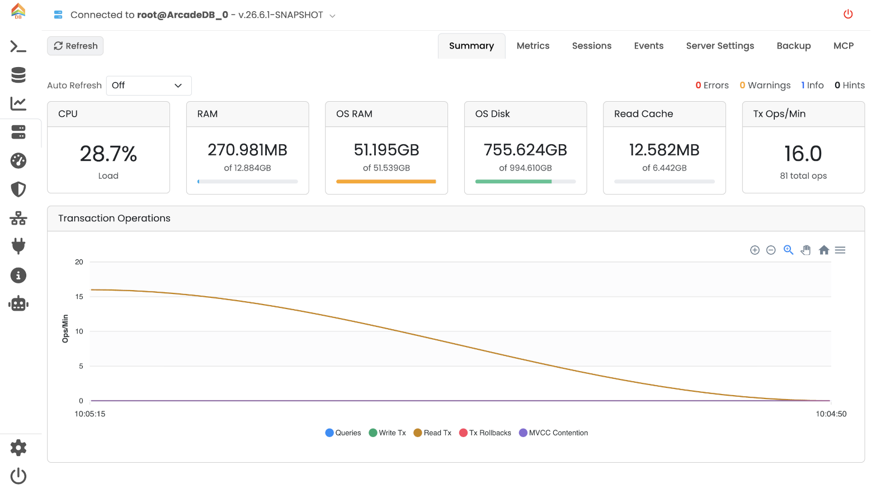
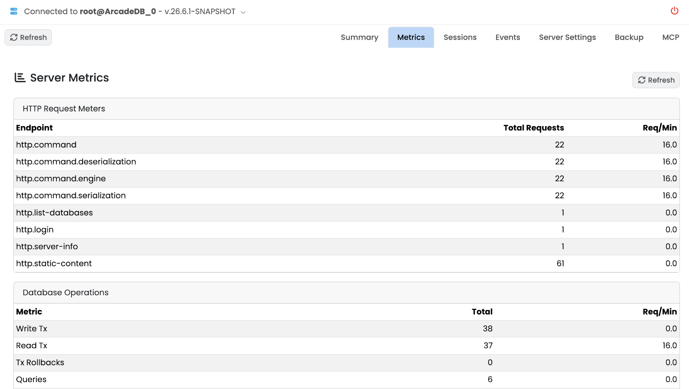
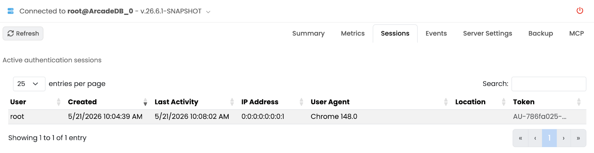
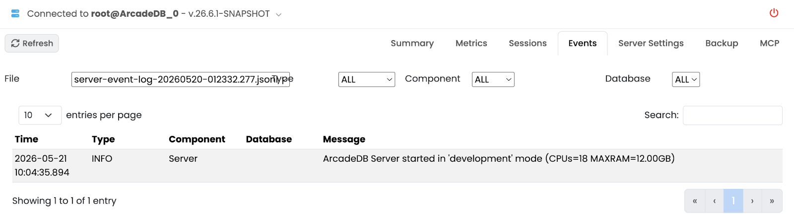
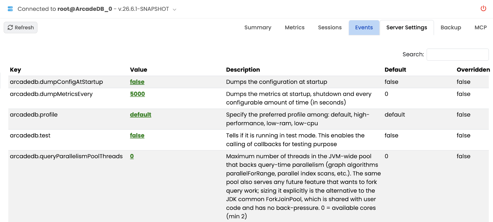
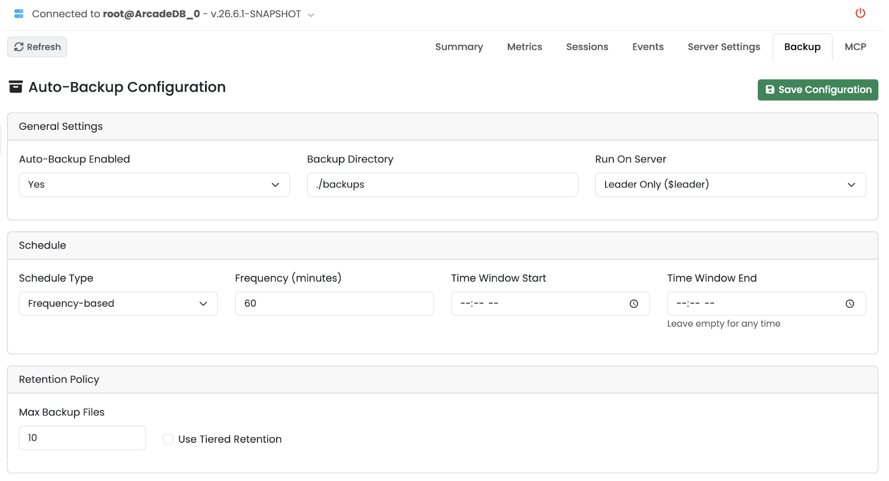
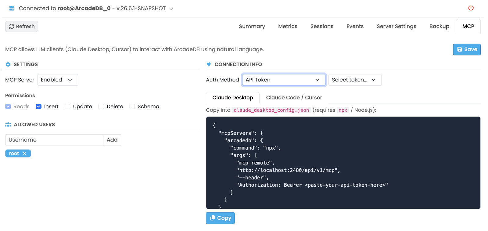

[[studio-server]]
==== Server Panel

The *Server* panel is the operational console for the ArcadeDB server itself: health summary, live metrics, active sessions, events, server-wide settings, automated backups and MCP integration.

// TODO: screenshot of the Server tab on the Summary sub-tab.

The header shows a *server info* label (click it to open a popover with version, JVM details, host, uptime, etc.) and a *Refresh* button.
A *Shutdown* button is available under the *Cluster* tab — see <<studio-cluster,Cluster Panel>>.

The panel has seven sub-tabs.

[[studio-server-summary]]
===== Summary

The default sub-tab.
*Auto Refresh* keeps the page in sync at a fixed interval (`Off`, `10s`, `30s`, `1m`, `5m`).

The top row shows clickable event counters — Errors, Warnings, Info and Hints — that jump straight to the <<studio-server-events,Events>> sub-tab filtered on that level.

Below them, system-resource cards report:

* *CPU Load* of the server process.
* *RAM (used / max)* of the JVM, with a progress bar.
* *OS RAM* available on the host.
* *OS Disk* free on the data directory.
* *Read Cache* hit ratio and size.
* *Transaction Ops/Min* throughput.

A *Transaction Operations* chart at the bottom plots ops/min over a rolling window.

// TODO: screenshot of the Summary sub-tab.
image::../../images/studio-server-summary.png[Server Summary]

[[studio-server-metrics]]
===== Metrics

Detailed numeric metrics for the server:

* *HTTP Request Meters* — per endpoint, total requests and req/min.
* *Database Operations* — per metric, total and req/min.
* *Profiler Details* — internal profiler counters.
* *Executor Pools* — thread pools (active vs. allocated threads, queue depth, completed tasks, fallbacks).
* *Sparse Vector Indexes* — counters for vector indexes when present.

// TODO: screenshot of the Metrics sub-tab.

[[studio-server-sessions]]
===== Sessions

Table of active authentication sessions: user, source, started, last-seen.
Use it to spot stale or unexpected connections.

// TODO: screenshot of the Sessions sub-tab.

[[studio-server-events]]
===== Events

Browsable server event log.
Filter dropdowns above the table:

* *File* — pick a log file.
* *Type* — `ALL`, `CRITICAL`, `WARNING`, `INFO`, `HINT`.
* *Component* — server subsystem (HTTP, transactions, indexes, ...).
* *Database* — limit to events scoped to one database.

Each row shows timestamp, level and message.

// TODO: screenshot of the Events sub-tab.

[[studio-server-settings]]
===== Server Settings

Key-value table of the server-scoped configuration.
See <<arcadedb-settings,Settings>> for the full setting reference.

// TODO: screenshot of the Server Settings sub-tab.

[[studio-backup]]
===== Backup

Server-wide auto-backup configuration.

* *Auto-Backup Configuration* — toggle to enable or disable automatic backups, set the backup directory, and choose whether backups run on the leader only or on every server in a cluster.
* *Backup Schedule* — pick *Frequency* (every N minutes/hours/days) or a full *CRON* expression.
* *Retention Policy* — *Max files* (simple ring) or *Tiered* (per-bucket keep counts: Hourly, Daily, Weekly, Monthly, Yearly).
* *Backup Status* — last run, next run, files produced.

See <<auto-backup,Automatic Backup>> for the underlying configuration and CLI equivalents.
Per-database backup history is managed from the <<studio-database-backup,Database › Backup>> sub-tab.

// TODO: screenshot of the Backup sub-tab.

[[studio-server-mcp]]
===== MCP

Configures the embedded https://modelcontextprotocol.io[Model Context Protocol] server so AI tools (Claude Desktop, Claude Code, Cursor, …) can talk to ArcadeDB.

The left column controls *Settings*:

* Enable or disable the MCP endpoint.
* Per-operation permissions: *Reads*, *Inserts*, *Updates*, *Deletes*, *Schema*.
* *Allowed Users* — add or remove users that may authenticate against MCP.

The right column shows *Connection Info*:

* *Auth Method* — Basic auth or API token.
* Ready-to-paste configuration snippets for *Claude Desktop* and for *Claude Code / Cursor*, each with a *Copy* button.

See <<mcp-server,MCP Server>> for the protocol reference.

// TODO: screenshot of the MCP sub-tab.

